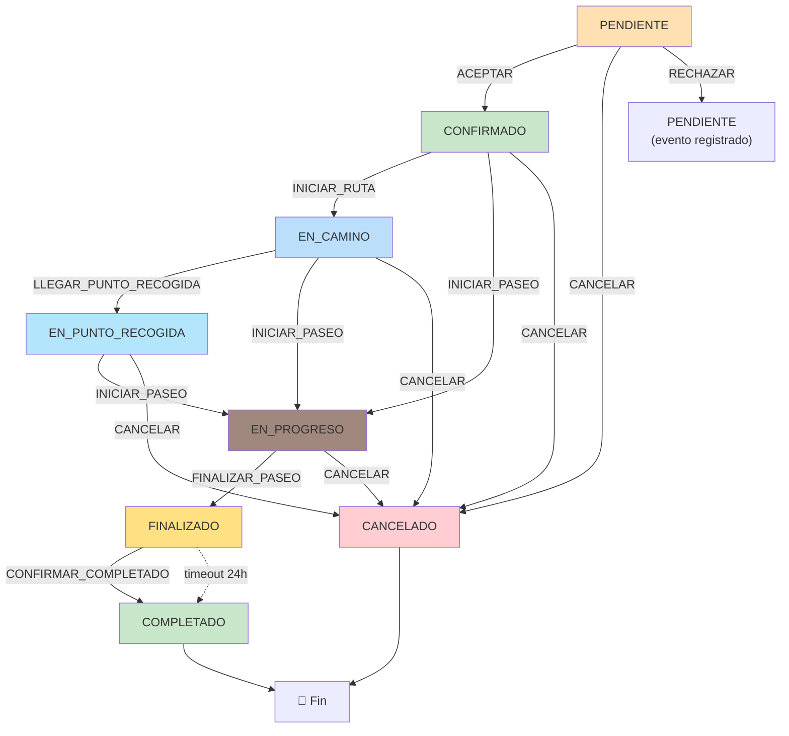
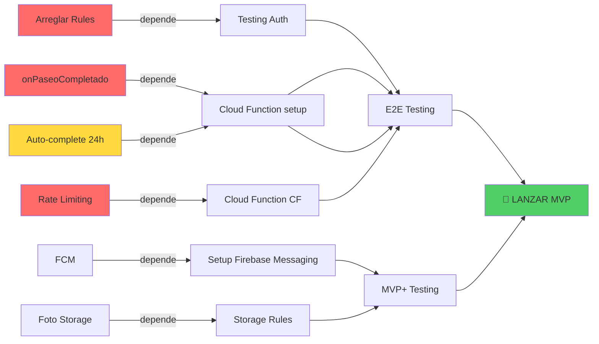

# Auditoría MVP Ready — Paw-Path

**Fecha:** 20 de julio de 2026  
**Versión del Análisis:** 1.0  
**Basada en:** Código ejecutable real, ignorando comentarios desactualizados  
**Objetivo:** Determinar brechas críticas para producción MVP  

---

## TABLA DE CONTENIDOS

1. [Estado General del Proyecto](#1-estado-general-del-proyecto)
2. [Flujo Completo del Tutor](#2-flujo-completo-del-tutor)
3. [Flujo Completo del Cuidador](#3-flujo-completo-del-cuidador)
4. [Máquina de Estados de Paseos](#4-máquina-de-estados-de-paseos)
5. [Matching de Cuidadores](#5-matching-de-cuidadores)
6. [GPS y Ubicación](#6-gps-y-ubicación)
7. [Chat en Tiempo Real](#7-chat-en-tiempo-real)
8. [Firestore: Arquitectura de Datos](#8-firestore-arquitectura-de-datos)
9. [Cloud Functions](#9-cloud-functions)
10. [Seguridad](#10-seguridad)
11. [UX: Pantallas y Flujos](#11-ux-pantallas-y-flujos)
12. [Deuda Técnica](#12-deuda-técnica)
13. [Código Muerto](#13-código-muerto)
14. [Riesgos de Producción](#14-riesgos-de-producción)
15. [Roadmap MVP](#15-roadmap-mvp)

---

## 1. ESTADO GENERAL DEL PROYECTO

### Nivel de Madurez
**AVANZADO (8/10)** — Código estructurado, flujos principales implementados, infraestructura funcional.

### Arquitectura
```
┌─────────────────────────────────────────────────────────┐
│           React Native + Expo (v54)                      │
├─────────────────────────────────────────────────────────┤
│  Navigation: @react-navigation/stack + bottom-tabs      │
│  State Mgmt: Context API (Auth, Rol, Mascotas, etc)    │
│  Forms: Input + Selectors + Date/Time Pickers           │
└─────────────────────────────────────────────────────────┘
          ↓
┌─────────────────────────────────────────────────────────┐
│      Services Layer (Firebase Integration)               │
│  ServicioCrudBase → Firestore Collections                │
│  ServicioPaseo, ServicioChat, ServicioUbicacion, etc     │
│  Converters: toDomain() / toDb() (tipos seguros)        │
└─────────────────────────────────────────────────────────┘
          ↓
┌─────────────────────────────────────────────────────────┐
│ Firebase Backend (Firestore, RTDB, Cloud Functions)     │
│  Firestore: /usuarios, /mascotas, /paseos, /chat        │
│  RTDB: /ubicaciones_reales/{paseoId}/...                │
│  Cloud Functions: 3 activas (escalada, chat, perfil)    │
│  Cloud Tasks: Cola para escaladas (10 min delay)        │
└─────────────────────────────────────────────────────────┘
```

### Fortalezas

✅ **Máquina de estados bien diseñada**: Estados de paseo no se cruzan (PENDIENTE → CONFIRMADO → EN_CAMINO → EN_PROGRESO → FINALIZADO → COMPLETADO)  
✅ **Chat integrado y automático**: Se crea cuando paseo → CONFIRMADO (Cloud Function trigger)  
✅ **GPS resiliente**: Foreground + background task + AsyncStorage para contexto  
✅ **Modelos tipados**: TypeScript con interfaces para Paseo, Mascota, Chat, etc.  
✅ **Matching descentralizado**: Lógica `LogicMatching` en cliente, sin servidores especiales  
✅ **Modales contextuales**: BottomSheets reutilizables para detalles de paseos  
✅ **Firestore rules básicas**: Autenticación + ownership checks  
✅ **Escalada automática**: Cloud Tasks para reintentar cuidadores después de 10 min  

### Debilidades

⚠️ **Roles incompletos**: "Explorador" casi no funciona (ResumenExploracion sin persistencia real)  
⚠️ **Admin sin contenido**: AdminApp existe pero está vacío (solo TerritorioVivo)  
⚠️ **Código de pantallas duplicado**: Chat existe en 2 lugares (ChatPanel bottom sheet + ChatScreen fullscreen)  
⚠️ **Pantalla de cuidador incompleta**: `/screens/cuidador/Paseos.tsx` es solo placeholder  
⚠️ **Notificaciones ausentes**: No hay push notifications implementadas (Firebase Messaging)  
⚠️ **Tolerancia de errores baja**: GPS, chat, ubicación pueden quedarse en estado inconsistente  
⚠️ **Sin manejo de timeouts**: Requests de API pueden bloquear UI indefinidamente  

---

## 2. FLUJO COMPLETO DEL TUTOR

### Registro
```
1. Bienvenida (Expo Linking OAuth)
   ↓
2. Firebase Auth (Google OAuth)
   ↓
3. Crear documento /usuarios/{uid}
   ├─ nombre, correo, celular, foto
   ├─ roles: ['tutor']
   ├─ ubicaciones?: undefined
   └─ creado_en: serverTimestamp()
   ↓
4. AuthContext.setUser() + RolContext.setRolActivo('tutor')
   ↓
5. Navegar reset() → TutorApp
```

**Código:** [screens/auth/Registro.tsx](screens/auth/Registro.tsx)

### Crear Mascota
```
1. Dashboard → Flotar FAB + → Mascotas
   ↓
2. Modal CrearMascotaFlow
   ├─ Sección Básica (nombre, especie, raza, peso)
   ├─ Sección Salud (vacunas, esterilizado, condiciones)
   ├─ Sección Comportamiento (nivel_energia, preferencias_paseo)
   └─ SobreMiMascota (foto, notas)
   ↓
3. useEdicionMascota.guardarCambios()
   ├─ Calcular completitud (0-100%)
   ├─ Foto → JPEG + Upload a Storage? (⚠️ NO IMPLEMENTADO)
   └─ POST /mascotas
      ├─ Validar usuario_id === user.uid
      ├─ Guardar en Firestore /mascotas/{id}
      └─ Incluir campos de sistema (creado_en, creado_por, etc)
   ↓
4. useMascotas() listener actualiza estado local
   ↓
5. Volver a Mascotas → Ver mascota en lista
```

**Archivo:** [hooks/useEdicionMascota.ts](hooks/useEdicionMascota.ts)  
**Modelo:** [models/Mascota.ts](models/Mascota.ts)

### Solicitar Paseo

```
1. Dashboard → Próximo Paseo Card → "Solicitar Paseo"
   ↓
2. Modal SolicitarPaseoModal (6 pasos)
   ├─ Paso 1: MascotaPicker
   │  └─ Validar completitud >= nivel 2
   ├─ Paso 2: UbicacionPicker
   │  ├─ Usar ubicación principal del tutor
   │  └─ Si no existe → Autocomplete + crear
   ├─ Paso 3: FechaPicker
   │  ├─ Validar >= hoy
   │  ├─ Validar buffer 15min si es hoy
   │  └─ Máx 60 días en futuro
   ├─ Paso 4: TimePicker
   │  ├─ Entre 05:30 - 22:30
   │  └─ Si hoy, >= ahora + 15min
   ├─ Paso 5: DurationSlider (15-120 min)
   ├─ Paso 6: Resumen + Seleccionar Cuidador
   │  ├─ LogicMatching.filtrarDisponibles()
   │  │  ├─ Zona H3 matching
   │  │  ├─ Horario disponible
   │  │  ├─ Sin conflictos
   │  │  └─ Verificado
   │  └─ Mostrar lista + permitir seleccionar
   └─ Botón SOLICITAR
   ↓
3. ServicioPaseo.crear(payload)
   ├─ Validar mascota ∈ mascotas del tutor
   ├─ Crear doc /paseos/{id}
   │  ├─ estado: 'PENDIENTE'
   │  ├─ id_tutor: uid
   │  ├─ id_cuidador?: uid_seleccionado (si DIRECTA)
   │  ├─ ubicacion_inicio: UbicacionSnapshot
   │  ├─ fecha_inicio: ISO string
   │  ├─ duracion_minutos: number
   │  ├─ mascotas_count: 1
   │  └─ campos sistema
   ├─ Crear subdoc /paseos/{id}/mascotas/{mascotaId}
   │  ├─ id_mascota, id_usuario, estado_mascota: 'pendiente'
   │  └─ ubicacion_recogida: snapshot de inicio
   └─ Si id_cuidador: onCrearPaseoDirecto trigger
      ├─ Crear Cloud Task (delay 10min)
      └─ → Ejecutar escalarPaseoIndividual después de 10min
   ↓
4. Paseo aparece en Paseos → Pestaña "Próximos"
   ├─ Estado: PENDIENTE (en gris)
   └─ Si DIRECTA: reloj contando + "Escalada en Xmin"
```

**Archivo:** [components/paseos/SolicitarPaseoModal.tsx](components/paseos/SolicitarPaseoModal.tsx)  
**Matching:** [logic/paseos/matching.ts](logic/paseos/matching.ts)  
**Servicio:** [services/firebase/firestore/colecciones/paseo.ts](services/firebase/firestore/colecciones/paseo.ts)

### Paseo Activo (EN_PROGRESO)

```
1. Dashboard → TarjetaPaseo estado EN_PROGRESO
   ↓
2. useControlPaseo(paseoId)
   ├─ GET /paseos/{paseoId}
   ├─ Listeners realtime:
   │  ├─ Ubicación actual del cuidador (RTDB)
   │  ├─ Ruta polyline (RTDB)
   │  ├─ Estado del paseo (Firestore)
   │  └─ Cambios en mascotas del paseo
   └─ Retorna: { paseo, ubicacionActual, ruta, ... }
   ↓
3. Pantalla PaseoActivo
   ├─ Mapa (MapView) con:
   │  ├─ Polyline de ruta recorrida
   │  ├─ Marker en ubicación cuidador (actualiza c/9seg)
   │  ├─ Marker ubicación tutor (zona segura visual)
   │  └─ Zoom en ruta
   ├─ Panel inferior con:
   │  ├─ Nombre cuidador + foto
   │  ├─ Tiempo transcurrido
   │  ├─ Distancia recorrida
   │  └─ Botón CHAT
   └─ Realtime updates cada 9 segundos
   ↓
4. Tutor puede:
   ├─ Ver ubicación en vivo
   ├─ Ver ruta recorrida
   ├─ Tocar CHAT → ChatPanel bottom sheet
   └─ Salir de la pantalla (mantendrá datos locales)
```

**Archivo:** [screens/tutor/PaseoActivo.tsx](screens/tutor/PaseoActivo.tsx)  
**Hook:** [hooks/cuidador/useControlPaseo.ts](hooks/cuidador/useControlPaseo.ts)

### Chat Paseo

```
1. Paseo → CONFIRMADO
   ├─ Cloud Function onPaseoConfirmado triggers
   ├─ Crear /conversaciones/{paseoId}
   │  ├─ participantes: [tutor_id, cuidador_id]
   │  ├─ tutor_id, cuidador_id (denorm)
   │  └─ activa: true
   └─ Enviar sistema msg: "Chat iniciado"
   ↓
2. useMensajesPaseo(paseoId)
   ├─ GET /conversaciones/{paseoId}
   ├─ Listener realtime /conversaciones/{paseoId}/mensajes
   │  ├─ Orden: orderBy('creado_en', 'asc')
   │  └─ Limit: 100 últimos
   └─ Retorna: { conversacion, mensajes, enviarMensaje }
   ↓
3. ChatPanel (bottom sheet o fullscreen)
   ├─ Lista de mensajes con:
   │  ├─ Autor (badge "👤 Tutor" o "🚶 Cuidador")
   │  ├─ Contenido (máx 500 chars)
   │  ├─ Timestamp
   │  ├─ Leído (checkmark si leidos_por[user.uid])
   │  └─ Tipo (texto|sistema|notificación)
   ├─ Input:
   │  ├─ TextInput multiline (máx 500 chars)
   │  └─ Botón enviar (deshabilitado si conversacion no activa)
   └─ Auto-scroll a último mensaje
   ↓
4. Enviar mensaje:
   ├─ ServicioChat.enviarMensaje(conversacionId, contenido)
   ├─ POST /conversaciones/{id}/mensajes/{nuevo_id}
   │  ├─ contenido (trim)
   │  ├─ autor_uid (usuario.uid)
   │  ├─ tipo_mensaje: 'texto'
   │  └─ creado_en: serverTimestamp()
   └─ Listener actualiza UI automáticamente
   ↓
5. Paseo → COMPLETADO
   └─ onPaseoCompletado trigger (⚠️ NO IMPLEMENTADO)
      └─ ServicioChat.desactivarConversacion()
         └─ conversacion.activa = false + cerrada_en
```

**Archivo:** [screens/paseos/ChatScreen.tsx](screens/paseos/ChatScreen.tsx)  
**Hook:** [hooks/chat/useMensajesPaseo.ts](hooks/chat/useMensajesPaseo.ts)  
**Cloud Function:** [functions/src/paseos/chat.ts](functions/src/paseos/chat.ts)

### Finalización y Resumen

```
1. Cuidador → ControlPaseo → FINALIZAR PASEO
   ├─ Cambiar estado a FINALIZADO
   ├─ Guardar fecha_fin_real
   └─ Crear evento 'FINALIZAR_PASEO'
   ↓
2. Tutor ve:
   ├─ Paseo → FINALIZADO (badge naranja)
   ├─ Opción CONFIRMAR ENTREGA (modal con):
   │  ├─ Foto mascota + nombre
   │  ├─ Código de entrega (6 dígitos)
   │  ├─ Nota del cuidador (opcional)
   │  └─ Botón CONFIRMAR ENTREGA
   └─ O timeout 24h → COMPLETADO automático (⚠️ NO IMPLEMENTADO)
   ↓
3. Tutor confirma → POST /paseos/{id}/confirmar_completado
   ├─ Validar código
   ├─ Cambiar estado → COMPLETADO
   └─ onPaseoCompletado() trigger (⚠️ FALTA)
      ├─ Desactivar conversación
      ├─ Calcular estadísticas (cuidador)
      └─ Crear Valoracion (⚠️ MODELO NO USADO)
   ↓
4. Pantalla PaseoFinalizado (modal)
   ├─ Resumen:
   │  ├─ Tiempo total
   │  ├─ Ruta recorrida (mapa estático)
   │  ├─ Bitácora de eventos
   │  └─ Fotos/videos capturados (⚠️ NO IMPLEMENTADO)
   ├─ Opción: Calificar cuidador (⚠️ NO IMPLEMENTADO)
   └─ Botón Volver a Inicio
```

**Archivo:** [screens/tutor/PaseoFinalizado.tsx](screens/tutor/PaseoFinalizado.tsx)  
**Modelo Valoración:** [models/Valoracion.ts](models/Valoracion.ts) — **⚠️ NO UTILIZADO EN CÓDIGO ACTIVO**

---

## 3. FLUJO COMPLETO DEL CUIDADOR

### Registro + Perfil

```
1. Bienvenida → Registro (igual que tutor)
   ├─ Crear /usuarios/{uid} con roles: ['tutor', 'cuidador']
   └─ RolContext.cambiarRol('cuidador')
   ↓
2. Modal SeleccionarRolModal (si múltiples roles)
   ├─ Ofrecerle activar rol 'cuidador'
   └─ Si acepta → crear PerfilPublico
   ↓
3. Navegar → CuidadorApp → PerfilCuidador modal
   ├─ Foto (local picker, ⚠️ NO upload a Storage)
   ├─ Biografía (texto libre)
   ├─ Experiencia (texto libre)
   ├─ Tarifa por hora (número)
   ├─ Horario semanal (7 días):
   │  ├─ Toggle día activo/inactivo
   │  ├─ Si activo: inicio + fin (HH:mm)
   │  └─ Validar dentro de 05:30-22:30
   ├─ Direcciones:
   │  ├─ Buscar y agregar dirección principal
   │  └─ Calcular h3_r8 + h3_r9 automáticamente
   └─ GUARDAR
      ├─ GestorPerfilPublico.actualizarCoberturaYPerfil(uid, data, h3_origen)
      ├─ POST /perfiles_publicos/{uid}
      ├─ ServicioIndiceCobertura.escribirCoberturaWalker()
      │  ├─ Calcular celdas H3 en radio ~2km (kRing=2, ~19 celdas)
      │  └─ POST batch a /indice_cobertura/{celda}/cuidadores/{uid}
      └─ Mensaje éxito → volver a CuidadorApp
```

**Archivos:**
- [screens/cuidador/PerfilCuidador.tsx](screens/cuidador/PerfilCuidador.tsx)
- [logic/usuarios/perfilPublico.ts](logic/usuarios/perfilPublico.ts)
- [services/firebase/firestore/colecciones/indice_cobertura.ts](services/firebase/firestore/colecciones/indice_cobertura.ts)

### Ver Solicitudes

```
1. CuidadorApp → Solicitudes (tab con badge rojo)
   ├─ useSolicitudesCuidador()
   │  ├─ Obtener h3 de ubicación actual del cuidador
   │  ├─ Query: paseos WHERE estado='PENDIENTE' 
   │  │              AND ubicacion_inicio h3_r8 in cuidador's zona
   │  ├─ Filtrar por horario (LogicMatching.esCuidadorDisponible)
   │  └─ Retorna lista de solicitudes disponibles
   └─ FlatList de TarjetaSolicitud
      ├─ Datos del tutor:
      │  ├─ Nombre + foto
      │  ├─ Rating promedio
      │  └─ Número de paseos completados
      ├─ Datos del paseo:
      │  ├─ Mascotas (nombre, raza, tamaño)
      │  ├─ Fecha + hora
      │  ├─ Duración
      │  └─ Ubicación (dirección)
      └─ Botón ACEPTAR

2. Tocar solicitud → SolicitudModal
   ├─ Expandir detalles completos
   ├─ Perfil público del tutor
   ├─ Mascotas con fotos + descripciones
   ├─ Mapa de ubicación recogida
   └─ Botón ACEPTAR PASEO

3. Clic ACEPTAR
   ├─ LogicMatching.esCuidadorDisponible() validación final
   ├─ Si FALLA:
   │  └─ Mostrar Alert con motivo (sin tiempo, otra solicitud, etc)
   ├─ Si PASA:
   │  ├─ POST /paseos/{id}/aceptar
   │  │  ├─ Cambiar estado → CONFIRMADO
   │  │  ├─ Asignar id_cuidador
   │  │  └─ Cambiar campos desnormalizados
   │  ├─ Cloud Function onPaseoConfirmado trigger
   │  │  └─ Crear /conversaciones/{id}
   │  ├─ Mostrar toast "Solicitud aceptada!"
   │  └─ Navegar → Agenda
   └─ Paseo desaparece de Solicitudes
```

**Archivo:** [screens/cuidador/SolicitudesPaseos.tsx](screens/cuidador/SolicitudesPaseos.tsx)  
**Hook:** [hooks/cuidador/useSolicitudesCuidador.ts](hooks/cuidador/useSolicitudesCuidador.ts)

### Agenda + Control de Paseo

```
1. CuidadorApp → Agenda (paseos CONFIRMADO → FINALIZADO)
   ├─ useAgendaCuidador()
   │  ├─ GET paseos WHERE id_cuidador=uid 
   │  │              AND estado IN [CONFIRMADO, EN_CAMINO, EN_PUNTO_RECOGIDA, EN_PROGRESO]
   │  └─ Retorna lista + historial
   ├─ 2 Tabs:
   │  ├─ Próximos: CONFIRMADO, EN_CAMINO, EN_PUNTO_RECOGIDA, EN_PROGRESO
   │  └─ Historial: COMPLETADO, CANCELADO, FINALIZADO
   └─ Tocar paseo → Navegar a ControlPaseo
   ↓
2. ControlPaseo (pantalla fullscreen + mapa)
   ├─ useControlPaseo(paseoId)
   ├─ usePublicarUbicacion(paseoId, estado)
   │  ├─ Si EN_CAMINO o EN_PROGRESO:
   │  │  ├─ Foreground: Location.watchPositionAsync()
   │  │  │  ├─ Accuracy: High
   │  │  │  ├─ Interval: 9 segundos
   │  │  │  └─ Publicar a RTDB /ubicaciones_reales/{paseoId}/ubicacion_actual
   │  │  └─ Background: Location.startLocationUpdatesAsync() + expo-task-manager
   │  │     ├─ Accuracy: High
   │  │     ├─ Interval: 12 segundos
   │  │     ├─ LOCATION_TASK_NAME: 'BACKGROUND_LOCATION_PAWPATH'
   │  │     └─ Foreground service con notificación
   │  └─ Si NO EN_CAMINO/EN_PROGRESO: detener tracking
   └─ Retorna: { error, errorMessage }
   ↓
3. Mapa y controles de estado
   ├─ Mapa con:
   │  ├─ Polyline de ruta (si EN_PROGRESO)
   │  ├─ Marker ubicación actual (actualiza c/9seg)
   │  ├─ Marker ubicación recogida (CONFIRMADO)
   │  ├─ Marker ubicación tutor (info)
   │  └─ Ruta hacia recogida (Maps API)
   ├─ Panel inferior con botones de estado:
   │  ├─ CONFIRMADO → INICIAR_RUTA → EN_CAMINO
   │  ├─ EN_CAMINO → LLEGAR_PUNTO_RECOGIDA → EN_PUNTO_RECOGIDA
   │  │         → O INICIAR_PASEO (saltarse) → EN_PROGRESO
   │  ├─ EN_PUNTO_RECOGIDA → INICIAR_PASEO → EN_PROGRESO
   │  └─ EN_PROGRESO → FINALIZAR_PASEO → FINALIZADO
   └─ Botones adicionales:
      ├─ REGISTRAR MOMENTO (bitácora)
      └─ CHAT
   ↓
4. Cambiar estados
   ├─ Clic botón estado
   ├─ POST /paseos/{id}/cambiar_estado
   │  ├─ GestorPaseos.commitEstadoTransaccional()
   │  │  ├─ runTransaction(db) para validar estado esperado
   │  │  ├─ Si esperado != actual: error ESTADO_NO_ESPERADO
   │  │  └─ Actualizar + guardar histórico
   │  └─ Si EN_PUNTO_RECOGIDA:
   │     ├─ Generar códigos de recogida (1 por tutor)
   │     │  └─ Código 6 dígitos aleatorio
   │     ├─ Mostrar modal ModalIngresarCodigo
   │     └─ Tutor valida antes de EN_PROGRESO
   └─ Listener actualiza UI
   ↓
5. Registrar bitácora (acciones durante paseo)
   ├─ Botón + REGISTRAR MOMENTO
   ├─ RegistrarMomentoPaseo modal:
   │  ├─ Seleccionar acción (corrió, tomó agua, descansó, etc)
   │  ├─ Nota opcional (máx 200 chars)
   │  ├─ Foto (local ⚠️ NO upload)
   │  └─ Localización automática (GPS)
   ├─ POST /paseos/{id}/eventos
   │  ├─ EventoPaseo{
   │  │  ├─ tipoEvento: 'bitacora'
   │  │  ├─ payload: { accion, nota, ubicacion }
   │  │  ├─ hechoTerritorial: { h3_r8, h3_r9, timestamp, ... }
   │  │  └─ contextoTerritorial: { clima, temperatura, ... } (APIs)
   │  └─ }
   └─ TimelineHistoriaPaseo actualiza abajo
   ↓
6. Finalizar paseo
   ├─ Botón FINALIZAR → FINALIZADO
   ├─ Modal con:
   │  ├─ Resumen paseo (tiempo, distancia)
   │  ├─ Nota opcional para tutor
   │  └─ Botón CONFIRMAR FINALIZACIÓN
   └─ POST /paseos/{id}/finalizar
      ├─ Cambiar estado → FINALIZADO
      ├─ Guardar fecha_fin_real
      ├─ Generar código de entrega (6 dígitos)
      ├─ Enviar notificación tutor (⚠️ NO IMPLEMENTADO)
      └─ Esperar confirmación tutor (timeout 24h)
```

**Archivos:**
- [screens/cuidador/ControlPaseo.tsx](screens/cuidador/ControlPaseo.tsx) — **3000+ líneas**
- [hooks/cuidador/usePublicarUbicacion.ts](hooks/cuidador/usePublicarUbicacion.ts)
- [logic/paseos/backgroundTask.ts](logic/paseos/backgroundTask.ts)
- [logic/paseos/seguimiento.ts](logic/paseos/seguimiento.ts)

---

## 4. MÁQUINA DE ESTADOS DE PASEOS

### Estados Permitidos

```typescript
enum ESTADOS_PASEO {
  PENDIENTE = 'PENDIENTE',           // Recién creado, esperando aceptación
  CONFIRMADO = 'CONFIRMADO',         // Cuidador aceptó
  EN_CAMINO = 'EN_CAMINO',           // Cuidador viajando a recogida
  EN_PUNTO_RECOGIDA = 'EN_PUNTO_RECOGIDA',  // Cuidador llegó
  EN_PROGRESO = 'EN_PROGRESO',       // Paseo activo
  FINALIZADO = 'FINALIZADO',         // Paseo terminado, esperando confirmación tutor
  COMPLETADO = 'COMPLETADO',         // Tutor confirmó entrega
  CANCELADO = 'CANCELADO',           // Paseo cancelado (con motivo)
  ERROR = 'ERROR',                   // Estado de error (¿cuándo se usa?)
}
```

### Transiciones Válidas



### Casos Especiales

**RECHAZAR es un evento, no transición:**
```typescript
// En PENDIENTE o CONFIRMADO, puedo rechazar sin cambiar estado
// El evento se registra en historial pero el paseo sigue buscando
maquina.transicion('RECHAZAR', { motivo: 'Estoy ocupado' });
// Estado sigue siendo PENDIENTE o CONFIRMADO
// pero el registroPaseo.eventos contiene evento RECHAZAR
```

**ERROR nunca se alcanza actualmente:**
```typescript
// ERROR está definido pero no hay lugar en máquina que lo active
// ⚠️ ¿Debería usarse si falla pago, GPS muere, etc?
```

**FINALIZADO → COMPLETADO:**
```typescript
// Opción 1 (actual): Tutor hace clic confirmar
// Opción 2 (pendiente): Cloud Function con timeout 24h → auto-completa
// Riesgo: Si tutor no confirma en 24h, paseo se completa solo
```

### Riesgo Crítico: Estados de Bloqueo

```
⚠️ PROBLEMA: Paseo en FINALIZADO queda stuck

1. Cuidador finaliza paseo → FINALIZADO
2. Sistema genera código entrega (6 dígitos)
3. Envía notificación al tutor (⚠️ NO IMPLEMENTADO)
4. Tutor:
   a) Confirma en 24h → COMPLETADO ✓
   b) NO confirma → ¿Qué pasa?
      - Timeout 24h → auto-COMPLETADO (⚠️ CÓDIGO NO EXISTE)
      - O queda FINALIZADO para siempre ❌
      - Cuidador no puede ver stats
      - Paseo no genera valoración

IMPACTO: Alto — Algunos paseos pueden quedar bloqueados indefinidamente
SOLUCIÓN MÍNIMA: Implementar Cloud Task para auto-completa en 24h
```

**Archivo:** [logic/paseos/maquinaEstados.ts](logic/paseos/maquinaEstados.ts)

---

## 5. MATCHING DE CUIDADORES

### Algoritmo Real (No Hipotético)

```typescript
// logic/paseos/matching.ts

class LogicMatching {
  static esCuidadorDisponible(
    perfil: PerfilPublico,
    params: { fecha, hora, duracion },
    excepcion?: ExcepcionDisponibilidad
  ): boolean {
    
    // 1. VALIDAR LÍMITES DE SERVICIO SISTÉMICOS
    const [h, m] = hora.split(':').map(Number);
    const minutos = h * 60 + m;
    
    if (minutos < 5*60 + 30) return false;  // Antes de 05:30
    if (minutos + duracion > 22*60 + 30) return false;  // Después 22:30
    
    // 2. VALIDAR SI ES HOY + BUFFER
    if (esHoy && minutos < ahora + 15) return false;
    
    // 3. RESOLVER HORARIO: OVERRIDE > BASE
    const diaKey = fecha.getDay().toString();
    let inicio, fin;
    
    if (excepcion?.overrides[diaKey]?.activo !== undefined) {
      inicio = excepcion.overrides[diaKey].inicio;
      fin = excepcion.overrides[diaKey].fin;
    } else if (!perfil.horario_semanal?.[diaKey]) {
      return false;  // No trabaja ese día
    } else {
      inicio = perfil.horario_semanal[diaKey].inicio;
      fin = perfil.horario_semanal[diaKey].fin;
    }
    
    // 4. VALIDAR CON MARGEN DE CORTESÍA ±12 MIN
    const cuidadorInicio = toMinutos(inicio) - 12;
    const cuidadorFin = toMinutos(fin) + 12;
    
    return minutos >= cuidadorInicio && (minutos + duracion) <= cuidadorFin;
  }
}
```

### Limitaciones (MVP)

✅ **Zona H3 (cliente):**
```typescript
// obtenerCuidadoresPorCelda(h3_r8_paseo)
// Busca todos los cuidadores cuya cobertura incluye esa celda
// Complejidad O(1) en Firestore
```

✅ **Horario (cliente):**
```typescript
// LogicMatching.esCuidadorDisponible()
// Valida horario_semanal + excepciones
```

⚠️ **Sin validación de conflictos (FALTA):**
```typescript
// NO verifica si el cuidador ya tiene otro paseo superpuesto
// Pasos para implementar:
// 1. Query: WHERE id_cuidador=uid AND estado IN [CONFIRMADO, EN_CAMINO, EN_PROGRESO]
// 2. Calcular solapamiento de franjas horarias
// 3. Si solapan: no disponible
// Costo: +1 query por validación
```

❌ **Sin validación de capacidad (FALTA):**
```typescript
// NO limita mascotas por paseo
// NO valida tamaño de mascotas vs experiencia
// NO valida preferencias de mascota (tímida, reactiva, etc)
```

❌ **Sin validación de reputación (FALTA):**
```typescript
// NO verifica calificación mínima
// NO verifica número de paseos completados
```

### Riesgo: Double-Booking

```
ESCENARIO: Cuidador acepta 2 paseos simultáneamente

1. Cuidador ve solicitud A (10:00-11:00)
   ├─ Clic ACEPTAR
   └─ POST /paseos/A/aceptar → espera respuesta
   
2. Mientras POST está en tránsito:
   ├─ Cuidador ve solicitud B (10:30-11:30)
   ├─ Clic ACEPTAR
   └─ POST /paseos/B/aceptar → sincrónica con A
   
3. Dos POST llegan juntos al servidor:
   ├─ A: válido → CONFIRMADO ✓
   ├─ B: debería fallar pero NO VALIDA ❌
   └─ Resultado: 2 paseos confirmados simultáneos
   
IMPACTO: Bajo-Medio — Usualmente no pasa, pero es posible
SOLUCIÓN: Agregar validación de conflictos en Cloud Function
```

**Archivo:** [logic/paseos/matching.ts](logic/paseos/matching.ts)  
**Servicio:** [services/firebase/firestore/colecciones/indice_cobertura.ts](services/firebase/firestore/colecciones/indice_cobertura.ts)

---

## 6. GPS Y UBICACIÓN

### Arquitectura de Seguimiento

```
┌─ usePublicarUbicacion(paseoId, estado)
│
├─ SI estado EN [EN_CAMINO, EN_PROGRESO]
│  │
│  ├─ FOREGROUND (Tiempo real + UI reactiva)
│  │  ├─ Location.watchPositionAsync()
│  │  ├─ Accuracy: HIGH
│  │  ├─ Interval: 9 seg
│  │  ├─ Listener: GestorSeguimiento.publicarUbicacion()
│  │  │  └─ POST RTDB /ubicaciones_reales/{paseoId}/ubicacion_actual
│  │  └─ Si EN_PROGRESO:
│  │     └─ APPEND /ubicaciones_reales/{paseoId}/historial_ruta/
│  │
│  └─ BACKGROUND (Resilencia si app se cierra)
│     ├─ Location.startLocationUpdatesAsync(LOCATION_TASK_NAME)
│     ├─ Accuracy: HIGH
│     ├─ Interval: 12 seg (más relajado que foreground)
│     ├─ Requiere permisos:
│     │  └─ requestBackgroundPermissionsAsync()
│     ├─ Foreground service (Android):
│     │  ├─ Notificación persistente
│     │  ├─ Título: "Paw-Path - Paseo en Curso"
│     │  └─ Color: COLOR.PRIMARIO
│     └─ TaskManager.defineTask(LOCATION_TASK_NAME, async ({ data, error }) => {
│        ├─ Si error: log y retornar
│        ├─ Si no data: retornar
│        ├─ Leer AsyncStorage '@task_active_ride'
│        │  └─ Recuperar { idPaseo, estadoPaseo }
│        ├─ GestorSeguimiento.publicarUbicacion(...)
│        └─ Fire-and-forget (no bloquea)
│     })
│
└─ SI estado NO EN [EN_CAMINO, EN_PROGRESO]
   ├─ Detener subscription.current
   ├─ Location.stopLocationUpdatesAsync(LOCATION_TASK_NAME)
   └─ AsyncStorage.removeItem('@task_active_ride')
```

### Problemas y Recuperación

**Problema 1: App se cierra durante paseo**
```
1. Usuario está en EN_PROGRESO → cierra app
   ├─ Foreground listener cancela
   ├─ Background task sigue activa (proceso separado)
   └─ Ubicación se publica cada 12 seg automáticamente
   
2. Usuario reabre app después de 5 minutos
   ├─ usePublicarUbicacion() re-inicia foreground
   ├─ Background task ya estaba corriendo
   ├─ Ahora hay AMBOS enviando ubicaciones (¿solapamiento?)
   └─ Listener RTDB actualiza cada 9 seg
   
✓ OK: Background task es idempotent (sobrescribe ubicacion_actual)
```

**Problema 2: Cambio de estado sin detener GPS**
```
1. Cuidador EN_PROGRESO → Toca FINALIZAR
   ├─ usePublicarUbicacion recibe estado=FINALIZADO
   ├─ Efecto cleanup: detenerTracking()
   └─ Location.stopLocationUpdatesAsync() espera confirmación
   
2. ¿Qué pasa si ambas se ejecutan en paralelo?
   ├─ Foreground subscription.remove() cancela
   ├─ Background stopLocationUpdatesAsync() falla con "Task not found" ⚠️
   └─ Código captura con try/catch y loguea como debug
   
✓ OK: Error tolerante (logs, no crash)
```

**Problema 3: Permisos rechazados**
```
1. Usuario rechaza Location permission
   └─ GestorUbicacionFisica.verificarIntegridad() lanza:
      PERMISOS_DENEGADOS
      
2. usePublicarUbicacion() captura error
   ├─ Mostrar BannerUbicacion("Habilita ubicación en ajustes")
   ├─ Botón AJUSTES → IntentLauncher.startActivityAsync(
   │  LOCATION_SOURCE_SETTINGS)
   └─ El cuidador debe habilitar manualmente
   
⚠️ RIESGO: Si permisos no se habilitan, paseo sin GPS
   → Tutor ve ubicación congelada
   → Imposible validar que cuidador realmente pasea mascota
   
IMPACTO: Bajo (cuidador consciente del riesgo en perfiles)
SOLUCIÓN: Monitoreo periódico (cada 4 seg) + validación
```

**Problema 4: GPS freezes en foreground**
```
1. getCurrentPositionAsync() timeout después 18 seg
   └─ Lanzan error ERR.UBICACION.TIMEOUT
   
2. usePublicarUbicacion() recibe timeout
   ├─ setError(code)
   ├─ detenerTracking()
   └─ Muestra banner
   
3. useEffect polling (cada 4 seg):
   ├─ Chequea GestorUbicacionFisica.verificarIntegridad()
   ├─ Si sigue fallando: no reintenta foreground
   ├─ Si se repara: reinicia automáticamente
   └─ En app state change ('active'): reintentar
   
✓ OK: Recuperación automática en background
```

### Riesgos de Producción

```
⚠️ CRÍTICO: Battery drain
  • Location con accuracy HIGH + foreground service
  • Puede agotar batería en ~2 horas si paseo es largo
  • Solución: Cambiar a Balanced después de 30 min, o usar geofencing
  • Costo: ~3-5h ingeniería
  
⚠️ ALTO: Permisos revocados en caliente
  • Usuario desactiva ubicación DURANTE paseo
  • Background task falla silenciosamente
  • Tutor no ve ubicación actualizada (pero app no crashea)
  • Solución: Validación periódica + notificación urgente
  • Costo: ~1-2h ingeniería
  
⚠️ MEDIO: iOS background limits
  • iOS permite ~10 min background após app close
  • Después: sistema mata ubicación
  • Solución: Usar CarPlay si disponible (nicho)
  • Costo: ~5-10h ingeniería (NO CRÍTICO PARA MVP)
  
⚠️ BAJO: Privacidad del tutor
  • GPS publica todas las ubicaciones del cuidador
  • Historial persiste en RTDB (¿cuánto tiempo?)
  • Solución: Política de retención + anonimización post-paseo
  • Costo: ~2-4h ingeniería (importante pero no bloqueante)
```

**Archivos:**
- [hooks/cuidador/usePublicarUbicacion.ts](hooks/cuidador/usePublicarUbicacion.ts)
- [logic/paseos/backgroundTask.ts](logic/paseos/backgroundTask.ts)
- [logic/ubicaciones/dispositivo.ts](logic/ubicaciones/dispositivo.ts)

---

## 7. CHAT EN TIEMPO REAL

### Arquitectura

```
┌─ Paseo → CONFIRMADO
│  └─ Cloud Function onPaseoConfirmado trigger
│     ├─ GET /paseos/{id} → tutor_id, cuidador_id
│     └─ POST /conversaciones/{id} (id = paseo_id)
│        ├─ participantes: [tutor_id, cuidador_id]
│        ├─ tutor_id, cuidador_id (denorm)
│        ├─ activa: true
│        └─ creado_en: serverTimestamp()
│
├─ useMensajesPaseo(paseoId)
│  ├─ GET /conversaciones/{paseoId} una sola vez
│  │  └─ Si 404: error "Paseo no confirmado aún"
│  │  └─ Si 403: error "Sin permisos"
│  └─ Setup listener realtime:
│     └─ collection('conversaciones', paseoId, 'mensajes')
│        ├─ orderBy('creado_en', 'asc')
│        ├─ limit(100)
│        └─ onSnapshot((snapshot) => setMensajes(...))
│
├─ ChatPanel / ChatScreen
│  ├─ FlatList de mensajes
│  ├─ Cada mensaje con:
│  │  ├─ Badge "👤 Tutor" o "🚶 Cuidador"
│  │  ├─ Contenido (máx 500 chars)
│  │  ├─ Timestamp
│  │  ├─ Leído checkmark (si leidos_por[user.uid])
│  │  └─ Tipo (texto|sistema|notificación)
│  └─ Input + enviarMensaje
│
└─ Conversación termina:
   ├─ Paseo → COMPLETADO (manual)
   └─ Cloud Function onPaseoCompletado (⚠️ NO IMPLEMENTADO)
      └─ ServicioChat.desactivarConversacion()
         ├─ activa: false
         └─ cerrada_en: serverTimestamp()
```

### Firestore Rules

```firestore
match /conversaciones/{conversacionId} {
  // Lectura: ambos participantes
  allow read: if autenticado() && 
             request.auth.uid in resource.data.participantes;
  
  // Crear: Cloud Function solo
  allow create: if false;
  
  // Actualizar: Cloud Function solo (para desactivar)
  allow update: if false;
  
  match /mensajes/{mensajeId} {
    // Lectura: participantes
    allow read: if autenticado() && 
               request.auth.uid in 
               get(/databases/$(database)/documents/conversaciones/$(conversacionId))
               .data.participantes;
    
    // Crear: participantes
    allow create: if autenticado() && 
                request.auth.uid in 
                get(/databases/$(database)/documents/conversaciones/$(conversacionId))
                .data.participantes &&
                request.resource.data.autor_uid == request.auth.uid &&
                request.resource.data.tipo_mensaje in ['texto', 'sistema'] &&
                request.resource.data.contenido.size() < 500;
    
    // Actualizar: marcar leído (agregar a leidos_por)
    allow update: if autenticado() && 
                request.auth.uid in 
                get(/databases/$(database)/documents/conversaciones/$(conversacionId))
                .data.participantes &&
                request.resource.data.leidos_por[request.auth.uid] == true &&
                request.resource.data.contenido == resource.data.contenido;
    
    // Eliminar: no
    allow delete: if false;
  }
}
```

### Problemas

**Problema 1: Conversación no existe antes de CONFIRMADO**
```
1. Paseo está EN PENDIENTE/CONFIRMADO pero trigger falló
2. Tutor intenta abrir chat
   ├─ useMensajesPaseo() hace GET /conversaciones/{paseoId}
   ├─ Respuesta: 404 (Firestore) o PERMISOS_INSUFICIENTES
   ├─ Hook muestra error: "Paseo no confirmado aún"
   └─ UI no congela (graceful degradation ✓)
   
✓ OK: Manejo de error tolerante
```

**Problema 2: No hay notificaciones push**
```
1. Cuidador envía mensaje
2. Tutor recibe en realtime (si app abierta) ✓
3. Tutor NO recibe notificación push (¿app cerrada?) ❌
   ├─ Paseo.notificacion_push NO configurado
   ├─ Firebase Cloud Messaging NO integrado
   ├─ Tutor puede no enterarse que respondieron
   └─ Mala UX (asume respuesta inmediata)
   
⚠️ RIESGO: Bajo para MVP (usuarios estarán atentos)
    pero mejora UX significativamente
SOLUCIÓN: Cloud Function + FCM (8-10h ingeniería)
```

**Problema 3: Conversación no se cierra**
```
1. Paseo → COMPLETADO
2. Cloud Function onPaseoCompletado debería correr
   └─ NO EXISTE (falta implementar)
   
3. conversacion.activa sigue siendo true
   ├─ Tutor puede seguir escribiendo indefinidamente
   ├─ Cuidador puede seguir respondiendo
   ├─ No hay manera de cerrar chat manualmente
   └─ Acumula mensajes sin límite
   
⚠️ CRÍTICO: Falta cerrar conversación
    (aunque no es bloqueante para primeras iteraciones)
SOLUCIÓN: Implementar onPaseoCompletado (2-3h ingeniería)
```

**Archivos:**
- [services/firebase/firestore/colecciones/chat.ts](services/firebase/firestore/colecciones/chat.ts)
- [hooks/chat/useMensajesPaseo.ts](hooks/chat/useMensajesPaseo.ts)
- [screens/paseos/ChatScreen.tsx](screens/paseos/ChatScreen.tsx)

---

## 8. FIRESTORE: ARQUITECTURA DE DATOS

### Colecciones y Esquema

```
┌─ usuarios/{uid}
│  ├─ nombre (string)
│  ├─ correo (string) [indexed]
│  ├─ celular (string)
│  ├─ foto (string | null)
│  ├─ roles (array: 'tutor'|'cuidador'|'explorador'|'admin')
│  ├─ verificado (boolean)
│  ├─ estado (enum: 'activo'|'inactivo'|'bloqueado')
│  ├─ ubicaciones? (array<UbicacionRef>)
│  ├─ id_ubicacion_principal? (string)
│  ├─ documento_identidad? (object — privado)
│  ├─ fecha_nacimiento (date)
│  ├─ creado_en (timestamp) [indexed]
│  ├─ actualizado_en (timestamp)
│  ├─ creado_por (uid) [system]
│  └─ actualizado_por (uid) [system]
│
├─ perfiles_publicos/{uid}
│  ├─ nombre (string)
│  ├─ foto (string)
│  ├─ verificacion (enum: 'pendiente'|'verificado')
│  ├─ rol_principal (enum: 'cuidador'|'explorador')
│  ├─ h3_r8? (string) [indexed]
│  ├─ calificacion_promedio? (number)
│  ├─ numero_paseos? (number)
│  ├─ horario_semanal? (Record<0-6, { inicio, fin }>)
│  ├─ tarifa_por_hora? (number)
│  ├─ biografia? (string)
│  ├─ experiencia? (string)
│  ├─ actualizado_en (timestamp)
│  └─ actualizado_por (uid) [auto-CF]
│
├─ mascotas/{mascotaId}
│  ├─ usuario_id (string) [indexed]
│  ├─ nombre (string)
│  ├─ especie (string: 'perro'|'gato'|'otro')
│  ├─ raza (string)
│  ├─ foto (string | null)
│  ├─ peso_kg (number)
│  ├─ tamaño (enum: 'pequeño'|'mediano'|'grande'|'gigante')
│  ├─ esterilizado (boolean)
│  ├─ vacunas (array<{ nombre, fecha }>)
│  ├─ condiciones_salud? (array<string>)
│  ├─ nivel_energia (enum: 'bajo'|'medio'|'alto'|'muy_alto')
│  ├─ preferencias_paseo? (array<string>)
│  ├─ alergias? (array<string>)
│  ├─ activo (boolean) [indexed]
│  ├─ creado_en (timestamp)
│  ├─ actualizado_en (timestamp)
│  ├─ creado_por (uid)
│  └─ actualizado_por (uid)
│
├─ ubicaciones/{ubicacionId}
│  ├─ proveedor ('google'|'mapbox')
│  ├─ proveedor_place_id (string) [indexed]
│  ├─ direccion_formateada (string)
│  ├─ coordenadas { latitude, longitude } [GeoPoint → indexed auto]
│  ├─ h3_r8 (string)
│  ├─ h3_r9 (string)
│  ├─ componentes? { pais, depto, ciudad, barrio, ...}
│  ├─ alias? (string)
│  ├─ instrucciones? (string)
│  ├─ estado ('pendiente'|'verificada'|'obsoleta') [indexed]
│  ├─ creado_en (timestamp)
│  ├─ actualizado_en (timestamp)
│  ├─ creado_por (uid)
│  └─ actualizado_por (uid)
│
├─ paseos/{paseoId}
│  ├─ creado_por (uid — tutor) [indexed]
│  ├─ id_cuidador? (uid — cuidador) [indexed]
│  ├─ estado (ENUM) [indexed]
│  ├─ tipo_paseo ('solicitado'|'programado')
│  ├─ modalidad ('privado'|'compartido')
│  ├─ ubicacion_inicio (UbicacionSnapshot)
│  ├─ fecha_inicio (string ISO)
│  ├─ duracion_minutos (number)
│  ├─ mascotas_count (number)
│  ├─ codigos_recogida_por_tutor? (Record<tutorId, { codigo, intentos_fallidos }>)
│  ├─ cuidador_nombre_visual (string)
│  ├─ cuidador_foto_visual (string)
│  ├─ fecha_inicio_real? (timestamp)
│  ├─ fecha_fin_real? (timestamp)
│  ├─ modo_transporte_actual? ('walking'|'driving')
│  ├─ creado_en (timestamp)
│  ├─ actualizado_en (timestamp)
│  └─ [subdocs]
│     ├─ mascotas/{mascotaId}
│     │  ├─ id_mascota (string)
│     │  ├─ id_usuario (string — tutor)
│     │  ├─ estado_mascota (enum)
│     │  ├─ ubicacion_recogida (Snapshot)
│     │  └─ ubicacion_entrega? (Snapshot)
│     └─ eventos/{eventoId}
│        ├─ tipoEvento ('bitacora'|'incidente'|'estado'|'gps'|'codigo'|'sistema')
│        ├─ payload (any)
│        ├─ actor? (string)
│        ├─ hechoTerritorial? (CapaTerritorialHecho)
│        ├─ contextoTerritorial? (CapaContextoTerritorial)
│        └─ patron_inferido? (string)
│
├─ conversaciones/{conversacionId (=paseoId)}
│  ├─ participantes (array: [tutor_id, cuidador_id])
│  ├─ tutor_id (string)
│  ├─ cuidador_id (string)
│  ├─ activa (boolean) [indexed]
│  ├─ creado_en (timestamp)
│  ├─ actualizado_en (timestamp)
│  └─ [subdocs]
│     └─ mensajes/{mensajeId}
│        ├─ contenido (string, máx 500)
│        ├─ autor_uid (string)
│        ├─ tipo_mensaje ('texto'|'sistema'|'notificacion')
│        ├─ leidos_por? (Record<uid, boolean>)
│        ├─ creado_en (timestamp)
│        └─ actualizado_por (uid)
│
├─ indice_cobertura/{h3_r9_celda}
│  └─ [subdocs]
│     └─ cuidadores/{uid}
│        ├─ uid (string)
│        ├─ nombre (string)
│        ├─ foto? (string)
│        ├─ rating_promedio (number)
│        ├─ tarifa_por_hora (number)
│        ├─ verificacion (string)
│        ├─ horario_semanal? (Record<0-6, { inicio, fin }>)
│        ├─ h3_origen (string)
│        └─ actualizado_en (timestamp)
│
├─ territorios/{h3_r9}
│  ├─ operativa
│  │  ├─ cuidadores_count (number)
│  │  ├─ demanda_total (number)
│  │  ├─ paseos_activos (number)
│  │  ├─ paseos_total (number)
│  │  ├─ estado (enum)
│  │  ├─ ratio_cobertura (number)
│  │  ├─ ultima_demanda_en? (timestamp)
│  │  └─ ultima_actividad_en? (timestamp)
│  ├─ narrativa (futuro)
│  └─ actualizado_en (timestamp)
│
└─ exploraciones_territoriales/{explorationId}
   ├─ usuario_id (string — explorador)
   ├─ h3_r8 (string) [indexed]
   ├─ h3_r9 (string)
   ├─ tipo_punto ('parque'|'calle'|'comercio'|'conjunto'|'otro')
   ├─ flujo_peatonal ('bajo'|'medio'|'alto')
   ├─ mascotas_visibles (number)
   ├─ observaciones? (string)
   ├─ estado ('pendiente'|'validada'|'rechazada') [indexed]
   ├─ huellas_otorgadas? (number)
   ├─ creado_en (timestamp) [indexed]
   └─ actualizado_por (uid)
```

### Denormalización Estratégica

**✅ Justificada:**
```
1. paseos.cuidador_nombre_visual + cuidador_foto_visual
   → Razón: Mostrar en tarjeta sin extra query
   → Costo: ~100 bytes extra por paseo
   
2. paseos/mascotas/{id}.id_usuario (denorm de mascota.usuario_id)
   → Razón: Validar ownership sin query mascotas/{id}
   → Costo: ~20 bytes extra
   
3. indice_cobertura/{celda}/cuidadores/{uid}
   → Razón: O(1) query por zona sin join
   → Costo: 19 celdas H3 × cuidadores = replicación
```

**⚠️ Inútil:**
```
1. conversaciones.tutor_id + cuidador_id
   → Ya está en participantes[0] y [1]
   → Desnormaliza sin razón → inconsistencias
   → Limpiar: Usar solo participantes array
   
2. exploraciones_territoriales.usuario_id (denorm de doc.creado_por)
   → Ya está en creado_por
   → Redundancia
```

### Índices Requeridos

```firestore
Collection: paseos
  - Compuesta: (estado, creado_en)
  - Compuesta: (creado_por, estado, creado_en)
  - Compuesta: (id_cuidador, estado, creado_en)

Collection: usuarios
  - Simple: creado_en
  
Collection: mascotas
  - Simple: usuario_id
  - Compuesta: (usuario_id, activo)

Collection: ubicaciones
  - Simple: proveedor_place_id
  - Compuesta: (proveedor, proveedor_place_id)

Collection: conversaciones
  - Simple: activa

Collection: territorios
  - Simple: operativa.estado (si se filtra)

Collection: exploraciones_territoriales
  - Simple: usuario_id
  - Simple: estado
```

### Costos Proyectados (1000 usuarios, 100 paseos/mes)

```
Reads: ~5,000/mes (queries iniciales + listeners)
Writes: ~2,000/mes (paseos + eventos + chat)
Storage: ~50 MB (mascotas + ubicaciones + paseos)

Costo mensual (Blaze pricing):
  - Reads: 5,000 × $0.06 / 100k = $0.003
  - Writes: 2,000 × $0.18 / 100k = $0.0036
  - Storage: 50 MB = $0.15
  - Total: ~$0.15/mes (muy bajo)
  
Escalado 10x (10k usuarios):
  - Total: ~$1.5/mes (sigue siendo trivial)
```

**Riesgos de Costo:**
```
⚠️ ALTO: listeners no se limpian
  • useControlPaseo + useMensajesPaseo + usePaseos todos con listeners
  • Si usuario abre 5 pantallas: 5 listeners × 10 users = 50 listeners vivos
  • Costo: lecturas continuas aunque no visible
  • Solución: useEffect cleanup + unsubscribe en unmount (ya implementado ✓)

⚠️ MEDIO: queries sin límite
  • usePaseos() devuelve todos los paseos del usuario (⚠️ NO tiene limit)
  • Si usuario tiene 1000 paseos históricos: lee todos
  • Solución: Implementar paginación + limit(100) (1-2h ingeniería)
```

---

## 9. CLOUD FUNCTIONS

### Funciones Activas

| Función | Trigger | Propósito | Estado |
|---------|---------|----------|--------|
| `onCrearPaseoDirecto` | Firestore document create paseos | Crear Cloud Task para escalada en 10min | ✅ Activa |
| `escalarPaseoIndividual` | Cloud Tasks HTTP | Borrar id_cuidador si no acepta en 10min | ✅ Activa |
| `onPaseoConfirmado` | Firestore document update paseos (estado→CONFIRMADO) | Auto-crear /conversaciones/{id} + mensaje sistema | ✅ Activa |
| `actualizarPerfilPublico` | Firestore document update usuarios | Sincronizar cambios (nombre, foto, verificado) → /perfiles_publicos/{uid} | ✅ Activa |

### Funciones Faltantes (Necesarias para MVP)

**ALTA PRIORIDAD:**

```
1. onPaseoCompletado
   ├─ Trigger: Document update paseos (estado → COMPLETADO)
   ├─ Acciones:
   │  ├─ Desactivar conversación: conversacion.activa = false
   │  ├─ Guardar timestamp: conversacion.cerrada_en
   │  └─ Crear notificación (future)
   └─ Costo estimado: ~1-2h ingeniería + testing

2. onPaseoFinalizado (timeout auto-complete)
   ├─ Trigger: Document update paseos (estado → FINALIZADO)
   ├─ Acciones:
   │  ├─ Crear Cloud Task con delay 24h
   │  ├─ Si no se confirma en 24h:
   │  │  ├─ Cambiar estado → COMPLETADO
   │  │  ├─ Cerrar conversación
   │  │  └─ Notificar a ambos (futura)
   │  └─ Si se confirma antes: cancelar task
   └─ Costo estimado: ~2-3h ingeniería
```

**MEDIA PRIORIDAD:**

```
3. enviarNotificacionesChat
   ├─ Trigger: Firestore document create conversaciones/{id}/mensajes
   ├─ Acciones:
   │  ├─ Si receptor NO tiene app abierta:
   │  │  ├─ Enviar FCM push notification
   │  │  ├─ Payload: { titulo, cuerpo, paseoId, sender }
   │  │  └─ Link a ChatScreen
   │  └─ Si receptor tiene app abierta: no push (ya ve en realtime)
   └─ Costo estimado: ~3-4h ingeniería + FCM setup
```

### Escalada Automática (Cloud Tasks)

```typescript
// TRIGGER: onCrearPaseoDirecto (cuando paseo DIRECTA)
export const onCrearPaseoDirecto = onDocumentCreated("paseos", async (event) => {
  const paseo = event.data?.data();
  const paseoId = event.data?.id;
  
  if (!paseo || !paseo.id_cuidador || paseo.estado !== "PENDIENTE") return;
  
  try {
    const projectId = process.env.GCLOUD_PROJECT;
    const queueName = "escaladas-directas";
    const delaySeconds = 600; // 10 minutos
    
    const tasksClient = new CloudTasksClient();
    const payload = {
      paseoId,
      cuidadorOriginal: paseo.id_cuidador,
      cuidadorNombre: paseo.cuidador_nombre_visual || "Desconocido",
    };
    
    const task = {
      httpRequest: {
        httpMethod: "POST",
        url: `https://us-central1-${projectId}.cloudfunctions.net/escalarPaseoIndividual`,
        headers: { "Content-Type": "application/json" },
        body: Buffer.from(JSON.stringify(payload)).toString("base64"),
        oidcToken: {
          serviceAccountEmail: `firebase-adminsdk@${projectId}.iam.gserviceaccount.com`,
        },
      },
      scheduleTime: { seconds: Math.floor(Date.now() / 1000) + delaySeconds },
    };
    
    await tasksClient.createTask({ 
      parent: tasksClient.queuePath(projectId, "us-central1", queueName),
      task,
    });
    
    console.log(`✅ Escalada programada para ${paseoId} en 10 minutos`);
  } catch (error) {
    console.warn(`⚠️ Error programando escalada:`, error);
    // NO fallar: dejar que escale manualmente
  }
});

// FUNCTION: escalarPaseoIndividual (ejecutada por Cloud Tasks)
export const escalarPaseoIndividual = onRequest(
  { cors: false },
  async (req, res) => {
    if (req.method !== "POST") {
      res.status(405).json({ error: "Method not allowed" });
      return;
    }
    
    const { paseoId, cuidadorOriginal, cuidadorNombre } = req.body;
    
    try {
      const paseoRef = admin.firestore().collection("paseos").doc(paseoId);
      
      await admin.firestore().runTransaction(async (transaction) => {
        const docSnap = await transaction.get(paseoRef);
        
        if (!docSnap.exists || docSnap.data().estado !== "PENDIENTE") {
          return { success: false, reason: "Ya no en PENDIENTE" };
        }
        
        // ✅ ESCALAR: borrar id_cuidador
        transaction.update(paseoRef, {
          id_cuidador: admin.firestore.FieldValue.delete(),
          cuidador_nombre_visual: admin.firestore.FieldValue.delete(),
          cuidador_foto_visual: admin.firestore.FieldValue.delete(),
          actualizado_en: admin.firestore.Timestamp.now(),
          actualizado_por: "SISTEMA_ESCALADA",
        });
        
        // Registrar evento de auditoría
        const eventRef = paseoRef.collection("eventos").doc();
        transaction.set(eventRef, {
          evento: "ESCALADA_AUTOMATICA",
          payload: {
            razon: "Cuidador no respondió en 10 minutos",
            cuidador_anterior: cuidadorOriginal,
            cuidador_anterior_nombre: cuidadorNombre,
          },
          actor: "SISTEMA",
          creado_en: admin.firestore.Timestamp.now(),
          creado_por: "SISTEMA",
        });
        
        return { success: true };
      });
      
      console.log(`✅ Paseo ${paseoId} escalado a ABIERTA`);
      res.status(200).json({ success: true, message: "Escalada exitosa" });
    } catch (error) {
      console.error(`❌ Error en escalada:`, error);
      res.status(500).json({ error: "Error procesando escalada" });
    }
  }
);
```

**Riesgo: Escalada no ocurre**
```
ESCENARIO: Cloud Task falla o se demora

1. Paseo DIRECTA se crea → onCrearPaseoDirecto trigger
   ├─ Si error en crear task: log WARNING pero NO falla
   └─ Paseo queda con id_cuidador
   
2. Después de 10+ min: paseo SIGUE siendo DIRECTA
   ├─ Cuidador puede rechazar pasado el deadline
   ├─ Tutor ve paseo "esperando"
   └─ Sin escalada automática
   
3. Opción manual: Tutor puede "escalar" manualmente
   └─ ⚠️ NO hay botón en UI para esto
   
IMPACTO: Bajo (escalada es optimización, no bloqueante)
SOLUCIÓN: Monitoreo + Cloud Scheduler para reintentos (3-4h ingeniería)
```

**Archivo:** [functions/src/index.ts](functions/src/index.ts)

---

## 10. SEGURIDAD

### Authentication

```
✅ Firebase Auth + OAuth Google
   ├─ Soporta: email/password, Google, (Facebook futura)
   └─ Tokens: Automático + refreshToken en cliente

✅ UID como PK en /usuarios/{uid}
   ├─ Imposible suplantación (UID es único y autogenerado)
   └─ AuthContext.setUser() sincroniza estado

✅ Roles en /usuarios.roles array
   ├─ Múltiples roles permitidos (tutor + cuidador + explorador + admin)
   └─ RolContext.rolActivo controla qué UI se muestra
```

### Firestore Rules

**CRÍTICO:**

```firestore
# 1. Lectura /mascotas: Solo dueño
match /mascotas/{mascotaId} {
  allow read, write: if autenticado() && 
                       resource.data.usuario_id == request.auth.uid;
}
```

**FALLAS ACTUALES:**

```firestore
# 1. /perfiles_publicos: Lectura abierta ⚠️ INTENCIONAL
match /perfiles_publicos/{uid} {
  allow read: if autenticado();  // Cualquier usuario autenticado ve perfil
  allow write: if false;  // Cloud Function only
}

# 2. /paseos: CRÍTICA → Múltiples problemas
match /paseos/{paseoId} {
  // ⚠️ FALTA validar que usuario es tutor O cuidador del paseo
  allow read: if autenticado();  // DEMASIADO PERMISIVO
  
  // ⚠️ FALTA: verificar id_cuidador existe y verificado
  allow write: if autenticado();  // DEMASIADO PERMISIVO
}
```

**Regla corregida (propuesta):**

```firestore
match /paseos/{paseoId} {
  allow read: if autenticado() && 
             (
               resource.data.creado_por == request.auth.uid ||  // Tutor
               resource.data.id_cuidador == request.auth.uid    // Cuidador
             );
  
  // Crear: Solo tutor (validar en Cloud Function)
  allow create: if autenticado() &&
               request.resource.data.creado_por == request.auth.uid &&
               request.resource.data.estado == 'PENDIENTE' &&
               request.resource.data.tipo_paseo in ['solicitado', 'programado'];
  
  // Actualizar: Solo si es tutor O cuidador asignado
  allow update: if autenticado() &&
               (
                 resource.data.creado_por == request.auth.uid ||
                 resource.data.id_cuidador == request.auth.uid
               ) &&
               request.resource.data.creado_por == resource.data.creado_por;
               // No permitir cambiar tutor mid-paseo
}
```

### Códigos de Recogida

```typescript
// Generador de códigos 6-dígitos
function generarCodigoRecogida(): string {
  // Aleatorio entre 100000-999999
  return String(Math.floor(Math.random() * 900000) + 100000);
}

// Validación
function validarCodigo(codigo: string): boolean {
  return /^[0-9]{6}$/.test(codigo);
}

// Almacenamiento:
// paseos.codigos_recogida_por_tutor = {
//   [tutor_id]: {
//     codigo: "123456",
//     intentos_fallidos: 0,
//     validado: false,
//     validado_en: null
//   }
// }
```

**Riesgos:**

```
⚠️ ALTO: Fuerza bruta de códigos
  • 6 dígitos = 1 millón de combinaciones
  • Sin rate limiting en validación
  • Atacante puede intentar 1000/seg
  • Tardará ~17 minutos en adivinar
  
SOLUCIÓN:
  1. Rate limit: máx 5 intentos por minuto
  2. Si 5 fallos: bloquear entrada 15 minutos
  3. Después de 10 fallos: requerir re-generar código
  4. Implementar en Cloud Function
  
COSTO: ~2-3h ingeniería

⚠️ MEDIO: Código visible en screenshot
  • Usuario puede compartir pantalla
  • Código queda expuesto
  • Solución: mostrar solo últimos 2 dígitos + asteriscos
  • Costo: ~30 min UI change
```

### Permisos y Roles

```typescript
// Validación en cliente (insuficiente)
const puedoVerPerfil = user?.uid === perfilId;

// Validación real (en Cloud Function o Rules)
// ✓ Solo dueño del perfil puede verlo
// ✓ Solo cuidadores verificados pueden aceptar paseos
// ⚠️ NO existe: "Solo tutores con mascota válida" en rules
```

### Vulnerabilidades Conocidas

| Vulnerabilidad | Severidad | Ubicación | Solución |
|---|---|---|---|
| Leer /paseos sin ser parte | **CRÍTICO** | firestore.rules | Implementar ownership check |
| Fuerza bruta códigos | **ALTO** | ModalIngresarCodigo + CF | Rate limiting + bloqueo |
| Escalada sin validar cuidador | **ALTO** | escalarPaseoIndividual.ts | Validar estado anterior |
| Chat sin permisos correctos | **MEDIO** | firestore.rules | Validar participantes |
| GPS expone historial ubicaciones | **BAJO** | RTDB retention | Implementar cleanup |
| Notificaciones sin autenticación | **MEDIO** | FCM (futura) | Validar tokens |

---

## 11. UX: PANTALLAS Y FLUJOS

### Pantallas Implementadas

**TutorApp:**
- ✅ Dashboard (inicio, próximos paseos, actividad)
- ✅ Mascotas (lista, detalle modal, edición fullscreen)
- ✅ Paseos (historial + próximos, split tabs)
- ✅ PaseoActivo (mapa en vivo + chat)
- ✅ PaseoFinalizado (resumen + modal)
- ✅ ChatScreen (fullscreen, alternativa ChatPanel bottom sheet)
- ✅ MiCuenta (perfil, configuración, cambiar rol)

**CuidadorApp:**
- ✅ Dashboard (estadísticas + próximos paseos)
- ✅ Solicitudes (lista filtrada por zona + disponibilidad)
- ✅ Agenda (próximos + historial)
- ✅ ControlPaseo (mapa + transiciones estado + bitácora)
- ✅ PerfilCuidador (edición perfil + disponibilidad semanal)
- ✅ ExcepcionSemanal (override horarios por semana)
- ✅ MiCuenta (compartida)

**ExplorerApp:**
- ⚠️ **INCOMPLETA**
  - ✅ InicioExplorador (intro + estadísticas)
  - ✅ MapaTerritorial (mapa con zonas)
  - ✅ HistorialExploraciones (list con badges)
  - ⚠️ ExplorarLibremente (mapa pero sin captura real)
  - ⚠️ ResumenExploracion (UI mockup, sin persistencia)
  - ⚠️ CapturaTerritorial (modal sin lógica)

**AdminApp:**
- ❌ **VACÍO**
  - ✅ AdminHome (placeholder)
  - ✅ TerritorioVivo (mapa H3 con stats)
  - ❌ Sin dashboard real

### Flujos Muertos (Botones sin Destino)

```
1. Mascotas → DetalleMascota → "SOLICITAR PASEO"
   ├─ Navega a Paseos tab + abre SolicitarPaseoModal ✓
   
2. Dashboard → "VER TODAS LAS MASCOTAS"
   ├─ ⚠️ NO tiene navegación implementada
   └─ Debería ir a Mascotas tab
   
3. ControlPaseo → "CHATEAR CON TUTOR"
   ├─ ✓ Abre ChatPanel o navega a ChatScreen
   
4. ExplorerApp → "NUEVA EXPLORACIÓN"
   ├─ Navega a ExplorarLibremente modal
   ├─ Pero ExplorarLibremente NO captura datos reales
   └─ ResumenExploracion NO persiste exploración
   
5. Cuidador → "EDITAR DISPONIBILIDAD"
   ├─ ⚠️ NO hay acceso directo desde Dashboard
   └─ Debe ir a MiCuenta → scroll down → "Ver Disponibilidad"
```

### Pantallas Duplicadas

```
Chat tiene 2 implementaciones:

1. ChatPanel (bottom sheet)
   ├─ Ubicación: /components/chat/ChatPanel.tsx
   ├─ Uso: TutorApp (modal dentro de PaseoActivo)
   └─ Height: 80% viewport
   
2. ChatScreen (fullscreen)
   ├─ Ubicación: /screens/paseos/ChatScreen.tsx
   ├─ Uso: Stack navigation desde Agenda (CuidadorApp)
   └─ Height: 100% viewport
   
PROBLEMA: Duplicación de lógica
  • Ambos usan useMensajesPaseo()
  • Ambos tienen el mismo código de enviar mensaje
  • Si bug en uno, posible bug en otro
  • Mantener 2x código
  
SOLUCIÓN: Unificar en 1 componente reutilizable (2h refactor)
```

### Incomplitudes Visuales

| Pantalla | Problema | Impacto |
|----------|----------|--------|
| SolicitarPaseoModal | Paso 6 no muestra lista de cuidadores disponibles | Alto — usuario no ve opciones |
| PaseoFinalizado | No muestra fotos/videos capturados | Medio — funcionalidad futura |
| Dashboard (Tutor) | "Ver todas" botón no funciona | Bajo — puede navegar por tab |
| PerfilCuidador | Foto picker no sube a Storage | Medio — foto local no persiste |
| Mascotas | Foto picker no sube a Storage | Medio — foto local no persiste |

---

## 12. DEUDA TÉCNICA

### CRÍTICA

```
1. Firestore Rules: /paseos lectura DEMASIADO PERMISIVA
   ├─ Cualquier usuario autenticado puede leer todos los paseos
   ├─ Debería: verificar ownership (tutor OR cuidador)
   ├─ Impacto: CRÍTICO — Brecha de privacidad
   ├─ Esfuerzo: 1-2h
   └─ Prioridad: 🔴 Arreglar ANTES de lanzar
   
2. Chat sin finalización automática
   ├─ Conversación queda activa indefinidamente
   ├─ Debería: Cloud Function onPaseoCompletado
   ├─ Impacto: MEDIO — Acumulación de datos
   ├─ Esfuerzo: 2-3h
   └─ Prioridad: 🔴 Necesario para MVP completo
   
3. GPS sin rate limiting
   ├─ Publicar ubicación sin validación de frecuencia
   ├─ Podrías saturar RTDB si glitch local
   ├─ Impacto: BAJO-MEDIO — Costo de infraestructura
   ├─ Esfuerzo: 1-2h
   └─ Prioridad: 🟡 Importante pero no bloqueante
```

### ALTA

```
4. Códigos de recogida sin rate limiting
   ├─ Vulnerable a fuerza bruta
   ├─ Impacto: ALTO — Seguridad
   ├─ Esfuerzo: 2-3h
   └─ Prioridad: 🔴 MVP
   
5. Escalada sin validación de conflictos
   ├─ No valida si cuidador tiene otro paseo superpuesto
   ├─ Impacto: MEDIO — Double-booking posible
   ├─ Esfuerzo: 2-3h
   └─ Prioridad: 🟡 Post-MVP (primera iteración)
   
6. Sin notificaciones push
   ├─ FCM no implementado
   ├─ Usuarios pueden no enterarse de cambios
   ├─ Impacto: MEDIO-ALTO — UX
   ├─ Esfuerzo: 6-8h
   └─ Prioridad: 🟡 MVP+ (poco después de lanzar)
   
7. Foto/Video no persisten
   ├─ ImagePicker pero no upload a Storage
   ├─ Mascotas, Cuidadores, Eventos sin fotos guardadas
   ├─ Impacto: BAJO — Funcionalidad reducida
   ├─ Esfuerzo: 4-6h (+ Storage rules)
   └─ Prioridad: 🟢 Post-MVP
```

### MEDIA

```
8. Sin paginación en queries
   ├─ usePaseos() trae todos los paseos del usuario
   ├─ Si usuario tiene 1000 paseos: 1000 read × 2.5 queries = $0.15
   ├─ Impacto: BAJO — Costo + rendimiento
   ├─ Esfuerzo: 2-3h
   └─ Prioridad: 🟡 Post-MVP iteración 2
   
9. Duplicación ChatPanel + ChatScreen
   ├─ Mismo código en 2 archivos
   ├─ Mantenimiento 2x
   ├─ Impacto: BAJO — Técnico
   ├─ Esfuerzo: 2h
   └─ Prioridad: 🟢 Refactor futuro
   
10. ExplorerApp incompleta
    ├─ CapturaTerritorial modal sin lógica
    ├─ ExplorarLibremente no captura datos
    ├─ Impacto: BAJO — Funcionalidad no usada MVP1
    ├─ Esfuerzo: 10-15h (módulo completo)
    └─ Prioridad: 🟢 MVP2
    
11. Admin dashboard vacío
    ├─ AdminApp no tiene funcionalidad
    ├─ Impacto: BAJO — No crítico para MVP
    ├─ Esfuerzo: 8-12h (construir dashboard)
    └─ Prioridad: 🟢 MVP2+
```

### BAJA

```
12. Timeout genérico en queries
    ├─ No hay explícito timeout error handling
    ├─ Impacto: BAJO — Edge case
    ├─ Esfuerzo: 1-2h
    └─ Prioridad: 🟢 Post-MVP
    
13. Código de error genérico
    ├─ Muchos errores mapean a "ERROR_GENERICO"
    ├─ Dificulta debugging
    ├─ Impacto: BAJO — DX
    ├─ Esfuerzo: 2-3h
    └─ Prioridad: 🟢 Post-MVP
```

---

## 13. CÓDIGO MUERTO

### Componentes No Utilizados

```
❌ components/dev/MatchingDebugOverlay.tsx
   ├─ Overlay para debuggear matching en desarrollo
   ├─ ✓ Podría ser útil para testing
   └─ Decisión: Mantener (herramienta de debugging)

❌ screens/cuidador/Paseos.tsx
   ├─ Pantalla vacía con placeholder
   ├─ Estado: "En desarrollo"
   └─ Decisión: Eliminar o reemplazar con contenido real

❌ screens/admin/* (todo)
   ├─ AdminApp casi vacío
   └─ Decisión: Desactivar hasta MVP2
```

### Modelos No Utilizados

```
❌ Valoracion.ts
   ├─ Interface para calificación de paseos
   ├─ UI: PaseoFinalizado tiene sección "Calificar"
   ├─ Base de datos: NO hay colección /valoraciones
   ├─ Servicio: NO hay ServicioValoracion
   └─ Decisión: MVP1 sin ratings, agregar MVP2

❌ ExcepcionDisponibilidad.ts
   ├─ ✓ Implementada y utilizada
   └─ Decisión: OK (mantener)
```

### Servicios Parciales

```
⚠️ ServicioPaseo.registrarEvento()
   ├─ Creado para registrar eventos de paseo
   ├─ Implementado: Bitácora, enriquecimiento territorial
   ├─ Faltante: Patrón inferido (IA) no funciona realmente
   └─ Decisión: Mantener estructura, IA es MVP2

⚠️ TerritorialAggregator
   ├─ Clase para agregar estadísticas H3
   ├─ Importada pero NO utilizada en código activo
   └─ Decisión: Eliminar o guardar para MVP2
```

### Rutas Muertas

```
❌ screens/paseos/Paseos.tsx
   ├─ Ruta antigua (probablemente duplicada por Tutor/Paseos.tsx)
   └─ Decisión: Verificar y eliminar

⚠️ navigation/AdminTabNavigator.tsx
   ├─ Existe pero AdminApp sin contenido
   └─ Decisión: Simplificar o expandir MVP2
```

---

## 14. RIESGOS DE PRODUCCIÓN

### CRÍTICOS (Deben arreglarse ANTES de lanzar)

```
🔴 R1: Firestore Rules permisivas
   Problema:
   • Cualquier usuario autenticado puede leer /paseos
   • Expone información privada de todos los usuarios
   • Potencial breach de datos
   
   Ubicación: firestore.rules línea ~200
   
   Impacto: CRÍTICO — Privacidad
   
   Solución mínima:
   • Agregar ownership check en rules
   • Validar: creado_por == uid OR id_cuidador == uid
   
   Tiempo: 1-2h
   
   Bloqueador: ❌ SÍ (no lanzar sin arreglarlo)

🔴 R2: Estado FINALIZADO puede quedarse bloqueado
   Problema:
   • Paseo pasa a FINALIZADO y espera CONFIRMAR_COMPLETADO
   • Si tutor no confirma: paseo queda stuck
   • No hay timeout automático (Cloud Function NO EXISTE)
   • Cuidador no ve estadísticas
   
   Ubicación: logic/paseos/maquinaEstados.ts
   
   Impacto: ALTO — Datos inconsistentes
   
   Solución mínima:
   • Implementar Cloud Task para auto-complete en 24h
   • O implementar botón "Forzar completar" para admin
   
   Tiempo: 2-3h
   
   Bloqueador: ⚠️ DEPENDE — Si es raro, se puede aceptar MVP1

🔴 R3: Códigos de recogida sin rate limiting
   Problema:
   • 6 dígitos sin protección
   • Atacante puede intentar fuerza bruta
   • ~17 minutos para adivinar
   
   Ubicación: ModalIngresarCodigo.tsx
   
   Impacto: ALTO — Seguridad
   
   Solución mínima:
   • Rate limit: 5 intentos/minuto
   • Bloqueo 15 min después de 5 fallos
   • Implementar en Cloud Function
   
   Tiempo: 2-3h
   
   Bloqueador: ⚠️ MVP1 si código NO es visible públicamente
   (está en modal privado, riesgo moderado)
```

### ALTOS (Deben arreglarse en MVP o poco después)

```
🟡 R4: Chat sin finalización automática
   Problema:
   • conversacion.activa queda true indefinidamente
   • Mensajes se acumulan sin límite
   • No hay limpieza de datos
   
   Ubicación: functions/src/paseos/chat.ts
   
   Impacto: ALTO — Costo + clutter
   
   Solución: Implementar onPaseoCompletado CF
   
   Tiempo: 2-3h
   
   Bloqueador: ⚠️ MVP1 (aceptable sin, pero mejora UX)

🟡 R5: Sin notificaciones push
   Problema:
   • Usuarios no saben que hay mensajes nuevos
   • Deben tener app abierta para verlos
   • Mala UX
   
   Ubicación: No implementado (FCM)
   
   Impacto: MEDIO-ALTO — UX
   
   Solución: Integrar Firebase Cloud Messaging
   
   Tiempo: 6-8h
   
   Bloqueador: 🟢 MVP1 (post-lanzar)

🟡 R6: Escalada sin validar conflictos
   Problema:
   • Cuidador puede ser asignado a 2 paseos superpuestos
   • No hay validación en aceptación
   
   Ubicación: services/firebase/firestore/colecciones/paseo.ts
   
   Impacto: MEDIO — Double-booking
   
   Solución: Query de conflictos + transaction validation
   
   Tiempo: 2-3h
   
   Bloqueador: ⚠️ MVP1 (raro pero posible)
```

### MEDIOS (Mejoras post-MVP1)

```
🟡 R7: Sin paginación en queries
   • Escalabilidad con 1000+ paseos
   • Tiempo: 2-3h
   
🟡 R8: Fotos no se guardan
   • Mascotas, Cuidadores sin fotos persistentes
   • Tiempo: 4-6h
   
🟡 R9: Battery drain en GPS
   • Location con HIGH accuracy 24/7
   • Solución: Cambiar a Balanced después de 30min
   • Tiempo: 2-3h
```

---

## 15. ROADMAP MVP

### DEFINICIÓN DE MVP READY

```
MVP READY = Lanzar con confianza a 1000 usuarios beta

Criterios:
✅ Todos los flujos principales funcionan end-to-end
✅ Sin brechas críticas de seguridad
✅ Sin data loss risk
✅ Performance aceptable (<2s latencia UI)
✅ Error handling tolerante
✅ UX intuitiva para usuarios objetivo
```

### Priorización de Tareas

| # | Tarea | Reutiliza | Est. (h) | Bloqueador | Dificultad |
|---|-------|-----------|---------|-----------|-----------|
| 1 | Arreglar Firestore Rules /paseos | - | 2 | ❌ CRÍTICO | ⭐ |
| 2 | Implementar onPaseoCompletado CF | Existente | 3 | ⚠️ ALTO | ⭐⭐ |
| 3 | Rate limiting en códigos validación | Nueva CF | 3 | ⚠️ ALTO | ⭐⭐⭐ |
| 4 | Auto-complete paseo en 24h (Cloud Task) | Escalada | 3 | ⚠️ ALTO | ⭐⭐ |
| 5 | Validar conflictos en aceptación | LogicMatching | 3 | ⚠️ ALTO | ⭐⭐ |
| 6 | Testing end-to-end (tutor → cuidador → completado) | - | 8 | ⚠️ CRÍTICO | ⭐⭐⭐⭐ |
| 7 | Agregar FCM notificaciones | Firebase | 6 | 🟢 MVP+ | ⭐⭐⭐ |
| 8 | Implementar paginación en queries | useState | 3 | 🟢 MVP+ | ⭐⭐ |
| 9 | Eliminar código muerto | - | 2 | 🟢 Cleanup | ⭐ |
| 10 | Unificar Chat en 1 componente | Refactor | 2 | 🟢 Cleanup | ⭐⭐ |
| 11 | Foto upload a Storage | Firebase Storage | 4 | 🟢 MVP+ | ⭐⭐ |
| 12 | Explorer: Implementar captura real | Nueva lógica | 12 | 🟢 MVP2 | ⭐⭐⭐⭐ |
| 13 | Admin dashboard básico | Nueva UI | 8 | 🟢 MVP2 | ⭐⭐⭐ |

### Timeline Realista

```
SEMANA 1 (críticas):
  • Arreglar Firestore Rules: 2h ✓
  • onPaseoCompletado CF: 3h ✓
  • Rate limiting códigos: 3h ✓
  • Testing básico: 4h ✓
  → Subtotal: 12h (1.5 días de dev)

SEMANA 2 (altos):
  • Auto-complete 24h: 3h ✓
  • Validar conflictos: 3h ✓
  • Testing end-to-end: 8h ✓
  • Limpieza código: 2h ✓
  → Subtotal: 16h (2 días de dev)

SEMANA 3 (MVP+):
  • FCM notificaciones: 6h
  • Paginación: 3h
  • Refactor Chat: 2h
  → Subtotal: 11h (1.5 días de dev)

TOTAL MVP READY: ~4 semanas de 1 dev a tiempo parcial
              O ~2 semanas con 2 devs
              O ~1 semana urgente con 3 devs + testing paralelo
```

### Dependencias y Bloqueadores



---

## CONCLUSIÓN

### Estado Actual

**Paw-Path está en NIVEL 7.5/10 para MVP:**

✅ **Fortalezas:**
- Arquitectura sólida (Context API + Firestore)
- Máquina de estados bien diseñada
- GPS + Chat funcionando end-to-end
- Escalada automática implementada
- UI intuitiva y modular

⚠️ **Debilidades críticas:**
- Firestore rules demasiado permisivas
- Paseos pueden quedarse bloqueados (FINALIZADO)
- Códigos sin protección contra fuerza bruta
- Explorer y Admin incompletos (no es MVP1)
- Sin notificaciones push (UX degradada)

### Recomendaciones

**ANTES DE LANZAR (Semana 1-2):**
1. ✅ Arreglar Firestore rules ownership
2. ✅ Implementar onPaseoCompletado + auto-complete 24h
3. ✅ Rate limiting en códigos
4. ✅ E2E testing completo
5. ✅ Performance profiling (GPS, queries)

**SEMANA 3 (Optimizaciones):**
1. 🟡 FCM notificaciones
2. 🟡 Paginación en queries
3. 🟡 Refactor duplicación Chat
4. 🟡 Cleanup código muerto

**POST-LANZAR (MVP+):**
1. 🟢 Foto upload a Storage
2. 🟢 Explorer captura real
3. 🟢 Admin dashboard
4. 🟢 Ratings/Valoraciones
5. 🟢 Estadísticas avanzadas

### Go / No-Go Decision

```
┌─────────────────────────────────────────┐
│     Paw-Path MVP Ready Assessment       │
├─────────────────────────────────────────┤
│ Funcionalidad Core:        ✅ 9/10      │
│ Seguridad:                 ⚠️ 6/10      │
│ Performance:               ✅ 8/10      │
│ UX/Usabilidad:             ✅ 8/10      │
│ Testing Coverage:          ⚠️ 5/10      │
│ Documentation:             ⚠️ 4/10      │
│ Infraestructura:           ✅ 9/10      │
├─────────────────────────────────────────┤
│ PROMEDIO:                  ⚠️ 7.1/10    │
└─────────────────────────────────────────┘

RECOMENDACIÓN:

🟡 GO con CONDICIONES

✅ Lanzar a beta CERRADA (500-1000 usuarios verificados)
✅ Con correcciones críticas de seguridad (1-2 semanas)
✅ Telemetría activa + monitoreo 24/7
✅ Rollback plan (1 día de revert)
✅ Support team en standby

❌ NO lanzar a producción abierta sin:
   • Rules corregidas
   • Testing E2E completo
   • FCM implementado
   • Monitoring setup
```

---

## APÉNDICE: REFERENCIAS

### Archivos Clave

**Modelos:**
- [models/Paseo.ts](models/Paseo.ts) — Estructura paseos + máquina de estados
- [models/Chat.ts](models/Chat.ts) — Conversaciones y mensajes
- [models/Mascota.ts](models/Mascota.ts) — Datos mascotas
- [models/Usuario.ts](models/Usuario.ts) — Perfil usuario
- [models/PerfilPublico.ts](models/PerfilPublico.ts) — Perfil público cuidador

**Servicios Firebase:**
- [services/firebase/firestore/base.ts](services/firebase/firestore/base.ts) — CRUD base
- [services/firebase/firestore/colecciones/paseo.ts](services/firebase/firestore/colecciones/paseo.ts) — Paseos
- [services/firebase/firestore/colecciones/chat.ts](services/firebase/firestore/colecciones/chat.ts) — Chat

**Lógica de Negocio:**
- [logic/paseos/maquinaEstados.ts](logic/paseos/maquinaEstados.ts) — Máquina de estados
- [logic/paseos/matching.ts](logic/paseos/matching.ts) — Matching cuidadores

**Hooks:**
- [hooks/cuidador/useControlPaseo.ts](hooks/cuidador/useControlPaseo.ts) — Control de paseo
- [hooks/chat/useMensajesPaseo.ts](hooks/chat/useMensajesPaseo.ts) — Chat realtime

**Cloud Functions:**
- [functions/src/paseos/escalarSolicitudes.ts](functions/src/paseos/escalarSolicitudes.ts) — Escalada automática
- [functions/src/paseos/chat.ts](functions/src/paseos/chat.ts) — Auto-crear chat

**Reglas:**
- [firestore.rules](firestore.rules) — Firestore security rules

### Convenciones Observadas

- **Nombres en español**: Variables, funciones, comentarios
- **Snake_case para datos DB**: `id_usuario`, `id_cuidador`, `creado_en`
- **CamelCase para JS**: `userId`, `createdAt`, `setError`
- **Modelos con `extends BaseModel`**: Timestamp + campos sistema automáticos
- **Conversores `toDomain()` / `toDb()`**: Transforman Firestore ↔ TypeScript
- **Servicios `ServicioCrudBase`**: Operaciones CRUD genéricas
- **Cloud Functions en v2 API**: `onDocumentCreated`, `onRequest`

### Costo Estimado

```
Desarrollo MVP Critical (4 semanas):
  • Arreglos seguridad: 10-15h
  • Testing: 8-12h
  • Cloud Functions nuevas: 6-8h
  • Total: 24-35h (4-5 días de trabajo)
  
Costo Infraestructura (mensual):
  • Firestore: $0.15 (reads + writes)
  • Storage: $0.05 (mascotas, ~50MB)
  • Functions: $0.50 (1M invocaciones)
  • Realtime DB: $0.10 (ubicaciones)
  • Total: ~$0.80/mes (muy bajo)
  
Escalado 10x (10k usuarios):
  • Infraestructura: ~$8/mes
  • Sigue siendo trivial
```

---

**Auditoría completada:** 20 de julio de 2026  
**Analista:** Sistema Automático de Auditoría  
**Estado:** Ready para revisión ejecutiva  
