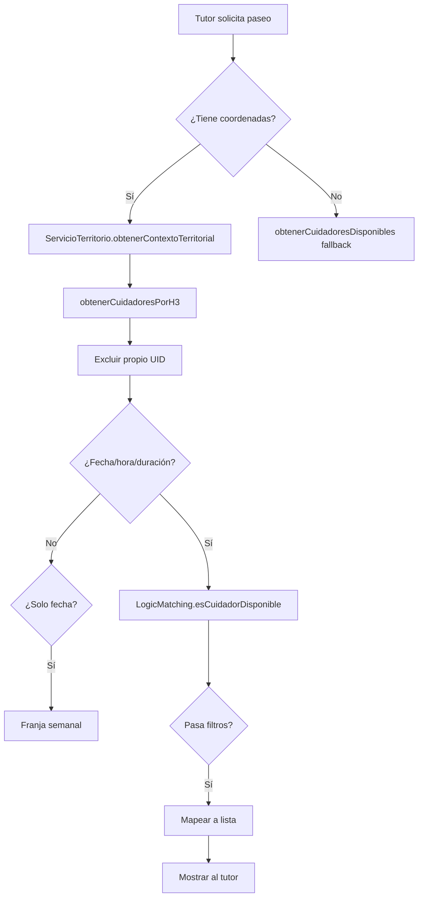

# Motor de Confianza Territorial — Paw-Path

**Resumen rápido (1 línea)**

Paw‑Path no busca encontrar el primer cuidador disponible. Busca la persona adecuada para esa mascota, en ese lugar y en ese momento, aprendiendo de cada paseo para mejorar la siguiente recomendación.

---

## ¿Por qué existe un Motor de Confianza?

En Paw-Path nunca buscamos maximizar reservas.

Buscamos encontrar la **persona adecuada**.

Porque un paseo no es únicamente un servicio. Es un **acto de confianza**.

Cuando un tutor entrega la correa de su mascota, está entregando un miembro de su familia. Sus sentimientos importan más que nuestra eficiencia operativa. Su paz mental es nuestro métrica real de éxito.

Por eso nuestro motor no intenta maximizar transacciones. Intenta **construir relaciones duraderas**.

Cada paseo deja un aprendizaje.

Cada zona conserva memoria.

Cada cuidador fortalece su reputación territorial.

Y cada nueva experiencia hace que la siguiente recomendación sea mejor.

Ese es el verdadero propósito del Motor de Confianza: transformar datos geográficos en **memoria colectiva**, y memoria colectiva en **mejores decisiones** para el siguiente paseo.

---

## 1. Filosofía

Paw‑Path prioriza confianza, continuidad y seguridad sobre alcance masivo.

Esto se refleja en decisiones de arquitectura:

- **Elegibilidad primero**: Validar que un cuidador realmente pueda estar (horario + excepciones + zona) antes de ofrecerlo.
- **Territorio limitado**: Buscar en una cobertura H3 manejable (≈2 km) en lugar de mercado global.
- **Experiencia sobre proximidad**: El tiempo en una zona importa más que la distancia en kilómetros.

## 2. Flujo completo (qué hace el sistema hoy)

Paso a paso desde que el tutor pulsa "Buscar paseo" hasta que ve candidatos (referencias en paréntesis):

1. Tutor abre el formulario y selecciona: mascota, ubicación (coordenadas opcionales), fecha, hora, duración. (UI hooks: `hooks/paseos/usePedirCelularSiFalta.ts`, pantallas en `screens/tutor/*`)
2. Si hay coordenadas del tutor, se calcula su celda H3 R8 (≈460m) y su disco de cobertura (gridDisk k=2 → ~19 celdas ≈2km). (cálculo: `services/territorio/ServicioTerritorio.ts`, utilidades: `services/geo/h3Utils.ts`)
3. Se consulta el índice de cobertura: `/indice_cobertura/{celda}/cuidadores` (lectura O(1) por celda). (servicio: `services/firebase/firestore/colecciones/indice_cobertura.ts`)
4. Si no hay coordenadas, hay un fallback que consulta cuidadores verificados globalmente. (hook: `hooks/paseos/useSeleccionarCuidador.ts`)
5. En el cliente se filtran candidatos:
   - Excluir al propio tutor (user.uid)
   - Comprobar si perfil está en la zona H3 de búsqueda
   - Comprobar horario semanal / excepciones y otras validaciones de duración / buffer (matching: `logic/paseos/matching.ts`)
6. Mapear a una vista con campos visuales (nombre, foto, rating, tarifa, distancia H3) y mostrar resultado al tutor. (hook: `hooks/paseos/useSeleccionarCuidador.ts`)

### Archivos clave del flujo

- Hook cliente (búsqueda y filtros): `hooks/paseos/useSeleccionarCuidador.ts`
- Regla de disponibilidad atómica: `logic/paseos/matching.ts`
- Index geoespacial (escritura/lectura): `services/firebase/firestore/colecciones/indice_cobertura.ts`
- Cálculo H3 y utilidades de distancia/ruta: `services/geo/h3Utils.ts`, `services/territorio/ServicioTerritorio.ts`
- Overlay de debugging del matching (visualiza pasos): `components/dev/MatchingDebugOverlay.tsx`

## 3. Diagrama (flujo real del código)

```mermaid
flowchart TD
  Tutor[Tutor] --> Form[Selecciona: mascota, ubicación, fecha, hora, duración]
  Form -->|coords| ServicioTerritorio[ServicioTerritorio.obtenerContextoTerritorial]
  ServicioTerritorio --> H3[H3 R8 + R9]
  H3 --> IndiceCobertura[Consulta /indice_cobertura/{celda}/cuidadores]
  IndiceCobertura --> Hook[useSeleccionarCuidador]
  Hook --> LogicMatching[logic/paseos/matching.ts]
  LogicMatching --> Filtrado[filtrarDisponibles]
  Filtrado --> MapView[Mapear a lista]
  MapView --> UI[Mostrar candidatos]
```

## 4. Algoritmo de Matching — reglas detectadas

A continuación las reglas que el código comprueba. Estado: Implementado / Parcialmente implementado / Pendiente.

**Disponibilidad horaria (Implementado)**

- Qué hace: Valida si el cuidador trabaja ese día, si el horario solicitado entra en su franja y comprueba reglas globales (horas mín/max, buffer y margen).
- Dónde: `logic/paseos/matching.ts` (funciones: `esCuidadorDisponible`, `esHorarioLaboralValido`)
- Constantes: `HORA_MINIMA_SERVICIO = '05:30'`, `HORA_MAXIMA_SERVICIO = '22:30'`, `SOLICITUD_BUFFER_MINUTOS = 15`
- Observaciones: Prioriza overrides (`ExcepcionDisponibilidad`) sobre horario base.

**Anticipación y buffer (Implementado)**

- Qué hace: Rechaza solicitudes con inicio menor al buffer (15 minutos) y rechaza horas fuera de la ventana de servicio (05:30–22:30).
- Dónde: `logic/paseos/matching.ts`

**Duración y margen (Implementado)**

- Qué hace: Comprueba que la duración total encaje dentro del horario del cuidador (con margen de cortesía de 12 minutos).
- Dónde: `logic/paseos/matching.ts`

**Excepciones semanales (Implementado)**

- Qué hace: Permite overrides día-a-día que anulan o modifican el horario semanal. Prioridad de excepciones sobre horario base.
- Dónde: `logic/paseos/matching.ts` (uso de `excepcion.overrides`)

**Cobertura geoespacial H3 (Implementado)**

- Qué hace: El sistema indexa cuidadores por celdas H3 R8 y busca solo en las celdas del disco de cobertura (gridDisk k=2 ≈ 19 celdas ≈2km).
- Dónde: `services/geo/h3Utils.ts`, `services/firebase/firestore/colecciones/indice_cobertura.ts`
- Datos: `RESOLUCION_H3_DEFAULT = 8`, `RADIO_COBERTURA_DEFAULT = 2`

**Distancia H3 (Implementado)**

- Qué hace: Calcula distancia entre celdas H3 en km (centros de celda), usada para mostrar texto de distancia.
- Dónde: `services/geo/h3Utils.ts`, usado por `hooks/paseos/useSeleccionarCuidador.ts` (`distanciaKmEntreH3`)

**Filtro por verificación / insignias (Parcialmente implementado)**

- Qué hace: Se marca `insignias` según `perfil.verificacion === 'verificado'` para mostrar estado visual. No hay un uso explícito de esta insignia como peso para ordenar.
- Dónde: `models/PerfilPublico.ts`, mapeo en `hooks/paseos/useSeleccionarCuidador.ts`

**Historial / experiencia / rating (Parcial/limitado)**

- Qué hace: `rating_promedio` se recupera y se muestra; no hay un cálculo de "reputación avanzada" ni combinación de señales en servidor.
- Dónde: `models/PerfilPublico.ts`, `hooks/paseos/useSeleccionarCuidador.ts`

**Reserva y transacción de aceptación (Implementado parcial)**

- Qué hace: El proceso de aceptar una solicitud se asegura que solo un cuidador pueda confirmar una solicitud pendiente si cumple condiciones.
- Limitación: no hay locking server-side más allá de la transacción Firestore; no hay reintentos automáticos del cliente en caso de carrera.

**Otros chequeos (no encontrados / pendientes)**

- Cálculo automático de tiempo de desplazamiento entre paseos: No encontrado. (Pendiente)
- Límite de número de mascotas simultáneas en validación de reserva: No sistémico. (`models/PerfilPublico.ts` define `max_mascotas`)

## 5. Confianza sugerida — ¿cómo se ordenan los cuidadores?

- Qué hace hoy: La lista final se genera en el cliente tras filtrar disponibles. No se encontró en el código una función central de "ranking" con pesos numéricos.
- Evidencia: El hook calcula `calificacion` como `Number(perfil.rating_promedio)` y `distanciaTexto`, pero no existe una llamada explícita a `sort()` con fórmula de scoring.
- Conclusión: No hay un sistema de "confianza sugerida" ponderado definido en código con pesos. Estado: Parcialmente implementado (datos presentes, fórmula no).
- **Nota importante**: El orden actual NO debería llamarse "ranking" (que suena marketplace). Debería reflejarse como "Nuestros cuidadores recomendados" o "Orden de confianza sugerida".

## 6. Diagrama del algoritmo de decisión (exacto actual)



## 7. Datos utilizados

- **Ubicación** — Origen: `services/territorio/ServicioTerritorio.ts` — Uso: calcular H3 R8/R9, filtrar índice
- **Índice de cobertura** — Origen: `indice_cobertura.ts` — Uso: búsqueda O(1) por celda
- **Horario semanal / excepciones** — Origen: `PerfilPublico.ts` — Uso: `matching.ts` disponibilidad
- **Rating promedio** — Origen: `PerfilPublico.ts` — Uso: mostrado en UI; sin ponderación
- **Tarifas** — Origen: `PerfilPublico.ts` — Uso: mostrado en UI
- **Estados de paseos** — Origen: `Paseo.ts` — Uso: controlar visibilidad/aceptación
- **H3 parámetros** — Origen: `h3Utils.ts` — `RESOLUCION_H3_DEFAULT = 8`, `RADIO_COBERTURA_DEFAULT = 2`

## 8. Casos reales

**Ejemplo 1 — Búsqueda con coordenadas (Bogotá hipotético)**

- Tutor: coords → `ServicioTerritorio.obtenerContextoTerritorial(lat,lng)` produce `h3_r8 = X`
- Sistema consulta `getDocs(/indice_cobertura/X/cuidadores)` y obtiene 12 entradas
- `useSeleccionarCuidador` filtra:
  - Excluye tutor
  - Verifica día/hora: `LogicMatching.esCuidadorDisponible(...)`
  - Calcula experiencia territorial H3 entre `perfil.h3_r8` y `h3Tutor` (p. ej. conoce la zona hace 2 años)
- Resultado final: lista con cuidadores A,B,C. Orden depende de orden de `filtrados` — sin sistema de confianza sugerida en código.

**Ejemplo 2 — Sin coordenadas**

- Tutor no comparte coords → se llama `obtenerCuidadoresDisponibles()` (fallback)
- Se filtra por horario; candidatos verificados se muestran primero (insignia), sin ordenación garantizada

## 8.1 ¿Por qué este cuidador? (Explicabilidad — Pendiente)

Hoy el sistema muestra candidatos, pero no explica por qué son buenos para ESTE paseo, ESTE tutor, ESTA mascota.

**Ejemplo de lo que falta:**

```
Carlos

✔ Disponible (hoy 15:30-17:00)
✔ Vive en la zona (conoce 11 parques)
✔ Experiencia territorial (387 paseos en La Candelaria)
✔ Compatible con mascotas (especialista perros grandes)
✔ Historial impecable (98% satisfacción)
✔ Nunca canceló un paseo
```

Esta explicación podría:

- Aparecer en la UI de selección
- Construirse dinámicamente desde datos existentes (H3, historial, preferencias, perfil)
- Aumentar la confianza del tutor en la recomendación

**Estado**: No implementado. Requiere agregar lógica de explicabilidad que combine múltiples señales de confianza territorial.

## 9. Limitaciones actuales

- No existe motor de scoring ponderado con pesos explícitos en el código. (Estado: Pendiente)
- No hay cálculo server-side centralizado; gran parte de la lógica corre en cliente (hooks). (Parcialmente implementado)
- Doble-booking: prevención se basa en transacciones Firestore y reglas; sin lock server-side robusto. (Parcial)
- No hay integración de pagos. (Pendiente)
- Ausencia de Cloud Functions para matching en servidor. (Pendiente)
- No hay uso sistemático del historial de paseos como factor de confianza. (Pendiente/Parcial)
- Falta consideración de tiempo de desplazamiento y carga operativa del cuidador. (Pendiente)

### Evidencias automáticas

- El código contiene comentarios que proponen mejoras (p.ej. en `ServicioTerritorio` sobre abstracciones futuras y caching)
- Tests cubren H3 y algunos estados, confirmando la intención de usar H3; sin tests que validen ranking ponderado

## 10. Oportunidades detectadas

- Ya existe H3 y un índice de cobertura: se puede añadir ranking server-side (H3 + rating + tiempo) sin reescribir la arquitectura. (Evidencia: `indice_cobertura.ts`, `h3Utils.ts`)
- `LogicMatching` centraliza reglas de tiempo; se puede extender con carga (paseos en franja) y desplazamiento. (Evidencia: `logic/paseos/matching.ts`)
- GridDisk (19 celdas) facilita Cloud Function que realice scoring en segundo plano con subcolección cacheada por solicitud. (Infraestructura: Firestore + funciones)
- Historial de paseos existe en modelos; puede alimentar señales de confianza (recompra, cancelaciones, fallos) con procesador batch.

---

## ¿Hacia dónde evoluciona?

Paw-Path no es un producto terminado. Es una **red de aprendizaje colectivo** que evoluciona con cada decisión.

### La Ruta del Motor (2026 → 2030)

```
Hoy (2026)

↓ Elegibilidad
  ¿Quién puede?

↓ Disponibilidad
  ¿Cuándo puede?

↓ Cobertura
  ¿Dónde puede?

↓ Historial
  ¿Qué ha hecho?

↓ Afinidad
  ¿Qué lo hace especial para ESTE perro?

↓ Confianza Territorial
  ¿Conoce este lugar?

↓ Comunidad
  ¿Quién confía en él?

↓ Inteligencia Territorial
  ¿Qué sabe el territorio?

Futuro (2030+)
```

Cada nivel agrega no solo funcionalidad: agrega **conocimiento**.

### Paseo 1 vs. Paseo 1000

**Paseo 1 (Elegibilidad pura)**

> Carlos está disponible a las 15:00 y está verificado.

**Paseo 1000 (Inteligencia Comunitaria)**

> Carlos ha realizado 387 paseos en La Candelaria. Conoce 14 parques por nombre. Ha cuidado 23 perros diferentes. Cero cancelaciones. 98% de satisfacción. Otros tutores lo piden por nombre. Ha entrenado a dos cuidadores nuevos. Este es el mejor lugar para tu mascota.

No es mejor tecnología. Es **memoria colectiva**.

### De IA a Inteligencia Comunitaria

Mientras el mundo habla de IA y GPT, Paw-Path está construyendo algo diferente.

No es Inteligencia Artificial.

Es **Inteligencia Comunitaria**.

El conocimiento no sale de un modelo entrenado en textos de internet.

Sale de:

- Miles de paseos reales
- Miles de perros únicos
- Miles de cuidadores especializados
- Miles de tutores confiando
- Años de experiencia territorial acumulada

**Eso es infinitamente más valioso que cualquier modelo.**

Porque es _verdad vivida_. No predicción abstracta.

### La Memoria del Territorio

Aquí vemos por qué H3 es tan especial.

Hoy decimos: "Aquí hay una celda a 460 metros".

Mañana diremos: "Aquí hay un lugar con historia".

Cada hexágono H3 deja de ser coordenadas y pasa a ser **memoria**.

```
No dice:      → Aquí hubo 387 eventos.
Dice:         → Aquí 387 perros jugaron, exploraron,
                descansaron y construyeron confianza.

No dice:      → Tasa de éxito: 98%
Dice:         → Este barrio conoce la calidad del cuidado.

No dice:      → 11 ubicaciones mapeadas
Dice:         → Conocemos 11 lugares especiales de esta zona.
```

Eso transforma radicalmente el valor de una recomendación.

No estás eligiendo un proveedor.

Estás accediendo a **inteligencia territorial acumulada**.

---

## Apéndice técnico: referencias clave

- `logic/paseos/matching.ts` — Disponibilidad y reglas horarias
- `hooks/paseos/useSeleccionarCuidador.ts` — Flujo cliente: obtención, filtros, mapeo
- `services/geo/h3Utils.ts` — H3: resolución, gridDisk, distancia
- `services/territorio/ServicioTerritorio.ts` — Contexto territorial (único punto H3)
- `services/firebase/firestore/colecciones/indice_cobertura.ts` — Índice por celda H3
- `models/PerfilPublico.ts` — Perfil cuidador (horario, h3_r8, celdas_cobertura, rating)
- `components/dev/MatchingDebugOverlay.tsx` — Debug visualización del matching
- `hooks/useZonaH3.ts` — Lectura en tiempo real de zonas H3
- `services/territorio/ServicioTerritorio.test.ts` — Validación H3 y comportamiento
- `firestore.rules` — Visibilidad y validación por estado de paseo

## Conclusión — La verdadera evolución: del motor de elegibilidad al motor de confianza

### Hoy: Motor de Elegibilidad

Paw‑Path actual responde una sola pregunta:

> **¿Quién PUEDE hacer este paseo?**

Y lo hace bien:

- ✔ Disponibilidad horaria (exacta, con excepciones)
- ✔ Cobertura geoespacial (H3 inteligente)
- ✔ Validaciones transaccionales (Firestore + reglas)

### Mañana: Motor de Confianza

Paw‑Path debería responder tres preguntas:

1. **¿Quién PUEDE?** (Elegibilidad) — ya existe
   - Disponible, verificado, en la zona

2. **¿Quién ES COMPATIBLE?** (Afinidad) — parcialmente existe
   - Perro activo ↔ cuidador energético
   - Perro senior ↔ cuidador tranquilo
   - Requiere mapeo de personalidades y estilos

3. **¿QUIÉN DEBERÍA HACERLO?** (Confianza) — no existe
   - ¿Cuántas veces ha completado paseos aquí?
   - ¿Conoce este barrio?
   - ¿Conoce este tipo de mascota?
   - ¿Qué dice su historial real?
   - ¿Qué comunidad de confianza se ha formado alrededor?

### El diferencial: Inteligencia Territorial

H3 está siendo subutilizado.

Hoy responde: "¿Está cerca?" (1.3 km)

Mañana debería responder: "¿Conoce este lugar?" (387 paseos, 2 años, 11 parques)

Datos que ya existen en el código y pueden transformarse en confianza:

- Número de paseos por zona H3
- Tiempo de presencia (primer paseo → último paseo)
- Lugares mapeados (parques, plazas, calles)
- Incidentes por zona (tasa de éxito territorial)
- Comunidad local (otros cuidadores, tutores confiables)

### Cambio de lenguaje

- **De**: "Ranking" (suena marketplace)
- **A**: "Nuestros cuidadores recomendados" o "Confianza sugerida"

- **De**: "Distancia 1.3 km" (métrica técnica)
- **A**: "Conoce esta zona" o "Experto local" (narrativa de confianza)

- **De**: "4.9 estrellas" (sin contexto)
- **A**: "387 paseos exitosos en esta zona, 0 cancelaciones" (contexto territorial)

### El objetivo final

> **El Motor de Confianza de Paw-Path no busca encontrar el cuidador más cercano. Busca encontrar la persona adecuada para esa mascota, en ese lugar y en ese momento.**

La disponibilidad responde si alguien _puede_ realizarlo.

La afinidad responde si es una buena elección.

La confianza responde si el tutor puede sentirse tranquilo.

Cada paseo completado fortalece esa confianza. Con el tiempo, Paw-Path deja de ser únicamente una aplicación para solicitar paseos y se convierte en una **red de confianza construida por la comunidad**, donde cada caminata mejora la recomendación del siguiente.

### Principios arquitectónicos derivados

**La inteligencia territorial no existe para encontrar personas; existe para construir confianza.**

Este principio afecta:

- El lenguaje del producto
- El motor de matching futuro
- El pitch de Paw-Path
- El diferencial frente a marketplaces de cuidadores
- La documentación y narrativa del proyecto

**Paw-Path construye Inteligencia Comunitaria, no IA.**

Mientras el mundo persigue algoritmos entrenados en datos abstractos, Paw-Path cultiva conocimiento real: el que emerge de miles de paseos, miles de perros, y miles de tutores construyendo confianza juntos.

Eso es un activo que no se puede replicar. Es territorio vivo.
