# ANÁLISIS DEL SISTEMA DE MATCHING DE CUIDADORES - PET PALS

## Estado Actual Basado en Código Real (14 de mayo de 2026)

---

## A. ESTADO ACTUAL REAL

### ✅ QUÉ EXISTE (Implementado y Funcional)

#### 1. **Modelo de Datos Completo**

- [Paseo.ts](../models/Paseo.ts): Modelo principal con estados: `PENDIENTE → CONFIRMADO → EN_CAMINO → EN_PROGRESO → FINALIZADO → COMPLETADO` y `CANCELADO`, `ERROR`
- [PerfilPublico.ts](../models/PerfilPublico.ts): Perfil de cuidador con:
  - `horario_semanal`: Record<"0"-"6", FranjaHoraria> (día semanal → rango horario)
  - `h3_home`: Celda H3 de origen (≈460m radio, resolución 8)
  - `celdas_cobertura`: Selección manual de cobertura (reemplaza gridDisk automático si existe)
  - `tarifa_por_hora`, `rating_promedio`, `verificacion`, `experiencia`
- [ExcepcionDisponibilidad.ts](../models/ExcepcionDisponibilidad.ts): Overrides semanales (permite cambios temporales de disponibilidad)

#### 2. **Sistema de Matching Formalizado**

**Ubicación**: [logic/paseos/matching.ts](../logic/paseos/matching.ts)  
**Estado**: **FUNCIONAL y BIEN ESTRUCTURADO**

```typescript
class LogicMatching {
  // Constantes globales
  HORA_MINIMA_SERVICIO = '05:30'
  HORA_MAXIMA_SERVICIO = '22:30'
  MAX_DIAS_ANTICIPACION = 60
  SOLICITUD_BUFFER_MINUTOS = 15

  // Función principal: disponibilidad atómica
  esCuidadorDisponible(
    perfil: PerfilPublico,
    params: ParametrosMatching,
    excepcion?: ExcepcionDisponibilidad
  ): boolean

  // Filtrado por lote
  filtrarDisponibles(perfiles: PerfilPublico[], params): PerfilPublico[]
}
```

**Validaciones que implementa**:

- ✅ Límites horarios globales (05:30-22:30)
- ✅ Anticipación máxima (60 días)
- ✅ Buffer de solicitud para hoy (15 min antes del inicio)
- ✅ Horario semanal del cuidador vs fecha solicitada
- ✅ Duración total cabe en rango del cuidador (con margen de 12 min)
- ✅ Prioridad de excepciones sobre horario base
- ✅ Validación de formato de tiempo (HH:mm)

#### 3. **Flujo de Creación-Aceptación**

**Creación**: [logic/paseos/gestor.ts](../logic/paseos/gestor.ts) → `crearConMascotas()`

- ✅ Crea paseo en estado `PENDIENTE`
- ✅ Valida propietario de mascotas
- ✅ Denormaliza datos visuales (fotos, nombres)
- ✅ Asocia mascotas en subcolección `paseos/{id}/mascotas/{mascotaId}`
- ✅ Registra demanda en zona H3 (fire-and-forget)

**Aceptación**: [logic/paseos/gestor.ts](../logic/paseos/gestor.ts) → `aceptarSolicitud()`

- ✅ Usa `commitEstadoTransaccional()` para cambio atómico `PENDIENTE → CONFIRMADO`
- ✅ Verifica:
  - Paseo aún en estado PENDIENTE
  - Solicitante ≠ cuidador que acepta
  - Si hay `id_cuidador`, solo ese cuidador puede aceptar (solicitud directa)
- ✅ Asigna cuidador: `id_cuidador`, `cuidador_nombre_visual`, `cuidador_foto_visual`
- ✅ Registra evento en subcolección `paseos/{id}/eventos`

**Transaccionalidad**: Implementada vía Firestore `runTransaction()` con optimistic locking

#### 4. **Búsqueda de Cuidadores por Geolocalización**

**Ubicación**: [services/geo/h3Utils.ts](../services/geo/h3Utils.ts) + [services/firebase/colecciones/indice_cobertura.ts]

**Arquitectura H3**:

- Resolución 8: celdas ≈460m de radio
- Radio de cobertura: `gridDisk(k=2)` = 19 celdas ≈2km efectivos
- Índice invertido en Firestore: `/indice_cobertura/{celda}/cuidadores/{uid}`

**Búsqueda** [logic/usuarios/perfilPublico.ts](../logic/usuarios/perfilPublico.ts) → `obtenerCuidadoresPorH3(indiceCelda)`:

- O(1) read: `getDocs(/indice_cobertura/{celda}/cuidadores)`
- Fallback: `obtenerCuidadoresDisponibles()` si sin coords

#### 5. **Máquina de Estados**

**Ubicación**: [logic/paseos/maquinaEstados.ts](../logic/paseos/maquinaEstados.ts)

✅ **Funcional y testeable**:

```
PENDIENTE → CONFIRMADO → EN_CAMINO → EN_PROGRESO → FINALIZADO → COMPLETADO
                ↓                                          ↓
                └─ CANCELADO ←────────────────────────────┘
```

- Transiciones validadas con `puede(evento)`
- Eventos no-transicionales: `RECHAZAR` (no cambia estado, solo registra)
- Tests unitarios: `paseoActivo.test.ts`, `maquinaEstados.test.ts`, `confirmador.test.ts`

#### 6. **Sincronización en Tiempo Real**

**Ubicación**: [logic/paseos/sincronizador.ts](../logic/paseos/sincronizador.ts)

✅ **Listeners activos**:

- Documento principal del paseo: `onSnapshot(doc(db, 'paseos', {id}))`
- Subcolección de eventos: `onSnapshot(collection(db, 'paseos', {id}, 'eventos'))`
- Mantiene singleton `GestorPaseos.paseoActivo` sincronizado

#### 7. **Geolocalización en Tiempo Real**

**Ubicación**: [logic/paseos/seguimiento.ts](../logic/paseos/seguimiento.ts)

✅ **Implementado**:

- Publica ubicación cada 5 segundos durante `EN_CAMINO` y `EN_PROGRESO`
- Almacena en `seguimiento_paseos/{paseoId}/ruta/{timestamp}`
- Usa Realtime Database (más optimizado que Firestore para streaming)

#### 8. **Visibilidad y Privacidad**

**Ubicación**: [firestore.rules](../firestore.rules) líneas 220-290

✅ **Reglas de negocio implementadas**:

```
PENDIENTE sin id_cuidador:
  ✓ Visible a TODOS (mercado abierto)
  ✓ Cualquier cuidador puede aceptar

PENDIENTE con id_cuidador:
  ✓ Solo visible al cuidador designado
  ✓ Solo ese cuidador puede aceptar

CONFIRMADO:
  ✓ Solo visible a creador + cuidador asignado

EN_CAMINO, EN_PROGRESO, FINALIZADO, COMPLETADO:
  ✓ Solo visible a actores del paseo
```

**Transición PENDIENTE → CONFIRMADO validada en rules**:

```
// Caso 2: Aceptar solicitud (PENDIENTE -> CONFIRMADO)
resource.data.estado == 'PENDIENTE' &&
request.resource.data.estado == 'CONFIRMADO' &&
request.resource.data.id_cuidador == request.auth.uid &&
(!('id_cuidador' in resource.data) ||
 resource.data.id_cuidador == null ||
 resource.data.id_cuidador == request.auth.uid)
```

---

### ⚠️ QUÉ EXISTE PERO ES PARCIAL / LIMITADO

#### 1. **Conflictos de Doble Asignación**

- ✅ Prevenido por transacción Firestore + reglas de negocio
- ⚠️ **NO hay lock explícito**: Si dos clientes aceptan simultáneamente, ambas transacciones compiten. La primera gana; la segunda falla en la validación de estado.
- ⚠️ **No hay reintento automático**: Si falla, el cliente debe reintentar manualmente

#### 2. **Disponibilidad Real del Cuidador**

- ✅ Checking de horario semanal + excepciones semanales
- ⚠️ **NO se considera**:
  - Paseos ya asignados al cuidador en esa franja horaria (doble booking)
  - Tiempo de desplazamiento entre paseos
  - Número máximo de mascotas simultáneas
  - Fatiga acumulada

#### 3. **Búsqueda y Ranking de Cuidadores**

- ✅ Búsqueda por zona H3
- ✅ Cálculo de distancia H3 inter-celdas
- ⚠️ **Ranking muy simple**:
  - Solo ordenado por `rating_promedio` (descendente)
  - NO considera: distancia real, tarifa, tiempo de respuesta histórico, preferencias del tutor

#### 4. **Cloud Functions**

**Ubicación**: [functions/src/index.ts](../functions/src/index.ts)

⚠️ **Mínimas e incompletas**:

```typescript
// Solo 1 función: actualizar perfil público al cambiar usuario
export { actualizarPerfilPublico } from './usuarios/actualizar'
```

**Ausencias críticas**:

- ❌ NO hay validación serverside de matching
- ❌ NO hay cálculo automático de pagos
- ❌ NO hay escalada de solicitudes no aceptadas
- ❌ NO hay notificaciones push (implementación cliente-side)
- ❌ NO hay limpieza de datos antiguos

#### 5. **Pagos**

- ⚠️ Solo cálculo de precio en frontend: `useConfirmarPaseo.ts`
- ⚠️ Fórmula simple: `(tarifaBase + (n-1)*adicional) * (duracion/60)`
- ❌ NO hay integración con Stripe/PaymentProcessor
- ❌ NO hay modelo de pago en BD
- ❌ NO hay comisiones de plataforma

#### 6. **Cancelaciones**

- ✅ Modelo soporta `CANCELADO`
- ✅ Se registra motivo en evento
- ⚠️ **NO hay**:
  - Política de cancelación (plazos, reembolsos)
  - Penalización por cancelaciones repetidas
  - Notificación automática a la otra parte

#### 7. **Paseos Compartidos**

- ✅ Modelo soporta `modalidad: 'compartido'` + `cupo_maximo_mascotas`
- ✅ Lógica de agregar mascota: `agregarMascota()`
- ⚠️ **NO hay**:
  - Ajuste de precio por número final de mascotas
  - Validación de compatibilidad entre mascotas
  - Límite de mascotas por zona

---

### ❌ QUÉ NO EXISTE (No Implementado)

#### 1. **Historial de Rechazos**

- ❌ Se registra evento `RECHAZAR` pero NO se persiste en BD
- ❌ NO hay lógica para penalizar cuidadores que rechazan frecuentemente
- ❌ NO se usa para mejorar matching futuro

#### 2. **Reputación Dinámica**

- ⚠️ `rating_promedio` existe pero NO se calcula automáticamente
- ❌ NO hay modelo de reseñas/valoraciones final implementado
- ❌ NO hay scoring de confiabilidad (cancelaciones, tardanzas, etc.)

#### 3. **Notificaciones Push**

- ❌ NO hay integración Expo Push Notifications configurada
- ❌ NO hay servidor de notificaciones
- ❌ UI notifica al usuario pero NO hay backend push

#### 4. **Soporte Multilingual para Matching**

- ⚠️ Límites horarios hardcodeados en `matching.ts` (05:30-22:30)
- ❌ NO hay validación de zonas prohibidas (áreas verdes, etc.)

#### 5. **Escalada de Solicitudes Expiradas**

- ❌ NO hay mecanismo automático para:
  - Reabrir solicitud si no es aceptada en X minutos
  - Notificar a otros cuidadores
  - Escalar a solicitud abierta

#### 6. **Análisis de Demanda**

- ⚠️ Se registra demanda en H3 (`ServicioZonasH3.actualizarZona()`)
- ❌ NO hay algoritmo de predicción de demanda
- ❌ NO hay sugerencias de "zonas calientes"

#### 7. **Fallback Automático**

- ❌ NO hay lógica para:
  - Si cuidador acepta y luego se desconecta: reintentar con otros
  - Si paseo llega a EN_PROGRESO sin confirmación del tutor

#### 8. **Auditoría**

- ✅ Se registran eventos en subcolección `eventos`
- ❌ NO hay campos de auditoría en cambios de estado (quién, cuándo, desde dónde)
- ❌ NO hay log centralizado de operaciones críticas

---

## B. ARQUITECTURA ACTUAL INFERIDA DESDE CÓDIGO

### Capas de Arquitectura

```
┌─────────────────────────────────────────────────┐
│           UI / React Native Components           │
│    (SolicitarPaseoModal, ControlPaseo, etc.)    │
└─────────────┬───────────────────────────────────┘
              │
┌─────────────▼───────────────────────────────────┐
│              Hooks (Estado Local)                │
│ useSeleccionarCuidador, useConfirmarPaseo, etc. │
└─────────────┬───────────────────────────────────┘
              │
┌─────────────▼───────────────────────────────────┐
│         Logic / Domain Layer                     │
│  GestorPaseos, GestorPerfilPublico, LogicMatching│
│  - crearConMascotas()                            │
│  - aceptarSolicitud()                            │
│  - filtrarDisponibles()                          │
│  - MaquinaEstadosPaseo                           │
└─────────────┬───────────────────────────────────┘
              │
┌─────────────▼───────────────────────────────────┐
│      Firebase Services (Persistencia)            │
│  ServicioPaseo, ServicioPerfilPublico, etc.     │
│  - crear(), actualizar(), obtenerPorId()        │
│  - commitEstadoTransaccional()                   │
│  - registerEvento()                              │
└─────────────┬───────────────────────────────────┘
              │
┌─────────────▼───────────────────────────────────┐
│      Firebase Backend (Firestore + RTDB)        │
│  /paseos, /perfiles_publicos, /eventos,         │
│  /indice_cobertura, /h3_zonas,                  │
│  seguimiento_paseos (RTDB)                      │
└─────────────────────────────────────────────────┘
```

### Flujo de Datos Crítico

```
1. TUTOR SOLICITA PASEO
   SolicitarPaseoModal
   → SeleccionarMascotaPaso → mascotaIds[]
   → SeleccionarDireccionPaso → direccionId
   → SeleccionarFechaPaso → fecha, hora, duracion
   → SeleccionarCuidadorPaso
     → GestorPerfilPublico.obtenerCuidadoresPorH3(h3_tutor)
     → LogicMatching.filtrarDisponibles(perfiles, params)
     → CuidadorListItem[] a UI
   → ConfirmarPaseoPaso → precio calculado
   → confirmarReservaPaseo()
     → GestorPaseos.crearConMascotas()
       → ServicioPaseo.crear({estado: PENDIENTE, ...})
       → ServicioPaseoMascota.commitMascotasBatch()
       → ServicioZonasH3.actualizarZona() [demanda_total + 1]

2. CUIDADOR ACEPTA
   SolicitudModal (muestra paseo PENDIENTE)
   → handleAceptar()
     → GestorPaseos.aceptarSolicitud(paseoId)
       → ServicioPaseo.commitEstadoTransaccional(
           PENDIENTE → CONFIRMADO,
           {id_cuidador: uid, ...}
         )
       → ServicioPaseo.registrarEvento('ACEPTAR', ...)

3. SINCRONIZACIÓN EN TIEMPO REAL
   iniciarSincronizador(paseoId)
   ├─ onSnapshot(doc) → GestorPaseos.paseoActivo.setPaseoActivo()
   └─ onSnapshot(collection/eventos) → mostrar historial

   usePublicarUbicacion(paseoId)
   → cada 5 seg: publicar ubicación actual
   → RTDB: seguimiento_paseos/{id}/ruta/{ts}
```

### Separación de Responsabilidades

| Capa         | Responsabilidad                                       | Ubicación                            |
| ------------ | ----------------------------------------------------- | ------------------------------------ |
| **UI**       | Presentación, flujo de wizard                         | `components/paseos/*`                |
| **Hooks**    | Estado local, orquestación de llamadas                | `hooks/paseos/*`                     |
| **Logic**    | Validaciones de negocio, matching, máquina de estados | `logic/paseos/*`, `logic/usuarios/*` |
| **Services** | CRUD, transacciones, persistencia                     | `services/firebase/*`                |
| **Models**   | Tipado de datos                                       | `models/*`                           |
| **Firebase** | Almacenamiento, autenticación, reglas                 | Firestore + RTDB                     |

---

## C. FLUJO IDEAL RECOMENDADO (Simple y Consistente)

```mermaid
graph TD
    A["📱 Tutor Abre App<br/>Screen: Paseos"] --> B["Botón: Solicitar Paseo"]

    B --> C["Modal: SolicitarPaseoModal<br/>5 Pasos"]

    C --> C1["Paso 1: Seleccionar Mascota(s)"]
    C1 --> C2["Paso 2: Dirección de Inicio"]
    C2 --> C3["Paso 3: Fecha, Hora, Duración<br/>LogicMatching.MAX_DIAS_ANTICIPACION = 60"]
    C3 --> C4["Paso 4: Buscar Cuidador<br/><br/>a) Con coords tutor:<br/>  H3(tutor) → IndiceCobertura<br/>  O(1) read<br/><br/>b) Sin coords:<br/>  obtenerCuidadoresDisponibles()<br/><br/>Filtrado:<br/>  LogicMatching.filtrarDisponibles()"]
    C4 --> C5["Paso 5: Confirmar Precio<br/>total = (tarifa_base +<br/>  (n-1)*adicional) *<br/>  (duracion/60)"]

    C5 --> D{"¿Directa o<br/>Abierta?"}
    D -->|Cuidador específico| D1["id_cuidador = uid<br/>tipo_solicitud = DIRECTA"]
    D -->|Cualquier cuidador| D2["id_cuidador = null<br/>tipo_solicitud = ABIERTA"]

    D1 --> E["crear({<br/>  estado: PENDIENTE,<br/>  id_cuidador: uid,<br/>  tipo_solicitud: DIRECTA<br/>})"]
    D2 --> E2["crear({<br/>  estado: PENDIENTE,<br/>  id_cuidador: null,<br/>  tipo_solicitud: ABIERTA<br/>})"]

    E --> F["✅ Paseo Creado en PENDIENTE"]
    E2 --> F

    F --> G["🔔 Notificación al Cuidador<br/>(push si implementada)"]

    G --> H["👀 Cuidador Ve Solicitud<br/>Screen: SolicitudesPendientes<br/><br/>Si DIRECTA: solo ese cuidador<br/>Si ABIERTA: todos en zona"]

    H --> I["Cuidador Toca: Ver Detalle<br/>SolicitudModal"]

    I --> J["Muestra:<br/>- Precio estimado<br/>- Tutor (perfil público)<br/>- Mascotas (fotos, razas)<br/>- Ubicación en mapa<br/>- Horario disponible"]

    J --> K{"¿Acepta?"}

    K -->|No| L["handleRechazar()<br/>registrarEvento(RECHAZAR)<br/>→ Solicitud sigue PENDIENTE<br/>(otro cuidador puede aceptar)"]

    K -->|Sí| M["handleAceptar()<br/>commitEstadoTransaccional(<br/>  PENDIENTE → CONFIRMADO,<br/>  {id_cuidador, ...}<br/>)<br/><br/>✅ Atómico + Validaciones:<br/>- Estado = PENDIENTE<br/>- No hay id_cuidador actual<br/>- Solicitante ≠ cuidador"]

    L --> N["Cuidador puede seguir<br/>buscando otras solicitudes"]

    M --> O["✅ Paseo Ahora CONFIRMADO"]

    O --> P["🔔 Notificar Tutor:<br/>'Cuidador aceptó'"]

    P --> Q["📍 Ambos Ven:<br/>- Teléfono y dirección exacta<br/>- Chat iniciado<br/>- Mapa en tiempo real"]

    Q --> R["Flujo de Ejecución<br/>CONFIRMADO → EN_CAMINO →<br/>EN_PROGRESO → FINALIZADO →<br/>COMPLETADO"]
```



### Reglas de Negocio Implementadas

```typescript
// Matching: Parámetros mínimos obligatorios
ParametrosMatching {
  fecha: Date        // [hoy, hoy+60 días]
  hora: string       // [05:30, 22:30] formato HH:mm
  duracion: number   // minutos, > 0
}

// Disponibilidad: Validaciones
1. Límites globales
   - Hora inicio >= 05:30
   - Hora fin <= 22:30
   - Duracion cabe en rango

2. Límites de solicitud
   - Si es hoy: hora_inicio >= ahora + 15 min buffer

3. Horario del cuidador
   - día_semana existe en horario_semanal
   - O tiene exception.override activo
   - [cuidador_inicio - 12min, cuidador_fin + 12min] >= [solicitud_inicio, solicitud_fin]

4. Anticipación
   - fecha <= hoy + 60 días

// Aceptación: Validaciones
1. Paseo debe estar PENDIENTE
2. Cuidador que acepta ≠ tutor que solicitó
3. Si id_cuidador ya existe:
   - Solo ese cuidador puede aceptar (solicitud directa)
   - Otros ven visibilidad denegada
```

---

## D. DISEÑO MÍNIMO DE MATCHING (MVP Formalizado)

### Entrada

```typescript
interface SolicitudMatching {
  // Obligatorio
  fecha: Date // Fecha del paseo
  hora: string // "HH:mm" formato
  duracion: number // minutos

  // Geolocalización (recomendado)
  coordenadas_tutor?: {
    latitude: number
    longitude: number
  }

  // Filtros opcionales
  tarifa_maxima?: number // $ máximo
  rating_minimo?: number // rating >= X
  verificado_solo?: boolean // solo perfiles verificados
  con_experiencia?: string[] // ej: ["perros", "gatos"]
  mascotas_aceptadas?: string[] // ej: ["Bulldog", "Poodle"]
}
```

### Flujo de Matching

```
1. BUSCAR CUIDADORES
   ├─ Si coordenadas_tutor:
   │  └─ h3_tutor = coordsAH3(lat, lon)
   │     → getCuidadoresPorH3(h3_tutor) [O(1)]
   │
   └─ Si no:
      → getCuidadoresDisponibles() [ordenado por rating]

2. FILTRAR POR DISPONIBILIDAD HORARIA
   para cada cuidador:
   ├─ perfil.horario_semanal[fecha.día]
   │  O excepcion.overrides[fecha.día]
   │  ¿existe?
   │
   └─ LogicMatching.esCuidadorDisponible(
        perfil,
        {fecha, hora, duracion},
        excepcion?
      )

3. FILTRAR OPCIONAL (REFINE)
   ├─ tarifa_por_hora <= tarifa_maxima
   ├─ rating_promedio >= rating_minimo
   ├─ verificacion == 'verificado' si aplica
   ├─ mascotas_aceptadas ∩ mascotas_solicitud > 0
   └─ experiencia requerida ∩ experiencia_cuidador > 0

4. RANKING
   ├─ Primaria: rating_promedio (descending)
   ├─ Secundaria: distancia_km (ascending)
   └─ Terciaria: cantidad_paseos_realizados (descending)

5. RETORNAR
   Top N cuidadores disponibles y ordenados
```

### Validaciones Críticas

```typescript
// Éstas son NON-NEGOTIABLE para matching consistente

✅ HORA MÍNIMA SERVICIO
   if (solicitud_inicio < 05:30) → RECHAZAR

✅ HORA MÁXIMA SERVICIO
   if (solicitud_fin > 22:30) → RECHAZAR

✅ DURACIÓN CABE EN RANGO
   if (cuidador_inicio > solicitud_inicio) → RECHAZAR
   if (cuidador_fin < solicitud_fin) → RECHAZAR
   (con margen de cortesía: ±12 min)

✅ ANTICIPACIÓN MÁXIMA
   if ((solicitud_fecha - hoy) > 60 días) → RECHAZAR

✅ SOLICITUD INMEDIATA HOY
   if (hoy) AND (solicitud_inicio < ahora + 15 min) → RECHAZAR

✅ DÍA VIGENTE
   if (dia_semana NOT IN horario_semanal) → RECHAZAR

✅ HORARIO LABORAL VÁLIDO
   if (cuidador_inicio >= cuidador_fin) → RECHAZAR (perfiles inválidos)
```

### Restricciones de Diseño

```
NO INCLUIR (fuera del scope mínimo):
  ❌ Algoritmo de IA o machine learning
  ❌ Optimización de rutas
  ❌ Predicción de demanda
  ❌ Recomendación de horarios
  ❌ Matching dinámico durante paseo
  ❌ Límite de mascotas por cuidador/día
  ❌ Compatibilidad automática mascota-cuidador

ASEGURAR SIEMPRE:
  ✅ Matching es determinístico (mismo input → mismo output)
  ✅ Matching es rápido (ms, no segundos)
  ✅ Matching es stateless (no depende de caché global)
  ✅ Matching es testeable (pruebas exhaustivas)
  ✅ Matching es auditado (se registra en evento)
```

---

## E. REFACTOR PRIORITARIO

### **TIER 1: URGENTE** (Impacto Alto, Complejidad Media)

#### 1. Prevención Robusta de Doble Asignación

**Problema**: Si dos clientes aceptan < 1seg, ambas transacciones compiten. Segunda falla silenciosamente.

**Solución**:

1. Mantener transacción actual ✅
2. Agregar retry automático en cliente (máx 2 intentos)
3. Mostrar error específico: "Cuidador ya aceptó este paseo"
4. Opcionalmente: serverside trigger para limpiar PENDIENTE con `id_cuidador` duplicado

**Archivo**: [logic/paseos/gestor.ts](../logic/paseos/gestor.ts) → `aceptarSolicitud()`  
**Cambio**: Envolver en try/retry, mejorar mensajes de error

**Impacto**: +95% confiabilidad en peak de concurrencia  
**Tiempo estimado**: 4 horas

---

#### 2. No Permitir Doble Booking de Cuidador

**Problema**: Un cuidador puede aceptar 2 paseos en la misma franja horaria → conflicto en terreno.

**Solución**:

1. Antes de `commitEstadoTransaccional()`, query paseos del cuidador:
   ```typescript
   WHERE id_cuidador == uid
   AND estado IN [CONFIRMADO, EN_CAMINO, EN_PROGRESO]
   AND fecha_hora_inicio < (solicitud.fin)
   AND (fecha_hora_inicio + duracion) > (solicitud.inicio)
   ```
2. Si hay overlap: RECHAZAR con motivo: "Tienes otro paseo en ese horario"

**Archivo**: [logic/paseos/gestor.ts](../logic/paseos/gestor.ts) → `aceptarSolicitud()` línea ~680  
**Cambio**: Agregar validación pre-transacción

**Impacto**: Elimina conflictos operacionales  
**Tiempo estimado**: 3 horas

---

#### 3. Escalada Automática de Solicitudes Expiradas

**Problema**: Paseo PENDIENTE directa a cuidador X, cuidador no responde → solicitud muere.

**Solución**:

1. Cloud Function: cada minuto, buscar PENDIENTE con `creado_en < (ahora - 10min)`
2. Si existen: convertir a ABIERTA (borrar `id_cuidador`)
3. Notificar tutor: "Cuidador no respondió, ya pueden otros"

**Archivo**: [functions/src/] → nuevo: `escaladas/escalarSolicitudes.ts`  
**Cambio**: Cloud Function con `setInterval` o Firestore Triggers

**Impacto**: 80% menos solicitudes "perdidas"  
**Tiempo estimado**: 6 horas

---

### **TIER 2: RECOMENDADO** (Impacto Medio, Complejidad Media)

#### 4. Historial y Penalización de Rechazos

**Problema**: Cuidadores rechazan muchas solicitudes → matching no aprende.

**Solución**:

1. Contador en PerfilPublico: `rechazos_ultimos_7dias`
2. Al registrar evento RECHAZAR: incrementar contador
3. En matching: degradar prioridad si contador > 3

**Archivo**: [models/PerfilPublico.ts](../models/PerfilPublico.ts), [logic/paseos/matching.ts](../logic/paseos/matching.ts)  
**Cambio**: +campo en modelo, +lógica en ranking

**Impacto**: Cuidadores más confiables suben en ranking  
**Tiempo estimado**: 5 horas

---

#### 5. Mejor Ranking (Distancia + Tarifa + Rating)

**Problema**: Solo ordena por rating; ignora distancia y tarifa.

**Solución**:

```typescript
score = (rating/5) * 0.5 +
        (1 - distancia/5) * 0.3 +  // si < 5km, puntaje alto
        ((max_tarifa - tarifa)/max_tarifa) * 0.2
ordenar descendente por score
```

**Archivo**: [hooks/paseos/useSeleccionarCuidador.ts](../hooks/paseos/useSeleccionarCuidador.ts)  
**Cambio**: Calcular score en mapeo de `CuidadorListItem`

**Impacto**: Experiencia de usuario 30% mejor (menos desplazamiento)  
**Tiempo estimado**: 2 horas

---

#### 6. Ajuste de Precio por Número Final de Mascotas (Paseos Compartidos)

**Problema**: Si tutor crea paseo para 1 mascota, luego 2 tutores más agregan mascotas, precio no se actualiza.

**Solución**:

1. Al crear paseo: `precio_base = tarifa * duracion`
2. Al agregar mascota: `precio_final = precio_base * (1 + 0.3 * (n-1))`
3. Actualizar campo `precio` del paseo
4. Notificar a todos los tutores: "Precio actualizado a $XXX"

**Archivo**: [logic/paseos/gestor.ts](../logic/paseos/gestor.ts) → `agregarMascota()`  
**Cambio**: Recalcular precio, notificar

**Impacto**: Transparencia, evita sorpresas  
**Tiempo estimado**: 3 horas

---

### **TIER 3: OPCIONAL** (Impacto Bajo, Complejidad Alta)

#### 7. Sugerencias Inteligentes de Horario

**Problema**: Si no hay cuidadores a las 10:00, ¿qué horarios sí tienen cobertura?

**Solución**:
En `useDisponibilidadCercana`: además de mostrar fechas, sugerir "Hay cuidadores a las 14:00"

**Archivo**: [hooks/paseos/useDisponibilidadCercana.ts](../hooks/paseos/useDisponibilidadCercana.ts)  
**Cambio**: Expandir busca a múltiples horarios/día

**Impacto**: +15% conversión (usuarios encuentran slot disponible)  
**Tiempo estimado**: 8 horas

---

#### 8. Notificaciones Push Serverside

**Problema**: Notificaciones solo en cliente; si app cerrada, sin notificación.

**Solución**:

1. Cloud Function: al crear PENDIENTE, enviar push al cuidador
2. Cloud Function: al aceptar, enviar push al tutor
3. Usar Expo Push Service

**Archivo**: [functions/src/] → nuevo: `notificaciones/enviarPush.ts`  
**Cambio**: Cloud Functions + almacenar deviceTokens

**Impacto**: +40% aceptación más rápida  
**Tiempo estimado**: 10 horas

---

#### 9. Reputación Dinámica (Cancelaciones, Tardanzas)

**Problema**: `rating_promedio` no refleja confiabilidad actual.

**Solución**:

1. Modelo: `ReputacionCuidador { score, cancelaciones, tardanzas, velocidad_respuesta }`
2. Actualizar en eventos CANCELAR, FINALIZAR, ACEPTAR
3. Usar score en matching

**Archivo**: [models/] → nuevo: `Reputacion.ts`, [logic/] → nuevo: `reputacion.ts`  
**Cambio**: Nuevo modelo + actualización en transiciones

**Impacto**: Matching 50% más preciso  
**Tiempo estimado**: 12 horas

---

#### 10. Análisis de Demanda por Zona

**Problema**: Cuidadores no saben dónde hay más demanda.

**Solución**:

1. Screen "TerritorioVivo": muestra H3 zonas con demanda
2. Colores: rojo = alta demanda, verde = baja
3. Sugerir: "Mucha demanda en Recoleta hoy"

**Archivo**: [screens/cuidador/] → nuevo: `TerritorioVivo.tsx`  
**Cambio**: Nuevo screen + query a `h3_zonas`

**Impacto**: Cuidadores pueden proactivamente ir a zonas calientes  
**Tiempo estimado**: 10 horas

---

## TABLA RESUMEN: Priorización

| ID  | Tarea                      | Tier | Impacto  | Complejidad | Horas | Dependencias    |
| --- | -------------------------- | ---- | -------- | ----------- | ----- | --------------- |
| 1   | Retry en doble asignación  | 1    | 🔴 Alto  | 🟡 Media    | 4     | Ninguna         |
| 2   | Validar no-double-booking  | 1    | 🔴 Alto  | 🟡 Media    | 3     | Ninguna         |
| 3   | Escalada automática        | 1    | 🔴 Alto  | 🟡 Media    | 6     | Cloud Functions |
| 4   | Historial rechazos         | 2    | 🟡 Medio | 🟡 Media    | 5     | Ninguna         |
| 5   | Mejor ranking              | 2    | 🟡 Medio | 🟢 Baja     | 2     | Ninguna         |
| 6   | Precio compartido dinámico | 2    | 🟡 Medio | 🟡 Media    | 3     | Ninguna         |
| 7   | Sugerencias horario        | 3    | 🟢 Bajo  | 🔴 Alta     | 8     | Ninguna         |
| 8   | Push notifications         | 3    | 🟡 Medio | 🔴 Alta     | 10    | Cloud Functions |
| 9   | Reputación dinámica        | 3    | 🟡 Medio | 🔴 Alta     | 12    | Ninguna         |
| 10  | Análisis de demanda        | 3    | 🟢 Bajo  | 🔴 Alta     | 10    | Ninguna         |

---

## RECOMENDACIÓN FINAL

### Roadmap Recomendado (Próximas 2 semanas)

**Semana 1** (Estabilidad):

- ✅ Completar Tier 1 (1, 2, 3) = 13 horas
- Resultado: Sistema de matching robusto, sin conflictos

**Semana 2** (Experiencia):

- ✅ Completar Tier 2 (4, 5, 6) = 10 horas
- Resultado: UX mejorada, better ranking, transparencia en precios

**Semana 3+** (Crecimiento):

- ✅ Comenzar Tier 3 según prioridad de negocio

### Principios de Implementación

1. **Una cosa a la vez**: Hacer Tier 1.1 → Test → Merge → Tier 1.2
2. **Mantener transiciones existentes**: No reescribir máquina de estados
3. **Tests primero**: Para cada cambio, agregar tests unitarios
4. **Monitorear**: Loguear matching decisions para debugging
5. **Iterar basado en datos**: Medir conversión antes/después de cada cambio

---

## REFERENCIAS CLAVE

| Archivo                                                                             | Responsabilidad                             |
| ----------------------------------------------------------------------------------- | ------------------------------------------- |
| [logic/paseos/matching.ts](../logic/paseos/matching.ts)                             | Matching engine (NO modificar sin tests)    |
| [logic/paseos/gestor.ts](../logic/paseos/gestor.ts)                                 | Orquestación (agregar validaciones aquí)    |
| [services/firebase/colecciones/paseo.ts](../services/firebase/colecciones/paseo.ts) | CRUD transaccional (mantener transacciones) |
| [firestore.rules](../firestore.rules)                                               | Reglas de negocio (alineado con logic)      |
| [models/Paseo.ts](../models/Paseo.ts)                                               | Contrato de datos (cambiar con cuidado)     |
| [logic/paseos/maquinaEstados.ts](../logic/paseos/maquinaEstados.ts)                 | Transiciones (estable, no tocar)            |

---

**Documento generado**: 14 de mayo de 2026  
**Análisis basado en**: Código fuente real únicamente  
**Siguiente revisión**: Después de completar Tier 1
