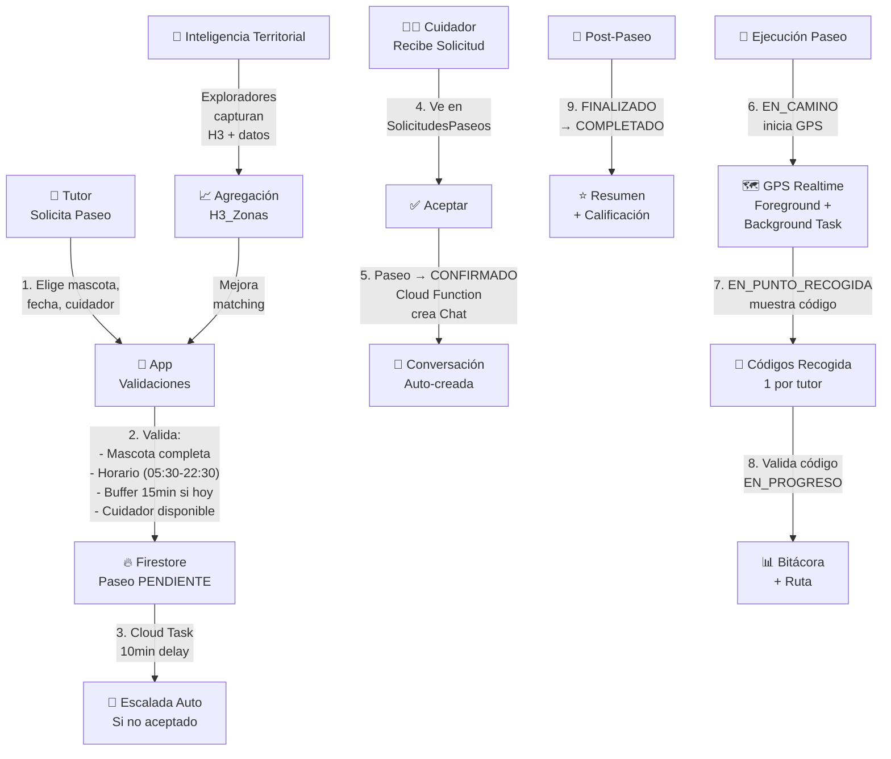
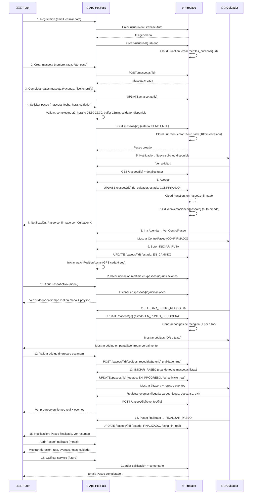
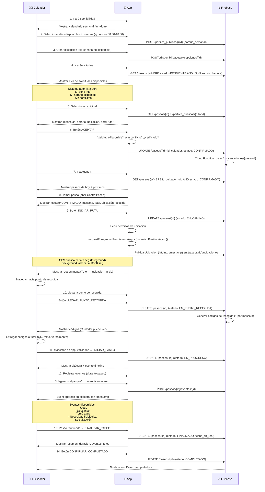
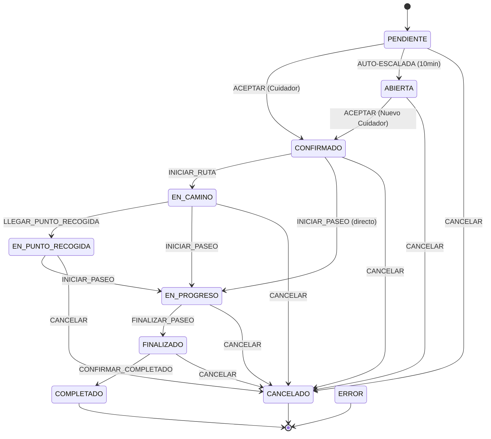

# Paw-Path: Documentación Funcional

**Última actualización:** 19 de julio de 2026  
**Versión:** MVP 1.0  
**Audiencia:** Desarrolladores, Inversores, Diseñadores UX, Product Owners, Stakeholders

---

## 1. Introducción

### ¿Qué es Paw-Path?

Paw-Path es una **plataforma móvil** que conecta tutores de mascotas con cuidadores profesionales para servicios de paseo gestionados en tiempo real. Es una aplicación nativa desarrollada en **React Native + Firebase** que facilita:

- **Solicitud de paseos** por parte de tutores
- **Búsqu   eda y aceptación** de solicitudes por cuidadores
- **Seguimiento en vivo** mediante GPS durante el paseo
- **Comunicación directa** entre tutores y cuidadores mediante chat integrado
- **Captura territorial crowdsourced** para construir inteligencia local

### El Problema

Los tutores de mascotas enfrentan:
- Dificultad para encontrar cuidadores confiables
- Falta de visibilidad en tiempo real durante los paseos
- Comunicación fragmentada
- Sin información sobre la calidad y disponibilidad local de servicios

### La Solución

Paw-Path ofrece:
- **Matching automático** basado en disponibilidad, ubicación e historial
- **Rastreo GPS en tiempo real** con alertas y polylines
- **Chat integrado** solo cuando paseo está confirmado
- **Inteligencia territorial** mediante datos crowdsourced
- **Máquina de estados** robusta que garantiza que nada se queda a mitad del camino

### Filosofía

1. **Confianza primero**: Verificación de usuarios, códigos de recogida, seguridad en Firestore
2. **Claridad absoluta**: El usuario siempre sabe dónde está su mascota y quién la cuida
3. **Automatización intelligente**: El sistema escala automáticamente solicitudes ignoradas, crea chats, publica ubicaciones
4. **Datos territoriales**: Exploradores capturan datos locales para mejorar matching y seguridad
5. **Resilencia**: GPS sigue funcionando incluso si la app se cierra, AsyncStorage persiste contexto

---

## 2. Arquitectura Funcional



### Capas del Sistema

```
┌─────────────────────────────────────────────────┐
│         React Native UI Layer                    │
│  (TutorApp | CuidadorApp | ExplorerApp | Admin) │
└──────────────┬──────────────────────────────────┘
                        ↓
┌─────────────────────────────────────────────────┐
│     State Management (Context + Hooks)           │
│  AuthContext | RolContext | MascotasContext     │
│  useChat | usePaseos | useGPS | useTerritorio   │
└──────────────┬──────────────────────────────────┘
                        ↓
┌─────────────────────────────────────────────────┐
│     Services Layer (Firebase Integration)        │
│  ServicioCrudBase | ServicioChat | ServicioPaseo│
│  Conversores toDomain() / toDb()                 │
└──────────────┬──────────────────────────────────┘
                        ↓
        ┌───────────┬─────────┬──────────┐
        ↓           ↓         ↓          ↓
    Firebase   Firestore  RTDB   Cloud Functions
     Auth       Storage   Messages  Escaladas
```

---

## 3. Roles en el Sistema

### 👨‍👩‍👧 Tutor (Dueño de Mascotas)

**¿Qué puede hacer?**
- Crear y editar mascotas
- Solicitar paseos para mascotas específicas
- Ver solicitudes pendientes (una vez enviada)
- Rastrear al cuidador en tiempo real durante el paseo
- Comunicarse con cuidador por chat
- Recibir códigos de recogida para validar reintegro
- Calificar el servicio (funcionalidad futura)

**Pantallas principales:**
- **Inicio**: Dashboard con próximos paseos
- **Mascotas**: CRUD de mascotas (nombre, raza, foto, peso, condiciones de salud)
- **Paseos**: Historial y solicitud de nuevos paseos
- **PaseoActivo** (modal): Seguimiento en vivo con mapa
- **Chat**: Comunicación con cuidador (solo si paseo confirmado)
- **Mi Cuenta**: Perfil, configuración, métodos de pago (futuro)

**Restricciones:**
- Solo puede ver/editar sus propias mascotas
- Solo puede solicitar paseos para mascotas con completitud ≥ nivel 2
- No puede solicitar fuera del horario 05:30-22:30
- Debe respetar buffer de 15 minutos si el paseo es hoy
- No puede solicitar más de 60 días en el futuro

**Flujo típico:**
```
1. Crear mascota (nombre, raza, foto, peso, vacunas)
   ↓
2. Completar datos de mascota (nivel 2 = apto para paseo)
   ↓
3. Solicitar paseo:
   - Seleccionar mascota(s)
   - Elegir fecha y hora
   - Seleccionar cuidador (si conoce)
   ↓
4. Sistema valida y crea paseo en PENDIENTE
   ↓
5. Esperar aceptación (con Auto-escalada en 10min)
   ↓
6. Paseo CONFIRMADO → Ver ubicación en tiempo real
   ↓
7. Recibir código de recogida en EN_PUNTO_RECOGIDA
   ↓
8. Validar códigos (1 por mascota)
   ↓
9. Paseo FINALIZADO → Ver resumen y calificar
```

**Referencias de código:**
- [hooks/useMascotas.ts](../hooks/useMascotas.ts)
- [hooks/useEdicionMascota.ts](../hooks/useEdicionMascota.ts)
- [screens/tutor/Mascotas.tsx](../screens/tutor/)
- [screens/tutor/SolicitarPaseo.tsx](../screens/tutor/)

---

### 👨‍🔧 Cuidador (Prestador de Servicio)

**¿Qué puede hacer?**
- Ver todas las solicitudes de paseos disponibles en su zona
- Aceptar solicitudes de paseos
- Ver detalles de mascotas antes de aceptar
- Consultar perfil público del tutor
- Iniciar el paseo y rastrear GPS
- Registrar eventos durante el paseo (llegada a parque, descanso, juego, etc)
- Finalizar paseo
- Comunicarse con tutor por chat
- Establecer disponibilidad semanal (horarios)
- Crear excepciones a disponibilidad (días no disponible)

**Pantallas principales:**
- **Inicio**: Dashboard con estadísticas
- **Solicitudes**: Lista de paseos disponibles, filtrados por zona y disponibilidad
- **Agenda**: Paseos confirmados organizados por fecha
- **ControlPaseo** (modal): Mapa con ruta a recogida + control de estado
- **Chat**: Comunicación con tutor
- **Disponibilidad**: Calendario semanal + excepciones
- **Mi Cuenta**: Perfil, documentos, calificación

**Restricciones:**
- Solo ve solicitudes en su zona de cobertura (H3)
- Solo ve solicitudes dentro de su horario de disponibilidad (con ±12min de margen)
- No puede aceptar si ya tiene un paseo superpuesto
- No puede aceptar si está marcado como no disponible
- Debe estar verificado para aceptar paseos

**Flujo típico:**
```
1. Abrir app (RolContext navega a CuidadorApp)
   ↓
2. Ir a Solicitudes → Filter automático por zona + disponibilidad
   ↓
3. Ver solicitud:
   - Mascotas del tutor
   - Horario exacto
   - Perfil público del tutor
   - Ubicación inicio + dirección
   ↓
4. Botón ACEPTAR
   ↓
5. Sistema valida:
   - ¿Disponible? (horario + excepciones)
   - ¿Sin conflicto? (otro paseo superpuesto)
   ↓
6. Paseo → CONFIRMADO
   ↓
7. Cloud Function crea Chat automático
   ↓
8. Ir a Agenda → Ver paseo CONFIRMADO
   ↓
9. Botón INICIAR RUTA → Estado EN_CAMINO
   ↓
10. GPS auto-publica ubicación cada 9 seg (foreground) + background task
    ↓
11. LLEGAR_PUNTO_RECOGIDA → Sistema genera códigos de recogida
    ↓
12. INICIAR_PASEO → EN_PROGRESO
    ↓
13. Registrar eventos (llegada a parque, etc)
    ↓
14. FINALIZAR_PASEO → FINALIZADO
    ↓
15. Tutor valida códigos → COMPLETADO
```

**Referencias de código:**
- [hooks/cuidador/useSolicitudesPaseos.ts](../hooks/cuidador/)
- [logic/paseos/matching.ts](../logic/paseos/matching.ts)
- [screens/cuidador/Solicitudes.tsx](../screens/cuidador/)
- [screens/cuidador/ControlPaseo.tsx](../screens/cuidador/)

---

### 🗺️ Explorador (Crowdsourcer Territorial)

**¿Qué puede hacer?**
- Capturar observaciones sobre zonas (parques, calles, comercios)
- Registrar cantidad de mascotas visibles, flujo peatonal, tipo de zona
- Acumular huellas (recompensas)
- Ver historial de exploraciones con estado (validada, pendiente, rechazada)
- Ver mapa territorial con inteligencia agregada
- Obtener badges de "Primera exploración del día"

**Pantallas principales:**
- **Inicio Explorador**: Bienvenida, estadísticas personales
- **Captura Territorial** (modal): Stepper conversacional (tipo de punto → mascotas → flujo → observaciones)
- **Mapa Territorial**: Visualización H3 con inteligencia territorial (placeholder)
- **Historial Exploraciones**: Lista estilo Strava con badges
- **Mi Cuenta**: Perfil, huellas acumuladas, nivel

**Restricciones:**
- Debe ser usuario verificado
- Solo puede capturar una exploración por zona (H3 R9) por día
- Datos temporales se validan después (FASE 2)

**Flujo típico:**
```
1. Ir a CapturaTerritorial (botón flotante o desde Inicio)
   ↓
2. Paso 0: Seleccionar tipo de punto (parque, calle, comercio, conjunto)
   ↓
3. Paso 1: ¿Cuántas mascotas viste? (0, 1, 2-3, 4-6, 7+)
   ↓
4. Paso 2: ¿Flujo peatonal? (bajo, medio, alto)
   ↓
5. Paso 3: Observaciones libres (opcional)
   ↓
6. Botón ENVIAR
   ↓
7. Sistema obtiene GPS + calcula H3_R8 + H3_R9
   ↓
8. Guardar en /exploraciones/{id}
   ↓
9. ResumenExploracion: "Ganaste 5 huellas 🐾"
   ↓
10. Exploración aparece en Historial (estado: PENDIENTE)
    ↓
11. Si validada (FASE 2): +huellas adicionales
```

**Recompensas:**
- 5 huellas inmediatas por exploración
- N huellas adicionales si validada (FASE 2)
- Badges por primer descubrimiento del día

**Referencias de código:**
- [components/explorer/CapturaTerritorial.tsx](../components/explorer/)
- [hooks/useExploracionTerritorial.ts](../hooks/)
- [context/CapturaTerritorialContext.tsx](../context/)

---

### 🔐 Administrador

**¿Qué puede hacer?**
- Ver dashboard admin con estadísticas globales
- Visualizar "Territorio Vivo" (mapa con inteligencia territorial)
- Ver explorador de zonas H3 con índices (bienestar, seguridad, actividad)
- Monitorear actividad de plataforma
- Gestionar usuarios (futuro: ban, verificación)

**Pantallas:**
- **Dashboard Admin**: KPIs, gráficos, estadísticas
- **Territorio Vivo**: Mapa interactivo H3
- **Mi Cuenta**: Perfil admin

**Referencias de código:**
- [screens/admin/DashboardAdmin.tsx](../screens/admin/)

---

## 4. Flujo Completo del Tutor: Desde Registro hasta Fin de Paseo



---

## 5. Flujo Completo del Cuidador: Desde Disponibilidad hasta Completar Paseo



---

## 6. Ciclo de Vida del Paseo: Estados y Transiciones

### Estados y Máquina de Estados



### Descripción de Estados

| Estado | Quién | Qué significa | Acciones posibles |
|--------|-------|--------------|------------------|
| **PENDIENTE** | Sistema | Solicitud creada, esperando aceptación | ACEPTAR, CANCELAR, ESCALADA automática (10min) |
| **ABIERTA** | Sistema | Paseo escalado (cuidador no respondió), abierto para otros | ACEPTAR (nuevo cuidador), CANCELAR |
| **CONFIRMADO** | Sistema | Cuidador aceptó, chat creado | INICIAR_RUTA, INICIAR_PASEO, CANCELAR |
| **EN_CAMINO** | Cuidador | Cuidador en ruta hacia recogida, publicando GPS | LLEGAR_PUNTO_RECOGIDA, INICIAR_PASEO, CANCELAR |
| **EN_PUNTO_RECOGIDA** | Cuidador | Cuidador llegó, generó códigos, esperando mascotas | INICIAR_PASEO, CANCELAR |
| **EN_PROGRESO** | Cuidador | Paseo en ejecución, registrando eventos, GPS activo | FINALIZAR_PASEO, CANCELAR |
| **FINALIZADO** | Sistema | Cuidador terminó, esperando confirmación tutor | CONFIRMAR_COMPLETADO, CANCELAR |
| **COMPLETADO** | Sistema | Paseo finalizado y confirmado (terminal) | [Sin acciones] |
| **CANCELADO** | Sistema | Paseo cancelado (terminal) | [Sin acciones] |

### Validaciones por Transición

**ACEPTAR** (PENDIENTE → CONFIRMADO):
- ¿Cuidador está verificado? ✓
- ¿Cuidador disponible en ese horario? ✓
- ¿Cuidador sin conflicto (otro paseo superpuesto)? ✓

**INICIAR_RUTA** (CONFIRMADO → EN_CAMINO):
- Permisos de ubicación habilitados
- GPS comienza a publicar

**LLEGAR_PUNTO_RECOGIDA** (EN_CAMINO → EN_PUNTO_RECOGIDA):
- Sistema genera códigos
- Códigos se muestran en app del cuidador

**INICIAR_PASEO** (EN_PUNTO_RECOGIDA → EN_PROGRESO):
- Tutor validó códigos (todos marcados como validados)
- O cuidador fuerza (fallback)

**FINALIZAR_PASEO** (EN_PROGRESO → FINALIZADO):
- Cuidador toma foto (futura)
- O solo registra hora de fin

**CONFIRMAR_COMPLETADO** (FINALIZADO → COMPLETADO):
- Tutor revisa resumen
- Chat se cierra (activa = false)

**Referencias de código:**
- [logic/paseos/maquinaEstados.ts](../logic/paseos/maquinaEstados.ts)
- [services/ServicioPaseo.ts](../services/)

---

## 7. Mascotas: Gestión y Participación

### Modelo de Mascota

```typescript
{
  // Identidad
  id: string
  nombre: string
  creado_por: string (UID tutor)
  
  // Biología
  especie: 'perro' (MVP solo perros)
  raza?: string (opcional)
  genero?: 'macho' | 'hembra'
  fecha_nacimiento?: Date
  peso?: number (kg)
  tamano?: 'pequeño' | 'mediano' | 'grande' | 'gigante'
  
  // Salud
  vacunas?: [{ nombre, fecha }]
  esterilizado?: boolean
  condiciones_salud?: [string]
  
  // Comportamiento
  nivel_energia?: 'bajo' | 'medio' | 'alto'
  preferencias_paseo?: [string]
  
  // Estado
  foto?: string (URL)
  activo: boolean
  
  // Sistema
  creado_en: Date
  actualizado_en: Date
}
```

### Niveles de Completitud

El sistema valida 3 niveles:

| Nivel | Requerimientos | Permite |
|-------|---|---|
| **Nivel 1** | nombre, especie | Visualización básica |
| **Nivel 2** | + foto, raza, peso, vacunas | Solicitar paseos ✓ |
| **Nivel 3** | + condiciones salud, nivel energía | Mejor matching (futuro) |

**Validación en solicitud de paseo:**
```
¿Alguna mascota tiene completitud < 2?
→ Bloquer: "Completa datos de mascota antes de solicitar paseo"
```

### Participación en Paseos

Una mascota participa en un paseo si su ID está en `Paseo.mascota_ids[]`.

```
Paseo {
  mascota_ids: ['perro_1', 'perro_2'],
  
  // Denormalización en paseo/mascotas
  /paseos/{id}/mascotas/perro_1 {
    nombre: "Firulais",
    foto: "...",
    raza: "Labrador"
  }
}
```

**¿Por qué denormalizar?** Para que el histórico del paseo sea invariable (si luego la mascota se edita, el paseo mantiene la versión original).

### Mascotas en Paseos Compartidos (Futura)

El modelo soporta:
```
modalidad: 'compartido'
cupo_maximo_mascotas: 3
mascotas_count: 2
```

Funcionalidad no implementada en MVP, pero estructura lista.

**Referencias de código:**
- [models/Mascota.ts](../models/)
- [hooks/useMascotas.ts](../hooks/)
- [components/mascota/TarjetaMascota.tsx](../components/mascota/)

---

## 8. Matching de Cuidadores

### Algoritmo de Búsqueda

Cuando tutor solicita paseo, el sistema busca cuidadores disponibles usando esta lógica:

```
1. FILTRO ZONA (H3)
   - Obtener H3_R8 de ubicación_inicio del paseo
   - Buscar cuidadores en /perfiles_publicos (h3_r8 matching)
   - Resultado: lista de cuidadores en zona
   
2. FILTRO HORARIO
   - Para cada cuidador, obtener horario_semanal
   - Día de semana del paseo → ¿horario disponible?
   - Validar hora_inicio del paseo está en rango
   - Incluir margen de cortesía ±12 minutos
   - Resultado: cuidadores disponibles en horario
   
3. FILTRO BUFFER (si paseo es HOY)
   - Hora_inicio - ahora >= 15 minutos?
   - Blocker: si < 15 min, rechazar solicitud
   - Resultado: paseo válido para hoy
   
4. FILTRO EXCEPCIONES
   - Cuidador tiene excepción para ese día?
   - (ej: vacaciones, enfermo)
   - Resultado: excluir del listado
   
5. FILTRO CONFLICTOS
   - Cuidador tiene otro paseo EN_PROGRESO o CONFIRMADO
   - en horario superpuesto?
   - Resultado: excluir del listado
   
6. RESULTADO FINAL
   - Lista ordenada de cuidadores disponibles
   - Tutor ve todos y elige uno (o sistema elige automáticamente)
```

### Criterios de Validación en Aceptación

Cuando cuidador hace clic ACEPTAR:

```
✓ LogicMatching.esCuidadorDisponible(
    cuidadorId, 
    fecha_inicio_programada, 
    duracion_estimada
  )
  
  ├─ ¿Rol 'cuidador' en perfil_publico?
  ├─ ¿Fecha_inicio dentro horario_semanal + excepciones?
  ├─ ¿Margen de cortesía ±12 min?
  ├─ ¿Sin otro paseo superpuesto?
  └─ ¿Verificado?
  
  → Resultado: boolean
```

**Código:**
```typescript
// logic/paseos/matching.ts

const esCuidadorDisponible = (
  cuidador: PerfilPublico,
  fecha_inicio: Date,
  duracion: number
): boolean => {
  // Lógica exacta...
  return resultado;
}
```

### Horario de Operación del Sistema

```
Rango global: 05:30 - 22:30
Buffer para solicitud HOY: ≥ 15 minutos desde ahora
Máxima anticipación: 60 días
Margen de cortesía: ±12 minutos
```

### Auto-Escalada Después de 10 Minutos

Si paseo está PENDIENTE + cuidador no responde:

```
1. Al crear paseo PENDIENTE
   ├─ Guardar: paseo.creado_en = timestamp
   └─ Cloud Function: crear Cloud Task con delay=10min
   
2. Después de 10 minutos
   ├─ Cloud Task dispara escalarPaseoIndividual()
   ├─ Validar: ¿paseo aún PENDIENTE?
   ├─ UPDATE paseo.id_cuidador = null
   ├─ UPDATE paseo.estado = ABIERTA
   └─ Notificar: Chat + otros cuidadores
```

**Efecto:** El paseo queda abierto para que otros cuidadores lo acepten.

**Referencias de código:**
- [logic/paseos/matching.ts](../logic/paseos/matching.ts)
- [functions/src/onCrearPaseoDirecto.ts](../functions/src/)

---

## 9. Inteligencia Territorial (H3 + Zonas)

### H3 Multiresolution: Las 2 Resoluciones

**H3 es un índice hexagonal geoespacial.** Pet Pals usa 2 resoluciones:

```
H3 Resolución 8 (R8)
├─ Radio: ~460 metros
├─ Cobertura: ~2 km²
├─ Uso: Cobertura de cuidadores, clustering macroscópico
└─ Ejemplo: "¿Hay cuidadores disponibles en La Candelaria?"

H3 Resolución 9 (R9)
├─ Radio: ~174 metros
├─ Cobertura: ~0.7 km²
├─ Uso: Microzoning, datos granulares, identidad local
└─ Ejemplo: "Este parque pequeño es especial para paseos"
```

### Servicio de Territorio: Punto Único de Cálculo

```typescript
ServicioTerritorio.obtenerContextoTerritorial(lat, lng) → {
  h3_r8: string
  h3_r9: string
}
```

**Ventaja:** El resto del código NO calcula H3 directamente. Si en futuro pasamos a R7 o R10, solo cambia ServicioTerritorio.

### Zona H3: Agregación de Datos

Cada zona H3_R9 tiene un documento `/h3_zonas/{h3_r9}`:

```typescript
{
  id: string (= h3_r9)
  h3_r8: string
  h3_r9: string
  
  // Contadores
  cuidadores_count: number
  demanda_total: number
  paseos_activos: number
  
  // Inteligencia Territorial (FASE 2)
  indices?: {
    bienestar: 0-100 (parques, espacios verdes)
    seguridad: 0-100 (delincuencia, tráfico)
    actividad: 0-100 (movimiento, eventos)
    socializacion: 0-100 (mascotas, comunidad)
  }
  
  // Identidad
  identidad?: {
    tipo: 'parque' | 'calle' | 'comercio' | 'conjunto' | 'otro'
    confianza: 0-100
    fuente: 'exploracion' | 'patron'
  }
  
  // Estado Operativo
  estado: 
    | 'sin_actividad'
    | 'disponible'
    | 'sin_cobertura'
    | 'activa'
    | 'en_operacion'
}
```

### Flujo: Explorador → Datos → Zona

```
1. Explorador captura punto (parque + flujo peatonal)
   ├─ POST /exploraciones/{id}
   └─ Datos: coordenadas, tipo, mascotas_visibles, h3_r9
   
2. Cloud Function agrupa datos por zona
   ├─ Buscar /h3_zonas/{h3_r9}
   ├─ Incrementar contadores
   └─ Actualizar estado (si empieza a haber actividad)
   
3. Zona actualizada
   ├─ Visible en Mapa Territorial
   ├─ Mejora Matching (futuro: priorizar zonas seguras)
   └─ Admin visualiza inteligencia
```

### Índices de Inteligencia (FASE 2)

Estos índices se calcularán en futuro:

| Índice | Fuente | Impacto |
|--------|--------|---------|
| **Bienestar** | Tipo zona (parques), mascotas visibles | Cuidadores priorizan zonas altas |
| **Seguridad** | Fuente externa (policial), reporte usuarios | Alertas para zonas bajas |
| **Actividad** | Paseos históricos, eventos | Mejor horarios de ocupación |
| **Socialización** | Mascotas visibles, exploraciones | Recomendación de zonas para juego |

**En MVP:** Arrays vacíos, estructura lista.

**Referencias de código:**
- [services/ServicioTerritorio.ts](../services/)
- [constants/h3.ts](../constants/h3.ts)
- [hooks/useTerritorio.ts](../hooks/)

---

## 10. GPS y Tracking en Tiempo Real

### Arquitectura de Ubicación

```
┌─────────────────────────────────────────┐
│       App Pet Pals (Cuidador)            │
├─────────────────────────────────────────┤
│                                          │
│  ┌──────────────────────────────────┐   │
│  │ watchPositionAsync (Foreground)  │   │
│  │ ├─ Actualización: 9 segundos     │   │
│  │ ├─ Precisión: ±10m               │   │
│  │ └─ Activo mientras app abierta   │   │
│  └────────────┬─────────────────────┘   │
│               │                         │
│               ↓                         │
│  ┌──────────────────────────────────┐   │
│  │ startLocationUpdatesAsync        │   │
│  │ ├─ Background Task (Expo)        │   │
│  │ ├─ Cada 12-30 seg en fondo       │   │
│  │ └─ Resilente si app se cierra    │   │
│  └────────────┬─────────────────────┘   │
│               │                         │
│               ↓                         │
│  ┌──────────────────────────────────┐   │
│  │ AsyncStorage persiste            │   │
│  │ @task_active_ride                │   │
│  │ └─ Contexto para reanudar        │   │
│  └────────────┬─────────────────────┘   │
│               │                         │
└───────────────┼──────────────────────────┘
                │
                ↓
    ┌───────────────────────┐
    │ GestorSeguimiento     │
    │ publicarUbicacion()   │
    └──────────┬────────────┘
               │
               ↓
    ┌──────────────────────────────┐
    │ Firestore Realtime Database   │
    │ /paseos/{id}/ubicaciones/{id} │
    │                              │
    │ ├─ latitude, longitude        │
    │ ├─ timestamp                  │
    │ ├─ accuracy                   │
    │ └─ estado_paseo (EN_CAMINO)   │
    └──────────┬───────────────────┘
               │
               ↓
    ┌──────────────────────────────┐
    │ Tutor (PaseoActivo modal)     │
    │ Listener en /ubicaciones      │
    │                              │
    │ → Mapa con ubicación cuidador │
    │ → Polyline acumulada          │
    │ → ETA a recogida (futura)     │
    └──────────────────────────────┘
```

### Estados Activos para GPS

El sistema publica ubicación SOLO en estos estados:

```
- EN_CAMINO: Cuidador en ruta hacia recogida
- EN_PROGRESO: Paseo en ejecución

Otros estados (PENDIENTE, CONFIRMADO, FINALIZADO):
  → Sin publicación de ubicación
```

### Hook usePublicarUbicacion

```typescript
usePublicarUbicacion(idPaseo, estadoPaseo) {
  
  // Si estado NO está en [EN_CAMINO, EN_PROGRESO]
  if (!estadosActivos.includes(estadoPaseo)) {
    detener toda publicación
    return
  }
  
  // FASE 1: Pedir permisos
  requestForegroundPermissionsAsync()
  requestBackgroundPermissionsAsync()
  
  // FASE 2: Foreground (UI activa)
  watchPositionAsync({
    accuracy: HIGH,
    timeInterval: 9000 // 9 segundos
  }, (ubicacion) => {
    publicarUbicacion(idPaseo, ubicacion)
  })
  
  // FASE 3: Background (App cerrada)
  startLocationUpdatesAsync(LOCATION_TASK_NAME)
  TaskManager.defineTask(LOCATION_TASK_NAME, ({ data }) => {
    // Obtener contexto de AsyncStorage
    const activePaseo = getActiveRideFromStorage()
    publicarUbicacion(activePaseo.id, data.locations[0])
  })
  
  // FASE 4: Monitoring
  setInterval(() => {
    // Detectar cambios: App reabrir, sistema apagar
    if (appWasRestarted || systemLocationTurnedOff) {
      reiniciar()
    }
  }, 4000)
  
  // FASE 5: AppState listener
  onAppStateChange((state) => {
    if (state === 'active') {
      // Reintentar si app estuvo cerrada
      reiniciar()
    }
  })
}
```

### Publicación de Ubicación

```typescript
GestorSeguimiento.publicarUbicacion(
  idPaseo: string,
  estadoPaseo: ESTADOS_PASEO,
  ubicacion: { latitude, longitude, accuracy, altitude }
) {
  // 1. Validar estado activo
  if (!estadosActivos.includes(estadoPaseo)) return
  
  // 2. Guardar en Firestore realtime
  set(ref(RTDB, `paseos/${idPaseo}/ubicacion_actual`), {
    latitude,
    longitude,
    timestamp: Date.now(),
    accuracy,
    altitude
  })
  
  // 3. Guardar histórico
  push(ref(RTDB, `paseos/${idPaseo}/ubicaciones`), {
    latitude,
    longitude,
    timestamp: Date.now()
  })
  
  // 4. Evento en bitácora
  post(`/paseos/${idPaseo}/eventos`, {
    tipo: 'ubicacion',
    coordenadas: { latitude, longitude },
    timestamp: Date.now()
  })
}
```

### Pantallas que Consumen GPS

**PaseoActivo (Modal - Tutor):**
```
- Listener en /paseos/{id}/ubicacion_actual
- Actualizar marker del cuidador en mapa
- Mostrar polyline acumulada
- ETA a recogida (futuro: Google Maps Directions)
```

**ControlPaseo (Modal - Cuidador):**
```
- Visualiza ruta hacia punto_recogida
- Muestra mascota en mapa
- Muestra próximos pasos
```

### Resilencia y Fallbacks

```
Si se pierde conectividad:
├─ GPS sigue funcionando (A-GPS local)
└─ Ubicaciones se almacenan en AsyncStorage
   → Cuando reconecta, sincronizar bulk

Si batería se agota:
├─ Último estado persiste
└─ Si despierta: reanudar desde AsyncStorage

Si usuario revoca permisos:
├─ Detener inmediatamente
└─ Notificar: "Activa ubicación para continuar"
```

**Referencias de código:**
- [hooks/usePublicarUbicacion.ts](../hooks/)
- [services/GestorSeguimiento.ts](../services/)
- [components/paseos/PaseoActivo.tsx](../components/paseos/)

---

## 11. Chat y Comunicación

### Cuándo Existe el Chat

El chat se crea **automáticamente** cuando:

```
Paseo.estado === CONFIRMADO
  ↓
Cloud Function: onPaseoConfirmado
  ↓
POST /conversaciones/{paseoId}
{
  participantes: [tutorId, cuidadorId],
  tutor_id: tutorId,
  cuidador_id: cuidadorId,
  activa: true
}
```

**Antes de confirmación:** No hay chat.  
**Después de finalización:** Chat se cierra (activa = false).

### Estructura de Conversación

```
/conversaciones/{paseoId}
├─ participantes: [tutorId, cuidadorId]
├─ tutor_id: string
├─ cuidador_id: string
├─ activa: boolean
├─ cerrada_en?: Date
│
└─ /mensajes/{mensajeId}
   ├─ contenido: string
   ├─ autor_uid: string
   ├─ tipo_mensaje: 'texto' | 'sistema' | 'notificacion'
   ├─ leidos_por: { [uid]: true }
   ├─ metadata?: object
   └─ creado_en: Date (autofecha Firestore)
```

### Tipos de Mensaje

| Tipo | Origen | Ejemplo | Renderizado |
|------|--------|---------|------------|
| **texto** | Usuario | "¿Dónde estás?" | Mensaje normal |
| **sistema** | Cloud Function | "Llegamos al parque" | Narrativo con emoji + separador |
| **notificacion** | Sistema | "Código de recogida generado" | Destacado, importante |

### Hook useMensajesPaseo

```typescript
useMensajesPaseo(paseoId) {
  // 1. Setup listener /conversaciones/{paseoId}
  const conversacionRef = ref(db, `conversaciones/${paseoId}`)
  const unsubscribe = onValue(conversacionRef, (snapshot) => {
    setConversacion(snapshot.val())
  })
  
  // 2. Setup listener /conversaciones/{paseoId}/mensajes
  const mensajesRef = ref(db, `conversaciones/${paseoId}/mensajes`)
  const unsub2 = onChildAdded(mensajesRef, (snapshot) => {
    const mensaje = snapshot.val()
    agregarMensaje(mensaje)
    
    // 3. Auto-marcar como leído por usuario actual
    update(ref(db, `conversaciones/${paseoId}/mensajes/${snapshot.key}/leidos_por`), {
      [currentUser.uid]: true
    })
  })
  
  // 4. Devolver helpers
  return {
    conversacion,
    mensajes,
    enviarMensaje: (contenido) => {
      const ref = push(mensajesRef)
      set(ref, {
        contenido,
        autor_uid: currentUser.uid,
        tipo_mensaje: 'texto',
        creado_en: serverTimestamp()
      })
    }
  }
}
```

### Flujo de Envío de Mensaje

```
Usuario escribe "¿Dónde estás?"
  ↓
Botón ENVIAR
  ↓
ServicioChat.enviarMensaje(conversacionId, contenido)
  ├─ POST /conversaciones/{paseoId}/mensajes
  ├─ Incluir autor_uid, tipo_mensaje, timestamp
  └─ Auto-marcar leído por autor
  
Firestore guardar + trigger
  ↓
Listener en cliente de ambos usuarios
  ↓
Mensaje aparece en pantalla en tiempo real
```

### Mensajes del Sistema (Ejemplos)

Estos se envían automáticamente desde Cloud Functions o lógica:

```
Evento: ACEPTAR (Cuidador acepta paseo)
→ Mensaje sistema: "👍 Tu solicitud fue aceptada"

Evento: LLEGAR_PUNTO_RECOGIDA
→ Mensaje sistema: "📍 Llegamos al punto de recogida"

Evento: INICIAR_PASEO
→ Mensaje sistema: "🐾 Comenzó el paseo"

Evento: FINALIZAR_PASEO
→ Mensaje sistema: "✓ El paseo terminó"
```

**Referencias de código:**
- [hooks/useChat/useMensajesPaseo.ts](../hooks/chat/)
- [services/ServicioChat.ts](../services/)
- [components/chat/ChatPaseo.tsx](../components/chat/)

---

## 12. Notificaciones Push

### Sistema de Notificaciones (MVP)

El MVP tiene **placeholders** para notificaciones:

```
TODAVÍA NO IMPLEMENTADAS EN:
├─ Push notifications (Firebase Cloud Messaging)
├─ Email transaccionales (SendGrid)
├─ SMS (Twilio)
└─ In-app notifications (Toasts)
```

**Qué existe:**
- Email manual para eventos críticos (futura)
- In-app modal para feedback (ej: "Paseo creado ✓")

### Puntos de Notificación Futuros

```
PARA TUTOR:
├─ "Solicitud aceptada por Cuidador X"
├─ "Cuidador en camino (5 min)"
├─ "Código de recogida: 4K2M9"
├─ "¡Tu mascota llegó al parque!"
└─ "Paseo finalizado. Ver resumen"

PARA CUIDADOR:
├─ "Nueva solicitud en tu zona"
├─ "Paseo escalado (10 min). ¿Lo quieres?"
└─ "Tutor validó código"

PARA EXPLORADOR:
├─ "Exploración validada +5 huellas"
└─ "Primer descubrimiento del día 🏆"
```

---

## 13. Estructura de Firestore

### Colecciones y Documentos

```
DATABASE
│
├─ usuarios/{uid}
│  ├─ nombre: string
│  ├─ correo: string
│  ├─ celular: string
│  ├─ foto?: string
│  ├─ roles: ['tutor'] | ['cuidador'] | ['explorador']
│  ├─ verificado: boolean
│  ├─ estado: 'activo' | 'inactivo' | 'baneado'
│  ├─ creado_en: Date
│  ├─ actualizado_en: Date
│  ├─ creado_por: uid (el mismo en registro)
│  └─ actualizado_por: uid
│
├─ perfiles_publicos/{uid}
│  ├─ nombre: string
│  ├─ foto?: string
│  ├─ verificado: boolean
│  ├─ rol_principal: 'cuidador' | 'explorador'
│  ├─ horario_semanal?: { lunes: {...}, martes: {...} }
│  ├─ calificacion?: number (0-5)
│  ├─ h3_r8?: string (zona del cuidador)
│  ├─ creado_en: Date
│  ├─ actualizado_en: Date
│  └─ Cloud Function actualiza automático desde usuarios
│
├─ mascotas/{mascotaId}
│  ├─ nombre: string
│  ├─ especie: 'perro'
│  ├─ raza?: string
│  ├─ foto?: string
│  ├─ peso?: number
│  ├─ tamano?: 'pequeño' | 'mediano' | 'grande'
│  ├─ nivel_energia?: 'bajo' | 'medio' | 'alto'
│  ├─ vacunas?: [{ nombre, fecha }]
│  ├─ condiciones_salud?: [string]
│  ├─ activo: boolean
│  ├─ creado_en: Date
│  ├─ actualizado_en: Date
│  ├─ creado_por: uid (tutor)
│  └─ actualizado_por: uid
│
├─ paseos/{paseoId}
│  ├─ creado_por: uid (tutor)
│  ├─ id_cuidador?: uid
│  ├─ mascota_ids: [string]
│  ├─ modalidad?: 'privado' | 'compartido'
│  ├─ cupo_maximo_mascotas?: number
│  ├─ mascotas_count: number
│  ├─ fecha_inicio_programada: Date
│  ├─ duracion_estimada: number (minutos)
│  ├─ fecha_inicio_real?: Date
│  ├─ fecha_fin_real?: Date
│  ├─ ubicacion_inicio: {
│  │  ├─ coordenadas: { lat, lng }
│  │  ├─ direccion_txt: string
│  │  ├─ h3_r8: string
│  │  └─ h3_r9: string
│  │}
│  ├─ ubicacion_fin?: { coordenadas, direccion_txt }
│  ├─ estado: PENDIENTE | CONFIRMADO | EN_CAMINO | ... | COMPLETADO
│  ├─ precio: number
│  ├─ ruta?: { coordinates: [[lng, lat]] } (GeoJSON)
│  ├─ modo_transporte_actual?: 'walking' | 'driving'
│  ├─ codigos_recogida?: {
│  │  [tutorId]: { codigo, validado, intentos }
│  │}
│  ├─ creado_en: Date
│  ├─ actualizado_en: Date
│  ├─ actualizado_por: uid
│  │
│  └─ Subcollections:
│     │
│     ├─ mascotas/{mascotaId} [Denormalización]
│     │  ├─ nombre: string
│     │  ├─ foto?: string
│     │  └─ ... (copia snapshot de Mascota)
│     │
│     ├─ ubicaciones/{id} [Histórico GPS]
│     │  ├─ latitude: number
│     │  ├─ longitude: number
│     │  ├─ timestamp: Date
│     │  ├─ accuracy?: number
│     │  └─ altitude?: number
│     │
│     ├─ eventos/{id} [Bitácora]
│     │  ├─ tipo: 'llegada_parque' | 'juego' | 'descanso' | 'agua' | 'ubicacion'
│     │  ├─ descripcion?: string
│     │  ├─ coordenadas?: { lat, lng }
│     │  ├─ timestamp: Date
│     │  └─ registrado_por: uid (cuidador)
│     │
│     ├─ codigos_recogida/{tutorId}
│     │  ├─ codigo: string (alphanumeric 6)
│     │  ├─ validado: boolean
│     │  ├─ intentos: number
│     │  ├─ creado_en: Date
│     │  └─ validado_en?: Date
│     │
│     └─ fotos/{fotoId}
│        ├─ url: string
│        ├─ timestamp: Date
│        └─ capturado_por: uid (cuidador)
│
├─ conversaciones/{paseoId}
│  ├─ participantes: [tutorId, cuidadorId]
│  ├─ tutor_id: string
│  ├─ cuidador_id: string
│  ├─ activa: boolean
│  ├─ cerrada_en?: Date
│  ├─ creado_en: Date
│  ├─ actualizado_en: Date
│  │
│  └─ mensajes/{mensajeId}
│     ├─ contenido: string
│     ├─ autor_uid: string
│     ├─ tipo_mensaje: 'texto' | 'sistema' | 'notificacion'
│     ├─ leidos_por: { [uid]: true }
│     ├─ metadata?: object
│     ├─ creado_en: Date (timestamp automático)
│     └─ actualizado_en: Date
│
├─ exploraciones/{exploracionId}
│  ├─ id_explorador: uid
│  ├─ coordenadas: { latitude, longitude }
│  ├─ h3_r8: string
│  ├─ h3_r9: string
│  ├─ tipo_punto: 'parque' | 'calle' | 'comercio' | 'conjunto' | 'otro'
│  ├─ mascotas_visibles: number (0-100)
│  ├─ flujo_peatonal: 'bajo' | 'medio' | 'alto'
│  ├─ observaciones?: string
│  ├─ foto_url?: string
│  ├─ estado: 'pendiente' | 'validada' | 'rechazada'
│  ├─ huellas_inmediatas: number (5)
│  ├─ huellas_otorgadas?: number
│  ├─ creado_en: Date
│  └─ actualizado_en: Date
│
├─ h3_zonas/{h3_r9}
│  ├─ h3_r8: string
│  ├─ h3_r9: string
│  ├─ cuidadores_count: number
│  ├─ demanda_total: number
│  ├─ paseos_activos: number
│  ├─ estado: 'sin_actividad' | 'disponible' | 'sin_cobertura' | 'activa' | 'en_operacion'
│  ├─ indices?: {
│  │  ├─ bienestar: 0-100
│  │  ├─ seguridad: 0-100
│  │  ├─ actividad: 0-100
│  │  └─ socializacion: 0-100
│  │}
│  ├─ identidad?: {
│  │  ├─ tipo: 'parque' | 'calle' | 'comercio' | 'conjunto' | 'otro'
│  │  ├─ confianza: 0-100
│  │  └─ fuente: 'exploracion' | 'patron'
│  │}
│  ├─ creado_en: Date
│  └─ actualizado_en: Date
│
└─ ubicaciones/{ubicacionId} [Caché de geocodificación]
   ├─ componentes: { pais, departamento, ciudad, barrio }
   ├─ coordenadas: { latitude, longitude }
   ├─ direccion_txt: string
   ├─ viewport: { ne, sw }
   ├─ creado_en: Date
   └─ fuente: 'google_places'
```

### Reglas de Firestore (Seguridad)

Principios clave:

```
1. AUTENTICACIÓN OBLIGATORIA
   request.auth != null

2. VALIDACIÓN DE ROLES
   request.auth.token.roles contains rol_requerido

3. CAMPOS DE SISTEMA INMUTABLES
   creado_en, creado_por:
     - No se pueden cambiar en UPDATE
     - Se validan automáticamente en CREATE

4. PROPIEDAD DE DATOS
   Tutor solo puede editar sus propias mascotas
   Cuidador solo puede actualizar estado de paseos aceptados

5. TRANSACCIONES ATÓMICAS
   Paseos: Solo ServicioPaseo puede actualizar estado
```

**Ejemplo de regla:**
```typescript
// /mascotas/{mascotaId}
allow create: if request.auth != null
              && request.resource.data.creado_por == request.auth.uid
              && request.resource.data.creado_en == request.time
              
allow update: if request.auth != null
              && resource.data.creado_por == request.auth.uid
              && request.resource.data.creado_en == resource.data.creado_en
              && request.resource.data.creado_por == resource.data.creado_por
```

**Referencias de código:**
- [firestore.rules](../firestore.rules)
- [services/ServicioCrudBase.ts](../services/)

---

## 14. Servicios Principales

### ServicioCrudBase

Operaciones genéricas de CRUD:

```typescript
class ServicioCrudBase {
  async crear<T>(collection: string, data: T): Promise<CrudResult<T>>
  async obtenerPorId<T>(collection: string, id: string): Promise<CrudResult<T>>
  async actualizar<T>(collection: string, id: string, data: Partial<T>): Promise<CrudResult<T>>
  async eliminar(collection: string, id: string): Promise<CrudResult<void>>
  async obtenerTodos<T>(collection: string): Promise<CrudResult<T[]>>
  async buscar<T>(collection: string, campo: string, valor: any): Promise<CrudResult<T[]>>
}
```

**Patrón de respuesta:**
```typescript
interface CrudResult<T> {
  ok: boolean
  data?: T
  error?: string
  codigo?: string
}
```

### ServicioAuth

Autenticación con Firebase:

```typescript
class ServicioAuth {
  registrar(email: string, password: string, userData: Partial<Usuario>)
  iniciarSesion(email: string, password: string)
  cerrarSesion()
  obtenerUsuarioActual()
  vincularGoogleAuth()
  reestablecerPassword(email: string)
}
```

### ServicioUsuario

Gestión de usuarios y perfiles:

```typescript
class ServicioUsuario {
  crear(usuario: Usuario)
  obtenerPorId(uid: string)
  actualizar(uid: string, datos: Partial<Usuario>)
  obtenerPerfil(uid: string) // → perfiles_publicos
  verificarUsuario(uid: string)
}
```

**Cloud Function:** `actualizarPerfilPublico` sincroniza cambios automáticamente.

### ServicioMascota

Gestión de mascotas:

```typescript
class ServicioMascota {
  crear(mascota: Mascota)
  obtenerPorId(id: string)
  actualizar(id: string, datos: Partial<Mascota>)
  obtenerPorTutor(tutorId: string) // Listener realtime
  eliminar(id: string)
  calcularCompletitud(mascota: Mascota) → 1 | 2 | 3
}
```

### ServicioPaseo

Operaciones críticas del paseo:

```typescript
class ServicioPaseo {
  crear(paseo: Paseo)
  obtenerPorId(id: string)
  actualizar(id: string, datos: Partial<Paseo>) // Valida máquina estados
  cambiarEstado(id: string, nuevoEstado: ESTADOS_PASEO)
  obtenerPorTutor(tutorId: string)
  obtenerPorCuidador(cuidadorId: string)
  generarCodigoRecogida(paseoId: string, tutorId: string) → string
  validarCodigoRecogida(paseoId: string, tutorId: string, codigo: string) → boolean
}
```

**Validaciones:**
- Máquina de estados respetada
- Campos de sistema no se modifican
- Transacciones atómicas para cambios críticos

### ServicioChat

Mensajería en tiempo real:

```typescript
class ServicioChat {
  obtenerConversacion(paseoId: string)
  obtenerMensajes(conversacionId: string) // Listener
  enviarMensaje(conversacionId: string, contenido: string, tipo: 'texto' | 'sistema')
  marcarComoLeido(conversacionId: string, usuarioId: string)
  cerrarConversacion(conversacionId: string)
}
```

### ServicioTerritorio

Lógica territorial (H3):

```typescript
class ServicioTerritorio {
  obtenerContextoTerritorial(lat: number, lng: number) → {
    h3_r8: string
    h3_r9: string
  }
  
  // Futuro:
  obtenerZonaH3(h3_r9: string) → ZonaH3
  obtenerIndicesZona(h3_r9: string) → Indicesterritoriales
}
```

**Ventaja:** Agnóstico a resoluciones. Si cambiamos R9 a R10, solo cambia aquí.

### ServicioExploracionTerritorial

Capturas crowdsourced:

```typescript
class ServicioExploracionTerritorial {
  capturar(exploracion: Exploracion)
  obtenerHistorial(exploradorId: string)
  obtenerPorZona(h3_r9: string)
  validarExploracion(exploracionId: string, valida: boolean)
}
```

---

## 15. Navegación y Estructura de Pantallas

### Stack de Navegación Principal

```
RootNavigator (Stack Navigator)
│
├─ AuthNavigator (Cuando NO autenticado)
│  ├─ LoginScreen
│  └─ RegisterScreen
│
├─ TutorApp (Cuando rol='tutor')
│  ├─ TutorTabNavigator
│  │  ├─ InicioTutorStack
│  │  │  ├─ InicioTutor (Inicio)
│  │  │  └─ PaseoDetailModal
│  │  │
│  │  ├─ MascotasStack
│  │  │  ├─ Mascotas (Lista)
│  │  │  └─ MascotaDetailModal
│  │  │
│  │  ├─ PaseosStack
│  │  │  ├─ Paseos (Historial)
│  │  │  └─ SolicitarPaseoModal
│  │  │
│  │  └─ CuentaStack
│  │     └─ MiCuentaTutor
│  │
│  └─ FullScreenModals (Group)
│     ├─ PaseoActivo (Live tracking)
│     ├─ ChatPaseo
│     └─ PaseoFinalizado
│
├─ CuidadorApp (Cuando rol='cuidador')
│  ├─ CuidadorTabNavigator
│  │  ├─ InicioCuidadorStack
│  │  │  └─ InicioCuidador (Dashboard)
│  │  │
│  │  ├─ SolicitudesStack
│  │  │  ├─ Solicitudes (Lista filtrada)
│  │  │  └─ SolicitudModal (Detalles)
│  │  │
│  │  ├─ AgendaStack
│  │  │  ├─ Agenda (Paseos confirmados)
│  │  │  └─ AgendaDetailModal
│  │  │
│  │  ├─ DisponibilidadStack
│  │  │  ├─ Disponibilidad (Calendario)
│  │  │  └─ ExcepcionModal
│  │  │
│  │  └─ CuentaStack
│  │     └─ MiCuentaCuidador
│  │
│  └─ FullScreenModals (Group)
│     ├─ ControlPaseo (Live control)
│     └─ ChatPaseo
│
├─ ExplorerApp (Cuando rol='explorador')
│  ├─ ExplorerTabNavigator (con CapturaTerritorialProvider)
│  │  ├─ InicioExplorador
│  │  │  └─ Dashboard exploraciones
│  │  │
│  │  ├─ MapaTerritorial
│  │  │  └─ H3 visual (placeholder)
│  │  │
│  │  ├─ HistorialExplor
│  │  │  └─ Lista exploraciones con estados
│  │  │
│  │  └─ CuentaExplorador
│  │
│  └─ CapturaTerritorial (Modal Group)
│     ├─ CapturaTerritorialModal (Stepper)
│     └─ ResumenExploracion
│
└─ AdminApp (Cuando rol='admin')
   ├─ AdminTabNavigator
   │  ├─ DashboardAdmin
   │  ├─ TerritoryLiveMap
   │  └─ MiCuentaAdmin
```

### Navegación Condicional

```typescript
// En App.tsx o RootNavigator:

if (!user) {
  return <AuthNavigator />
}

// User tiene múltiples roles
if (user.roles.length > 1) {
  if (!rolActivo) {
    return <SeleccionarRolModal />
  }
}

// Navegar según rol activo
switch (rolActivo) {
  case 'tutor':
    return <TutorApp />
  case 'cuidador':
    return <CuidadorApp />
  case 'explorador':
    return <ExplorerApp />
  case 'admin':
    return <AdminApp />
}
```

### Modales y Presentación

**Card Modals:**
```
├─ DetalleMascota
├─ EdicionMascota
├─ SolicitarPaseo
├─ SolicitudPaseoDetalle
└─ ExcepcionSemanal
```

**Full-Screen Modals:**
```
├─ PaseoActivo (Tutor live tracking)
├─ ControlPaseo (Cuidador live control)
├─ Chat (Mensaje completo)
├─ PaseoFinalizado (Resumen post-paseo)
└─ CapturaTerritorial (Explorer stepper)
```

---

## 16. Reglas Importantes y Restricciones

### Validaciones Globales

```
┌─────────────────────────────────────────────────────┐
│ 1. EDAD MÍNIMA (18 años)                             │
├─────────────────────────────────────────────────────┤
│ En registro: fecha_nacimiento valida edad ≥ 18      │
│ Si < 18: Rechazar con "Debes ser mayor de 18"       │
└─────────────────────────────────────────────────────┘

┌─────────────────────────────────────────────────────┐
│ 2. COMPLETITUD DE MASCOTA                            │
├─────────────────────────────────────────────────────┤
│ Nivel 1: nombre + especie → Ver solo               │
│ Nivel 2: + foto + raza + peso + vacunas → Paseos    │
│ Nivel 3: + salud + energía → Mejor matching (futura)│
└─────────────────────────────────────────────────────┘

┌─────────────────────────────────────────────────────┐
│ 3. HORARIO DE OPERACIÓN                              │
├─────────────────────────────────────────────────────┤
│ Rango global: 05:30 - 22:30                         │
│ Solicitar fuera: ❌ Rechazada                        │
│ Disponibilidad: Respeta horario_semanal + excepciones
└─────────────────────────────────────────────────────┘

┌─────────────────────────────────────────────────────┐
│ 4. BUFFER PARA PASEOS HOY                            │
├─────────────────────────────────────────────────────┤
│ Si paseo.fecha_inicio - ahora < 15 min              │
│ ❌ Rechazar: "Reserva con 15 min de anticipación"   │
└─────────────────────────────────────────────────────┘

┌─────────────────────────────────────────────────────┐
│ 5. MÁXIMA ANTICIPACIÓN                               │
├─────────────────────────────────────────────────────┤
│ Si paseo.fecha_inicio > 60 días desde hoy           │
│ ❌ Rechazar: "Máximo 60 días de anticipación"       │
└─────────────────────────────────────────────────────┘

┌─────────────────────────────────────────────────────┐
│ 6. DISPONIBILIDAD DE CUIDADOR                        │
├─────────────────────────────────────────────────────┤
│ Solicitar con cuidador X:                           │
│   • ¿Cuidador tiene horario ese día? ✓              │
│   • ¿Horario incluye fecha_inicio? ✓                │
│   • ¿Dentro de margen ±12 min? ✓                    │
│   • ¿Sin otro paseo superpuesto? ✓                  │
│   • ¿Verificado? ✓                                  │
│ Si alguno falla: ❌ No mostrar cuidador             │
└─────────────────────────────────────────────────────┘

┌─────────────────────────────────────────────────────┐
│ 7. ESCALADA AUTOMÁTICA                               │
├─────────────────────────────────────────────────────┤
│ Paseo PENDIENTE + 10 minutos sin ACEPTAR            │
│ → Cloud Task: eliminar id_cuidador → ABIERTA        │
│ → Otros cuidadores pueden aceptar                   │
└─────────────────────────────────────────────────────┘

┌─────────────────────────────────────────────────────┐
│ 8. UN PASEO A LA VEZ                                │
├─────────────────────────────────────────────────────┤
│ Cuidador no puede:                                  │
│   • Aceptar 2 paseos superpuestos                   │
│ Validación: EN_PROGRESO + CONFIRMADO no coexisten   │
└─────────────────────────────────────────────────────┘

┌─────────────────────────────────────────────────────┐
│ 9. MÁQUINA DE ESTADOS ROBUSTA                        │
├─────────────────────────────────────────────────────┤
│ PENDIENTE → no puede ir a EN_PROGRESO               │
│ Solo transiciones válidas en CONFIG_MAQUINA         │
│ Sistema rechaza cambios inválidos                   │
└─────────────────────────────────────────────────────┘

┌─────────────────────────────────────────────────────┐
│ 10. CHAT SOLO SI CONFIRMADO                          │
├─────────────────────────────────────────────────────┤
│ /conversaciones/{paseoId} creado por Cloud Function │
│ Solo cuando paseo.estado === CONFIRMADO             │
│ Se cierra cuando paseo.estado === FINALIZADO        │
└─────────────────────────────────────────────────────┘
```

### Restricciones por Rol

| Acción | Tutor | Cuidador | Explorador | Admin |
|--------|-------|----------|-----------|-------|
| Ver mascotas propias | ✅ | ❌ | ❌ | ✅ |
| Crear mascota | ✅ | ❌ | ❌ | ✅ |
| Solicitar paseo | ✅ | ❌ | ❌ | ❌ |
| Ver solicitudes disponibles | ❌ | ✅ | ❌ | ✅ |
| Aceptar paseo | ❌ | ✅ | ❌ | ❌ |
| Controlar paseo (GPS, eventos) | ❌ | ✅ | ❌ | ❌ |
| Capturar exploración | ❌ | ❌ | ✅ | ❌ |
| Enviar chat | ✅ | ✅ | ❌ | ✅ |
| Ver dashboard admin | ❌ | ❌ | ❌ | ✅ |
| Ver territorio vivo | ❌ | ❌ | ✅* | ✅ |

*Explorador: Solo propio territorio.

---

## 17. Limitaciones Actuales

### Funcionalidades NO Implementadas (MVP)

```
❌ Pagos (integración Stripe/PayU)
   → Sistema propietario future
   
❌ Calificaciones y reseñas
   → Estructura lista, UI pendiente
   
❌ Notificaciones push
   → Firebase Cloud Messaging no conectada
   
❌ Email transaccional
   → SendGrid no integrado
   
❌ SMS (código de recogida vía SMS)
   → Twilio no integrada
   
❌ Gamificación (huellas, XP, badges)
   → Estructura mínima lista, lógica pendiente
   
❌ Validación de exploraciones (FASE 2)
   → Datos guardados, sin validación manual
   
❌ Índices territoriales (bienestar, seguridad, etc)
   → Estructura lista, sin cálculo
   
❌ Paseos compartidos (múltiples mascotas)
   → Estructura soporta, UI mono-mascota
   
❌ Paseos recurrentes
   → No implementado
   
❌ Historial de calificaciones
   → No hay vista de reviews en perfil
   
❌ Analytics avanzados
   → Eventos básicos, sin dashboards
```

### Conocidas Issues y Workarounds

```
⚠️  GPS background requiere Android 10+
    → En Android < 10: solo foreground
    
⚠️  AsyncStorage limitado a 10MB
    → Historial ubicaciones limpiado después de 30 días
    
⚠️  Chat sin cifrado end-to-end
    → Futuro: implementar JOSE
    
⚠️  Modales pueden sobrelaperse en contexto anidado
    → Workaround: usar GlobalPaseoManager para detectar estado
```

---

## 18. Resumen Ejecutivo

### Qué Es Paw-Path

Paw-Path es una **plataforma de matching y ejecución de paseos** que conecta tutores de mascotas con cuidadores profesionales en tiempo real.

### Los 4 Roles

1. **Tutor**: Crea mascotas, solicita paseos, rastrea en vivo
2. **Cuidador**: Acepta solicitudes, ejecuta paseos con GPS
3. **Explorador**: Captura datos territoriales crowdsourced
4. **Admin**: Visualiza inteligencia de plataforma

### El Flujo Central

```
Tutor crea mascota
    ↓
Tutor solicita paseo
    ↓
Sistema valida: ✓ Mascota completa, ✓ Horario, ✓ Cuidador disponible
    ↓
Cuidador acepta (o escalada automática en 10 min)
    ↓
Paseo CONFIRMADO → Chat auto-creado
    ↓
Cuidador inicia ruta → GPS en tiempo real
    ↓
Tutor recibe código de recogida
    ↓
Cuidador ejecuta paseo, registra eventos
    ↓
Tutor recibe mascotas
    ↓
Paseo COMPLETADO → Chat cierra
```

### Inteligencia Territorial

El sistema agrupa datos en **H3 hexagons**:
- **R8** (~460m): Cobertura de cuidadores
- **R9** (~174m): Microzoning local

Exploradores capturan observaciones que mejoran matching y seguridad (FASE 2).

### Garantías del Sistema

✅ **Confianza**: Verificación, códigos de recogida, seguridad Firestore  
✅ **Transparencia**: GPS en tiempo real, chat integrado  
✅ **Automatización**: Escalada, chat auto-creado, GPS background  
✅ **Inteligencia**: Matching por zona + horario, validaciones robustas  
✅ **Resilencia**: GPS sigue si app se cierra, AsyncStorage persiste contexto  

### Arquitectura

```
React Native (Frontend)
    ↓
Context + Custom Hooks (Estado)
    ↓
Services (Persistencia)
    ↓
Firebase (Backend)
  ├─ Authentication
  ├─ Firestore (Datos)
  ├─ Realtime DB (Chat, ubicaciones)
  ├─ Cloud Functions (Escaladas, auto-creación)
  └─ Storage (Fotos, documentos)
```

### Próximas Fases (Futura)

**FASE 2: Inteligencia Territorial**
- Validación de exploraciones
- Cálculo de índices (bienestar, seguridad)
- Notificaciones push

**FASE 3: Pagos & Gamificación**
- Integración Stripe/PayU
- Sistema de huellas y XP
- Leaderboards

**FASE 4: Escalabilidad**
- Multi-ciudad
- Analytics ML
- Cache distribuido

---

## Referencias Rápidas

### Principales Archivos

**Modelos:**
- [models/Mascota.ts](../models/Mascota.ts)
- [models/Paseo.ts](../models/Paseo.ts)
- [models/Usuario.ts](../models/Usuario.ts)

**Hooks Críticos:**
- [hooks/useMascotas.ts](../hooks/useMascotas.ts)
- [hooks/usePublicarUbicacion.ts](../hooks/usePublicarUbicacion.ts)
- [hooks/useChat/useMensajesPaseo.ts](../hooks/chat/useMensajesPaseo.ts)

**Lógica de Negocio:**
- [logic/paseos/matching.ts](../logic/paseos/matching.ts)
- [logic/paseos/maquinaEstados.ts](../logic/paseos/maquinaEstados.ts)
- [logic/paseos/generador.ts](../logic/paseos/generador.ts)

**Servicios:**
- [services/ServicioCrudBase.ts](../services/ServicioCrudBase.ts)
- [services/ServicioPaseo.ts](../services/ServicioPaseo.ts)
- [services/ServicioChat.ts](../services/ServicioChat.ts)
- [services/ServicioTerritorio.ts](../services/ServicioTerritorio.ts)

**Cloud Functions:**
- [functions/src/actualizarPerfilPublico.ts](../functions/src/)
- [functions/src/onCrearPaseoDirecto.ts](../functions/src/)
- [functions/src/onPaseoConfirmado.ts](../functions/src/)

**Reglas de Seguridad:**
- [firestore.rules](../firestore.rules)
- [database.rules.json](../database.rules.json)

**Contextos:**
- [context/AuthContext.tsx](../context/AuthContext.tsx)
- [context/RolContext.tsx](../context/RolContext.tsx)
- [context/MascotasContext.tsx](../context/MascotasContext.tsx)

**Navegación:**
- [navigation/RootNavigator.tsx](../navigation/RootNavigator.tsx)
- [navigation/TutorNavigator.tsx](../navigation/TutorNavigator.tsx)
- [navigation/CuidadorNavigator.tsx](../navigation/CuidadorNavigator.tsx)

---

## Contacto y Dudas

Este documento refleja el estado actual del código **a 19 de julio de 2026**.

Para preguntas sobre funcionalidad específica, consultar los archivos de código referenciados.

Para propuestas de mejora o nuevas fases, verificar PLAN_MIGRACION_NUEVO.md y discussions del proyecto.

---

**Documento generado automáticamente del análisis del código.**  
**Única fuente de verdad: El código en el repositorio.**
