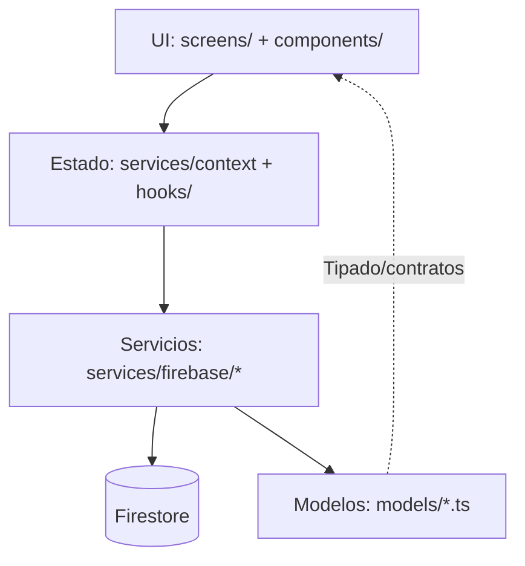
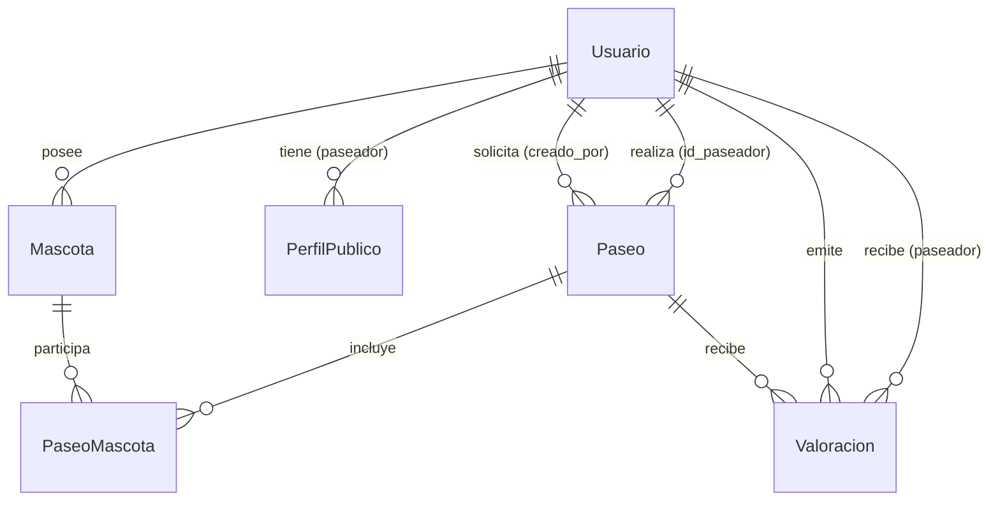
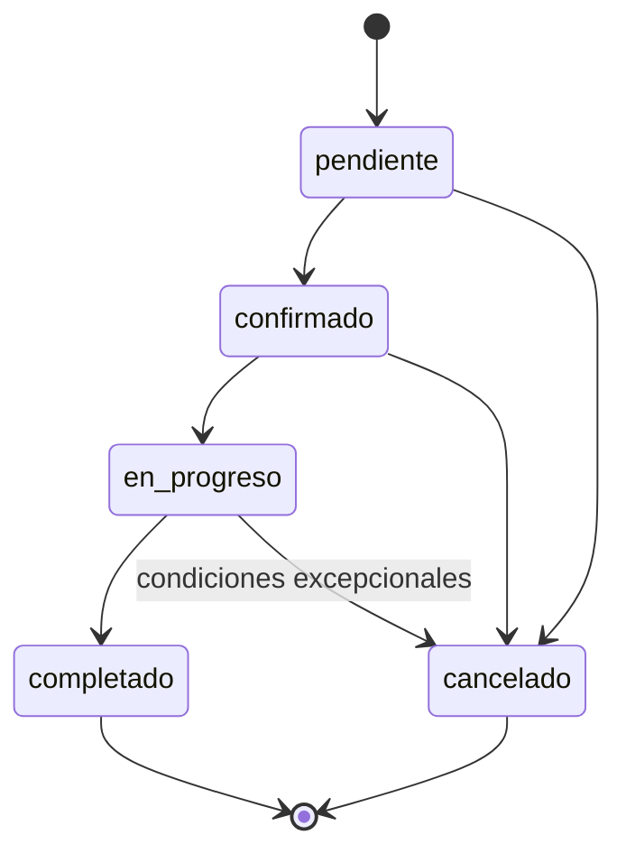
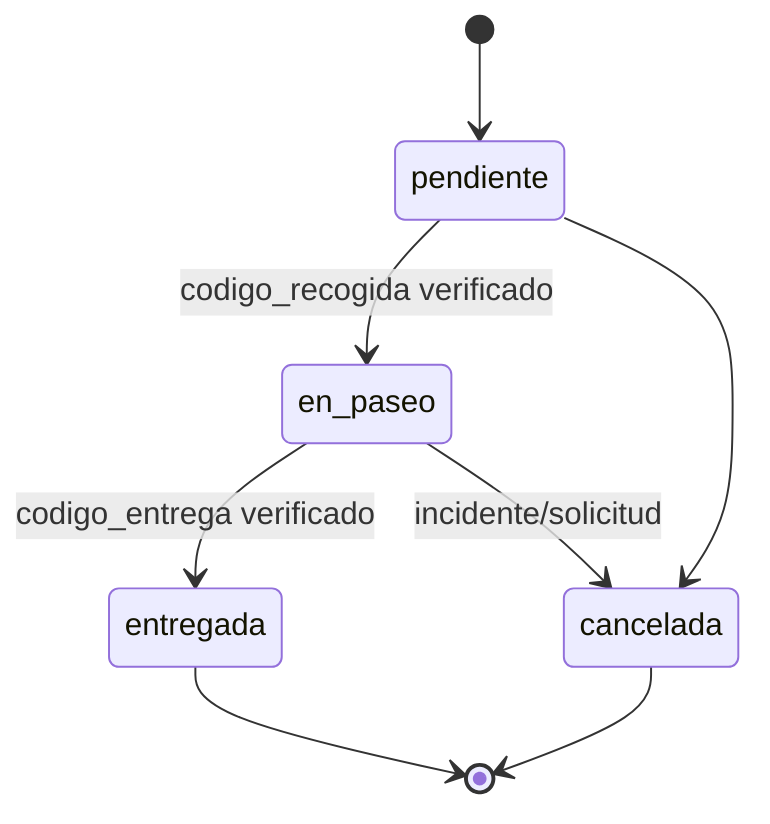

# Modelos de datos: estructura, robustez y madurez

Este documento describe la solidez técnica del modelado de datos del proyecto y cómo se integra en la aplicación. Incluye principios de diseño, estructuras de datos, relaciones, máquinas de estado, calidad y seguridad.

- Base técnica: TypeScript con tipado estricto y modelos explícitos.
- Persistencia: Firebase/Firestore (ver `services/firebase/*`).

## Resumen ejecutivo

El dominio de Pet Pals está modelado con entidades claras, estados explícitos y reglas de negocio declarativas. Se prioriza:

- Consistencia: enumeraciones y máquinas de estado para evitar ambigüedades.
- Integridad: referencias por ID y campos de auditoría en todas las entidades.
- Escalabilidad: consultas indexadas y colecciones normalizadas.
- Evolutividad: compatibilidad hacia adelante mediante convenciones, deprecaciones guiadas y migraciones controladas.

## Resumen de entidades

- BaseModel: metacampos comunes (id y auditoría)
- Usuario: identidad, contacto, roles y estado
- PerfilPublico: perfil visible del paseador
- Mascota: características, salud y preferencias
- Paseo: servicio solicitado/asignado
- PaseoMascota: vínculo paseo↔mascota y estado por mascota
- Valoracion: feedback del servicio

---

## Principios de diseño de datos

- Tipado fuerte de dominio: enums para estados, tamaños y especies.
- Estados como primera clase: flujos definidos y validados (ver máquinas de estado).
- Auditoría consistente: `id`, `creado_en`, `actualizado_en`, `creado_por`, `actualizado_por` en todas las entidades.
- Normalización pragmática: referencias por ID; agregaciones se resuelven en la capa de servicios.
- Preparado para Firestore: diseño optimizado para consultas por filtros y ordenamientos comunes.

<!-- Sección de convenciones eliminada para mantener el documento descriptivo y conciso. -->

## Arquitectura de capas y flujo de datos (cómo se usa el modelo en la app)

La aplicación organiza la lógica alrededor de capas claras que consumen estos modelos tipados:

- Presentación: `screens/` y `components/` (UI, inputs, feedback).
- Estado y utilidades: `services/context/` (p. ej., `AuthContext.tsx`), `hooks/` (p. ej., `useGlobalLoading.ts`).
- Acceso a datos: `services/firebase/` con módulos por entidad (`auth.ts`, `mascota.ts`, `paseo.ts`, `usuario.ts`) y utilidades (`crud.ts`, `index.ts`).
- Contratos de dominio: `models/*.ts` con interfaces y enums de negocio.

Diagrama de alto nivel:



Estrategias actuales evidenciadas en el repositorio:

- Tipado estricto en `models/` con enums para estados y categorías.
- Separación de servicios por dominio en `services/firebase/`.
- Contexto de autenticación centralizado (`services/context/AuthContext.tsx`).
- Hooks reutilizables para experiencia de usuario (`hooks/useGlobalLoading.ts`).

## BaseModel

Campos comunes presentes en todas las entidades.

- id: string (requerido)
- creado_en: Date (requerido)
- actualizado_en: Date (requerido)
- creado_por: string (opcional)
- actualizado_por: string (opcional)

<!-- Reglas operativas retiradas para mantener una descripción estrictamente estructural. -->

## Usuario

Identidad, contacto, roles y estado de la cuenta.

- nombre: string (req)
- foto: string (opt)
- correo: string (req)
- celular: string (req)
- fecha_nacimiento: Date (opt)
- direccion: Direccion (opt)
  - calle, numero, barrio, comuna, ciudad, departamento, pais, codigo_postal (opt)
  - coordenadas: { lat: number; lng: number } (opt)
  - referencia, descripcion (opt)
- zona: string (opt)
- roles: ('dueño' | 'paseador' | 'admin')[] (req)
- documento_identidad: { tipo: 'NUIP' | 'CC' | 'CE' | 'Pasaporte'; numero: string } (opt)
- verificado: boolean (req)
- fecha_registro: Date (req)
- estado: 'activo' | 'inactivo' | 'baneado' (req)

<!-- Validaciones operativas retiradas para mantener una descripción estrictamente estructural. -->

Ejemplo JSON:

```json
{
  "id": "usr_123",
  "creado_en": "2025-10-01T12:30:00Z",
  "actualizado_en": "2025-10-10T08:00:00Z",
  "nombre": "Ana Pérez",
  "correo": "ana@example.com",
  "celular": "+57 3001234567",
  "roles": ["dueño"],
  "verificado": false,
  "fecha_registro": "2025-10-01T12:30:00Z",
  "estado": "activo"
}
```

---

## PerfilPublico

Perfil visible asociado típicamente a un usuario paseador.

- id_usuario: string (req)
- nombre: string (req)
- foto: string (opt)
- biografia: string (opt)
- experiencia: string (opt)
- zonas_servicio: string[] (opt)
- disponibilidad: string (opt)
- mascotas_aceptadas: string[] (opt)
- max_mascotas: number (opt)
- valoraciones: string[] (opt, IDs de `Valoracion`)
- rating_promedio: number (opt)
- cantidad_paseos_realizados: number (opt)
- verificacion: 'pendiente' | 'verificado' | 'rechazado' (req)

<!-- Reglas de consistencia retiradas para mantener una descripción estrictamente estructural. -->

---

## Mascota

Características, salud y preferencias de la mascota.

- id_usuario: string (req, dueño)
- nombre: string (req)
- foto: string (opt)
- especie: 'perro' (req)
- raza: string (opt)
- fecha_nacimiento: Date (opt)
- genero: 'macho' | 'hembra' (opt)
- tamano: 'muy pequeño' | 'pequeño' | 'mediano' | 'grande' | 'gigante' (opt)
- peso: number (opt, kg)
- esterilizado: boolean (opt)
- vacunas: { nombre: string; fecha?: Date }[] (opt)
- condiciones_salud: string[] (opt)
- condiciones_comportamiento: string[] (opt)
- historial_medico: string (opt)
- nivel_energia: 'bajo' | 'medio' | 'alto' (opt)
- preferencias_paseo: string[] (opt)
- descripcion: string (opt)

<!-- Validaciones operativas retiradas para mantener una descripción estrictamente estructural. -->

Ejemplo JSON:

```json
{
  "id": "pet_001",
  "createdAt": "2025-09-01T10:00:00Z",
  "updatedAt": "2025-10-01T10:00:00Z",
  "id_usuario": "usr_123",
  "nombre": "Luna",
  "especie": "perro",
  "tamano": "mediano",
  "nivel_energia": "alto"
}
```

---

## Paseo

Servicio solicitado/asignado para una mascota.

- creado_por: string (req, dueño)
- id_paseador: string (opt)
- tipo_paseo: 'solicitado' | 'programado' (req)
- fecha_hora_inicio: Date (req)
- duracion_estimada: number (req, minutos)
- precio: number (req)
- estado: 'pendiente' | 'confirmado' | 'en_progreso' | 'completado' | 'cancelado' (req)
- ubicacion_inicio: string (opt)
- ubicacion_fin: string (opt)
- tracking_gps: string (opt, referencia a doc de tracking)

<!-- Reglas e invariantes operativas retiradas para mantener una descripción estrictamente estructural. -->

<!-- Nota de modelado prescriptiva retirada. -->

---

## PaseoMascota

Vinculación de una mascota con un paseo, con estado por mascota.

- id_paseo: string (req)
- id_mascota: string (req, debe coincidir con el docId)
- id_usuario: string (req, dueño de la mascota)
- observaciones: string (opt)
- codigo_recogida: string (opt)
- codigo_entrega: string (opt)
- estado_mascota: 'pendiente' | 'en_paseo' | 'entregada' | 'cancelada' (req)

Ruta de almacenamiento: subcolección `paseos/{paseoId}/mascotas/{mascotaId}` donde `mascotaId` es el ID de la mascota y coincide con el campo `id_mascota`.

<!-- Reglas e invariantes operativas retiradas para mantener una descripción estrictamente estructural. -->

---

## Valoracion

Feedback de un servicio de paseo.

- id_paseo: string (req)
- id_usuario: string (req, autor)
- id_paseador: string (req, receptor)
- rating: number (req, 1..5)
- comentario: string (opt)
- fecha: Date (req)

<!-- Reglas e invariantes operativas retiradas para mantener una descripción estrictamente estructural. -->

Ejemplo JSON:

```json
{
  "id": "val_777",
  "createdAt": "2025-10-12T11:00:00Z",
  "updatedAt": "2025-10-12T11:00:00Z",
  "id_paseo": "ps_555",
  "id_usuario": "usr_123",
  "id_paseador": "usr_456",
  "rating": 5,
  "comentario": "Excelente servicio",
  "fecha": "2025-10-12T10:45:00Z"
}
```

---

## Relaciones entre entidades



<!-- Se eliminaron recomendaciones de colecciones e índices para mantener el carácter descriptivo. -->

---

## Máquinas de estado

### Paseo



<!-- Texto prescriptivo retirado para mantener el carácter descriptivo. -->

### PaseoMascota



<!-- Texto prescriptivo retirado para mantener el carácter descriptivo. -->

---

<!-- Secciones de prácticas, rendimiento, gobernanza y pruebas retiradas para mantener el documento breve y estrictamente descriptivo. -->
