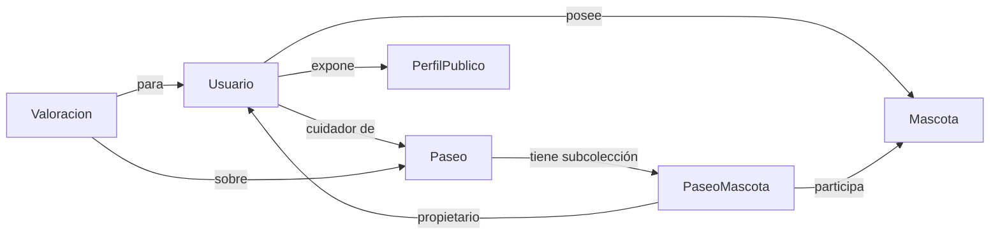

# Models — Resumen de dominio

Resumen: Guía compacta y práctica de los modelos de dominio. Aquí encontrarás la descripción esencial de cada entidad, sus campos clave, relaciones y ejemplos rápidos. Usa esto como guía de referencia antes de abrir los MD individuales.

Índice rápido

- BaseModel — metadatos y auditoría (`BaseModel.md`)
- Usuario — cuenta, roles y datos privados (`Usuario.md`)
- PerfilPublico — vista pública y estadísticas (`PerfilPublico.md`)
- Mascota — datos de mascotas y salud (`Mascota.md`)
- Paseo — servicio de paseo, estado y precio (`Paseo.md`)
- PaseoMascota — enlace mascota ↔ paseo (subcolección) (`PaseoMascota.md`)
- Valoracion — calificaciones y comentarios (`Valoracion.md`)

¿Cómo leer esto?

1. Comienza por el índice y abre el MD del modelo con el que vas a trabajar.
2. Revisa la sección "Contrato (TypeScript)" para conocer campos y tipos.
3. Usa el ejemplo JSON como referencia para payloads de API o fixtures de tests.

Relaciones principales (diagrama):



Resumen por modelo (rápido)

- BaseModel
  - Qué: Metadatos comunes (id, creado_en, actualizado_en, creado_por, actualizado_por).
  - Nota: Firestore usa `Timestamp`; en dominio usamos `Date`.

- Usuario
  - Campos clave: `nombre`, `correo`, `celular`, `roles`, `verificado`, `estado`.
  - Ubicación: `usuarios`.
  - Nota rápida: `documento_identidad` solo con consentimiento y control de acceso.

- PerfilPublico
  - Qué: Datos públicos mostrados a otros usuarios (nombre, foto, rating_promedio, zonas_servicio).
  - Uso: UI de búsqueda y ficha pública.
  - Recomendación: sincronización eventual desde `Usuario`.

- Mascota
  - Campos clave: `nombre`, `especie`, `tamano`, `nivel_energia`, `vacunas`.
  - Ubicación: `mascotas` (o subcolección de `usuarios`).
  - Validación: `peso` >= 0; `fecha_nacimiento` opcional para calcular edad.

- Paseo
  - Qué: Registro del servicio (tipo, inicio, duracion, precio, estado).
  - Importante: `mascotas_count` es denormalizado — mantener coherencia.
  - Reglas: `fecha_hora_inicio` futura para paseos programados; `precio` >= 0.

- PaseoMascota
  - Qué: Entrada por mascota en cada paseo (estado_mascota, codigos de verificación).
  - Ubicación recomendada: subcolección `paseos/{paseoId}/mascotas`.
  - Campo clave: `id_mascota`, `id_usuario`, `estado_mascota`.

- Valoracion
  - Qué: Calificación (1..5) y comentario sobre un paseo.
  - Reglas: `rating` entero 1..5; política para evitar duplicados.
  - Uso: calcular `PerfilPublico.rating_promedio` desde backend o funciones programadas.

Ejemplos rápidos (dominio, fechas ISO)

Mascota (resumen):

```json
{ "id": "masc_001", "nombre": "Luna", "especie": "perro", "tamano": "grande" }
```

Paseo (resumen):

```json
{
  "id": "paseo_100",
  "tipo_paseo": "programado",
  "fecha_hora_inicio": "2025-11-12T10:00:00.000Z",
  "precio": 25000
}
```

Valoracion (resumen):

```json
{
  "id": "val_100",
  "id_paseo": "paseo_100",
  "id_cuidador": "user_cuidador_01",
  "rating": 5
}
```

Siguientes pasos sugeridos

- Añadir esquemas JSON (ajv) para validar los ejemplos y generar tests automáticos.
- Añadir diagramas más detallados por modelo (mermaid) en cada MD si lo prefieres.
- Si quieres, genero automáticamente payloads de API (create/update) y un pequeño conjunto de fixtures para tests.

Contacto y revisión

Si quieres ajustes de tono, vocabulario o formato (más técnico o más “no técnico”), dime el estilo y lo cambio en todos los archivos.

---

Archivo: `docs/models/README.md` — versión generada automáticamente.
