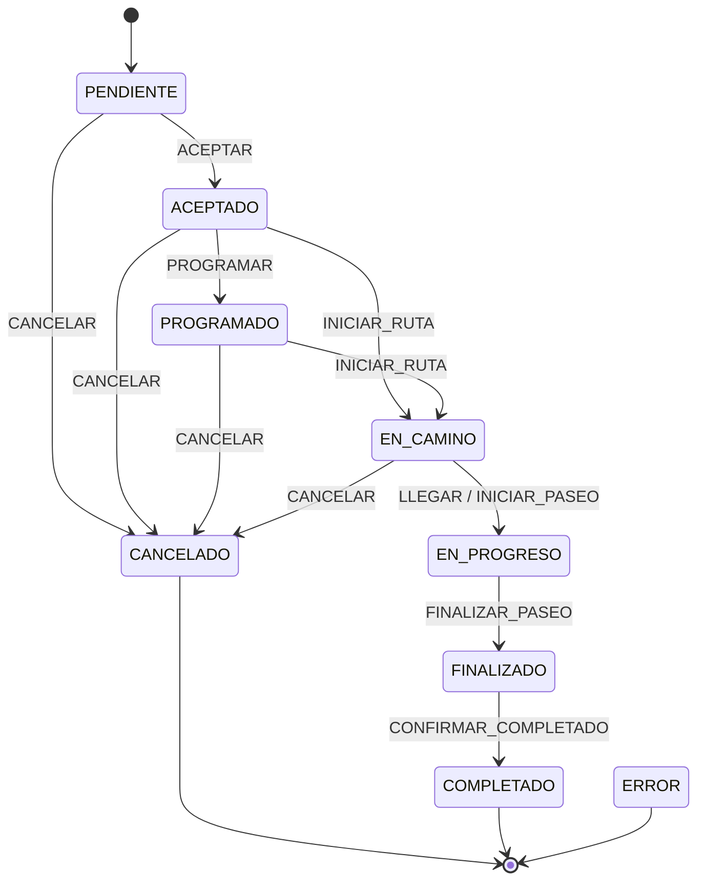

# Máquina de Estados de Paseos

Este documento describe el diseño de la máquina de estados para el modelo "Paseo" en `pet-pals-native`.

## Estados

| Estado          | Descripción                                                |
| :-------------- | :--------------------------------------------------------- |
| **PENDIENTE**   | Tutor solicitó el paseo; aún sin respuesta.                |
| **ACEPTADO**    | Un Cuidador aceptó la solicitud (preparación).             |
| **PROGRAMADO**  | Paseo con fecha/hora confirmada (opcional, intermedio).    |
| **EN_CAMINO**   | Cuidador en camino hacia inicio (opcional).                |
| **EN_PROGRESO** | Paseo activo (Cuidador inició el paseo).                   |
| **FINALIZADO**  | Cuidador marcó que terminó el paseo y espera confirmación. |
| **COMPLETADO**  | Tutor y/o sistema confirma cierre; reseñas pendientes.     |
| **CANCELADO**   | Paseo cancelado por Tutor o Cuidador (con motivo).         |
| **ERROR**       | Estado para fallos (ops, pagos, geolocalización).          |

## Eventos (Triggers)

| Evento                 | Descripción                                                                   |
| :--------------------- | :---------------------------------------------------------------------------- |
| `SOLICITAR`            | Tutor crea la solicitud.                                                      |
| `ACEPTAR`              | Cuidador acepta.                                                              |
| `RECHAZAR`             | Cuidador rechaza (evento). No cambia estado: se registra y notifica al tutor. |
| `PROGRAMAR`            | Se confirma fecha/hora (si aplica).                                           |
| `INICIAR_RUTA`         | Cuidador inicia desplazamiento hacia la mascota.                              |
| `LLEGAR`               | Cuidador llega al punto.                                                      |
| `INICIAR_PASEO`        | Cuidador marca inicio del paseo.                                              |
| `FINALIZAR_PASEO`      | Cuidador marca fin del paseo.                                                 |
| `CONFIRMAR_COMPLETADO` | Tutor confirma recibida la mascota / sistema cierra.                          |
| `CANCELAR`             | Tutor o Cuidador cancela (guardar motivo).                                    |

## Transiciones



## Ejemplo de Uso

```typescript
import {
  createPaseoMachine,
  ESTADOS_PASEO,
} from 'services/paseos/maquinaEstados'

const machine = createPaseoMachine({ estado: ESTADOS_PASEO.PENDIENTE })
const nextState = machine.transition('ACEPTAR')
// nextState === ESTADOS_PASEO.ACEPTADO
```

## Pruebas

Cada transición debe ser validada con un test unitario que verifique:

1. Cambio de estado correcto.
2. Validaciones de negocio (ej. no pasar de PENDIENTE a FINALIZADO directo).
3. Payload opcional (motivos de cancelación, etc).
